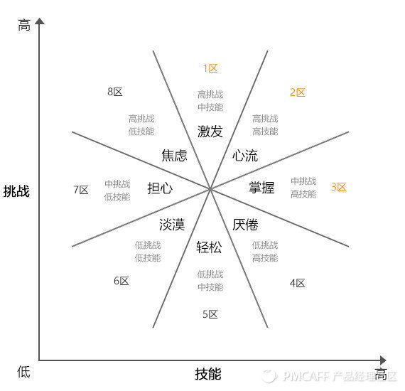

# 创新高效团队-管理者角色升级

## 前言关键字：

讲师：**林海**

<u>案例1：</u>骆驼图，大人和小孩看的视角

<u>关键字：</u>

**视角决定心态，视野决定质量**。

**扎心不打脸**。

**每个人或许都需要一个教练**。—Eric Emerson Schmidt 埃里克·施密特 Google董事长

> 埃里克·施密特（Eric Emerson Schmidt），1955年出生，[Google](https://baike.baidu.com/item/Google)前CEO、著名电脑工程师， [1]  现任[Alphabet](https://baike.baidu.com/item/Alphabet/18349995)公司（Google 母公司）董事长 [1-2]  ，他拥有[普林斯顿大学](https://baike.baidu.com/item/%E6%99%AE%E6%9E%97%E6%96%AF%E9%A1%BF%E5%A4%A7%E5%AD%A6/400839)电子工程师学士学位， [1]  同时有[加州大学伯克利分校](https://baike.baidu.com/item/%E5%8A%A0%E5%B7%9E%E5%A4%A7%E5%AD%A6%E4%BC%AF%E5%85%8B%E5%88%A9%E5%88%86%E6%A0%A1/3755024)的计算机科学硕士学位和博士学位。 [3] 
>
> 埃里克·施密特于2001年到2011年四月十年间担任 [Google](https://baike.baidu.com/item/Google) CEO， [2-3]  2001年由Google 创始人拉里·佩奇（Larry Page）和谢尔盖·布林（Sergey Brin）从 Novell 公司聘请其担任这一职务，此前他在 Novell 公司任董事长兼首席执行官，负责公司的战略规划、管理和技术发展。也曾是苹果公司董事会成员。 [1-2]  同时他亦为卡内基美隆大学和普林斯顿大学理事会托管者，并亦是程式编译器lex的共同作者。 [2] 

**漏斗式沟通技巧**。

**正能量**。

**心流**。

## 传统管理者的画像：

### 老师式管理者：

1. 方向指引
2. 知识补充
3. 行为指导

### 裁判式管理者：

1. 裁判公平
2. 理念公正
3. 手法公开

> 最容易得罪所有人，法官，律师

## 目前的状态：

企业管理层级与互联网扁平化的博弈->互联网，架构扁平化

90后与80，70后的鸿沟式特征差异->90后

团队成员背景呈现多元化趋势->多元化，情况复杂

技能深度垂直，专家式的管理者面临巨大挑战。->专家式，压不住

<u>案例：</u>电子元器老板的办公室，专家带科学家

## 90后的特征差异：

`理想化`，`自我`，`自由主义`，`高马斯洛需求层次`，`藐视权威`，`孤独`，

> 马斯洛需求层次理论是[人本主义](https://baike.baidu.com/item/%E4%BA%BA%E6%9C%AC%E4%B8%BB%E4%B9%89)科学的理论之一，由美国心理学家[亚伯拉罕·马斯洛](https://baike.baidu.com/item/%E4%BA%9A%E4%BC%AF%E6%8B%89%E7%BD%95%C2%B7%E9%A9%AC%E6%96%AF%E6%B4%9B)在1943年在《人类激励理论》论文中所提出。书中将人类需求像阶梯一样从低到高按层次分为五种，分别是：生理需求、安全需求、社交需求、尊重需求和自我实现需求。

<u>案例分享</u>：00后的小孩如何评价90后

60后：信仰，70后：责任，80后：阶层(对比心理)，90后：自我

—>马佳佳 也叫张孟宁

> 张孟宁，前《时尚Cosmo digital》主编 [1-2]  ，1990年出生；2008年云南省高考语文状元；2012年毕业于中国传媒大学；2013年，以女嘉宾身份参加江苏卫视《[非诚勿扰](https://baike.baidu.com/item/%E9%9D%9E%E8%AF%9A%E5%8B%BF%E6%89%B0/157)》；2014年受邀到[万科](https://baike.baidu.com/item/%E4%B8%87%E7%A7%91/6141470)演讲剖析互联网如何影响房地产，成为话题人物 [3-4]  。女性社区App“High”创始人 [5]  。

## 教练式管理者：

极少的颐指气使，从不歇斯底里，甚至较少发号施令；

一位用心的聆听者和有力的鼓励者；

偶尔问的问题能帮助你迅速地理清思路，甚至获得力量。

案例：自己曾经的老板是如何教导他的，

| 传统管理者角色         | 教练式管理者角色           |
| ---------------------- | -------------------------- |
| 规则的制定者->定活两便 | 氛围的营造者->持续的正能量 |
| 结果的裁定者           | 内驱的构建者               |
| 自上而下的传达者       | 由内而外的聆听者           |
| 严厉的惩戒者           | 有效的激励者               |

### 定活两便：

定：目标，操守，态度->原则

- 目标清晰化，让团队清晰明确无理解歧义；将目标可视化。
- 形式生动化，让生活场景融入规则，会提升管理的柔性。案例：开会捐款箱，迟到罚洗碗
- 改善迭代渐进化，即慢慢来。不要出现断层式的改变，案例：公司周报。

活：手段，过程，方法->多样

<u>案例</u>：腾讯视频负责人。

### 正能量=+收获感-失去感：

#### 获得感营造：

- 专注思考事情的可能性，放大收获；
- 专注过程的重要节点，延长收获感；
- 养成仔细复盘的好习惯，强化收获状态；注：复盘不等于总结。

项目心得：需要晨会，但是只同步关键节点工作进展，开会后并记录马上同步，后面项目结束，就以，复盘晨会内容为主，看看走过的路，哪些地方有问题，哪些地方值得表扬。

#### 失去感如何从容营造：

提前预定好三条警戒线：即管理者提前给自己设置好这三条线

最高"警喜"线：该场景下，或许能够得到的惊喜和背后的隐含警示；

正常"平均"线：该场景下，正常无意外的表现；

最低"止损"线：该场景下的，可能发生的最差情况；

<u>案例</u> 自己演讲的时候，台下的人突然走一大半。

### 发令枪和终点的魅力，永远不如安静的跑道和澎湃的心

### 内驱型团队基础：

清晰化，聚焦化，量化，回味无穷。

> 心得：受用于沟通评价。

目标凝聚，激活心流。

**米哈里**·契克森米哈赖：**《心流》**

> “心流”是指我们在做某些事情时，那种全神贯注、投入[忘我](https://baike.baidu.com/item/%E5%BF%98%E6%88%91/420271)的状态——这种状态下，你甚至感觉不到时间的存在，在这件事情完成之后我们会有一种充满能量并且非常满足的感受。其实很多时候我们在做自己非常喜欢、有挑战并且擅长的事情的时候，就很容易体验到心流，比如爬山、游泳、打球、玩游戏、阅读、演奏乐器还有工作的时候。

**心得**：管理者把控核心的，不重要的可控的事情，让下属自己选择去做。

### 由内而外的聆听者：

目前的团队沟通的大量传播冗余：**信息熵**(shang)

<u>案例</u>：开会。

#### 聆听者的三个层次：

心得：自己做甲方，把握主动权，多问，少答

1. 共感：启发深度连接，给乙方开启信任和尊重；圆桌作为120度，给双方留白时间，必要的发射带入感。我对你不论赞同与否，都能十分**理解你的感受**，我们的**沟通场域对你是安全**的。
2. 辨意：听懂弦外之音；心得：三想：**词句本意**？->**当下语境**？->**沟通者立场**？。
3. 听文：吸收基本的语义。

反例：你说吧，我边发邮件，边仔细听着呢。啊？等等..你刚说了什么？稍等，我能不能打断一下。

案例：王健林答记者，飞机事件，谍战片视频。

负效发问：

- 审问式：这个月的业绩下滑的厉害，怎么回事？
- **过于发散**的发问：最近你的状态为什么这么差？
- 强买强卖：你难道觉得的这个方案还有什么不好的吗？

有效发问：

- 聚焦，用减冗让思路聚焦
- 深挖，用假设促进深挖
- 促凝：客观描述触动疑问避免情绪渗漏

### 有效激励：

- 鸡血：在精神层面，获得鞭策与激发。
- 鸡肉：在物质层面，得到奖赏与犒劳的正反馈。
- 鸡蛋：在意愿层面，对未来产生正面的期待与希望
- 鸡汤：在情感层面，因受到感动而产生共鸣，进而得到疏解。

案例：送员工礼物，**不要low**.**量少有B格**。

核心：靶子+体温计+尺子

心得：**尽一切的机会分析到下属的鼻毛孔里**，即分析下属的生活癖习。

心得：精于酝酿，勇于试错，勤于总结。

心得：人人都有需求，只要你能抓住，哪怕是打他都愿意。

## 推荐书籍：

《怪诞行为学》，《心流》，《探询式领导》

## 彩蛋：

锻炼：双手平胸，左右扩张，用力不要用惯性，弯腰下拉，深呼吸。

三高三低一减两避免一少：

**高水分**（多喝水）->体内需

**高蛋白**（鸡蛋，鸭肉，淡水鱼等，少牛/羊肉）->脑需要

**高纤维**（[麦麸](https://baike.baidu.com/item/%E9%BA%A6%E9%BA%B8)、玉米、[糙米](https://baike.baidu.com/item/%E7%B3%99%E7%B1%B3)、大豆、[燕麦](https://baike.baidu.com/item/%E7%87%95%E9%BA%A6)、荞麦、[茭白](https://baike.baidu.com/item/%E8%8C%AD%E7%99%BD)、[芹菜](https://baike.baidu.com/item/%E8%8A%B9%E8%8F%9C)、[苦瓜](https://baike.baidu.com/item/%E8%8B%A6%E7%93%9C)、水果）->防止癌

**低盐**：如中年脸胖，肚子等 ->血管

**低糖**：可乐糖分最高，

**减少吃油炸食品**：腐竹等二次油炸等食品，星巴克等蛋糕等

**避免喝酒**：中国啤酒90%是兑出来的。

**避免抽烟**：

**少熬夜**：11点30前睡觉

