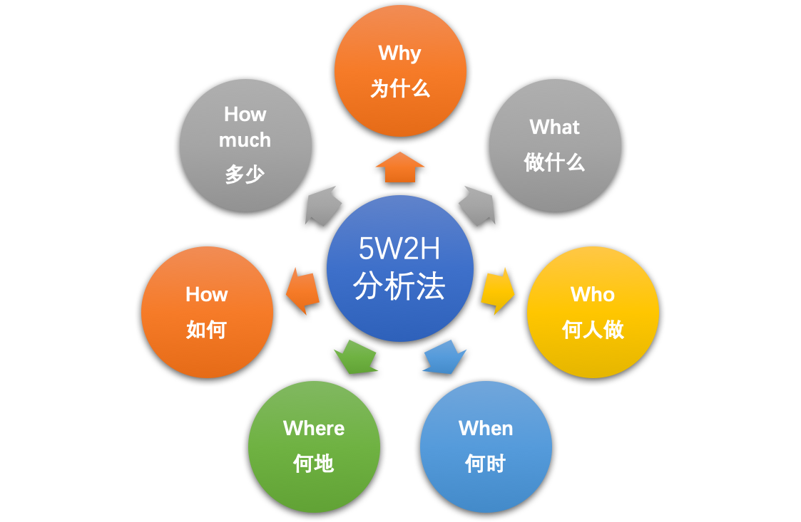

# 方法论汇总

https://www.zhihu.com/column/dream2riches

## 结构化思维

为什么？把话说清楚，把事情做的有条理。

结构化思维的定义就是：逻辑 +套路。

### 表达要有逻辑：

1）**演绎（因果）顺序**：“大前提、小前提、结论”的演绎推理方式就是演绎顺序。比如，经典三段论：所有人都要死，苏格拉底是人，苏格拉底要死。

2）**时间（步骤）顺序：**“第一、第二、第三”，“首先、然后、再者”等，很多的时间顺序同时也是因果顺序。

3）**空间（结构）顺序：**“前端、后端、数据”，“波士顿、纽约、华盛顿”，化整为零（将整体分解为部分）等都是空间顺序。

4）**程度（重要性）顺序：**比如“最重要、次重要、不重要”等。

### 做事要有套路：

#### 5W2H 分析法则

Why（为什么）、What（做什么）、Who（谁来做）、When（何时）、Where（何地）、How（如何做）、How much（多少）

### 如何进行结构化思考

#### 1）建立中心

建立中心也就是要定义清楚要解决的问题，要明确目标；

1. 自上而下：适用于问题比较明确的情况，我们只需要找到问题的核心要素即可，然后进行展开即可。

2. 自下而上：对于问题不够明确的情况，我们需要对多种杂乱的内容，进行分类、剪枝、归纳汇总成一个中心。

#### 2）结构化分解

参照表达逻辑，即演绎顺序、时间顺序、空间顺序和程度顺序进行思考。

### 打造极客文化

空间顺序：

时间顺序：

### 麦肯锡问题解决框架：

提出问题，定义问题，分析问题，解决问题，最后是展望未来

PS：如何做晋升述职，1）罗列事情，2）价值的背后 ==》参照上面的框架。

