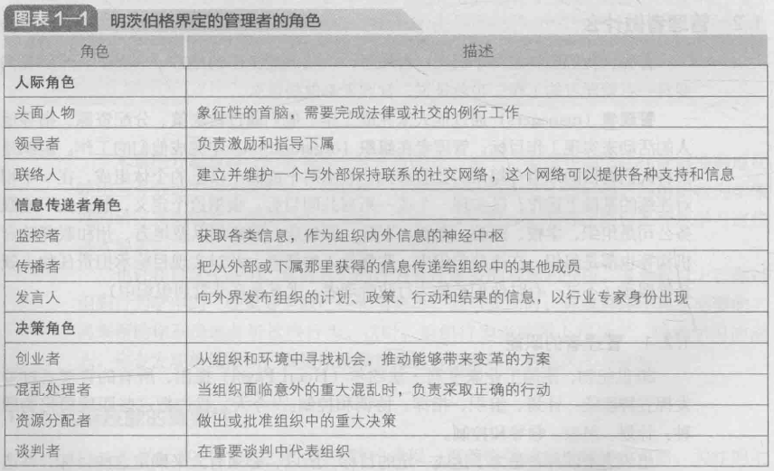
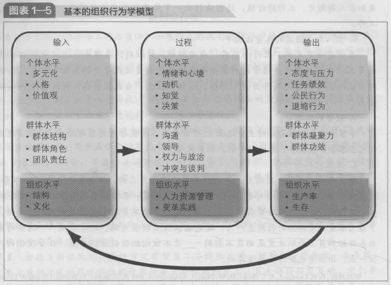

# 组织行为学

## 导论

### 1）什么是组织行为学

Organizational Behavior，OB 关注的是人们在组织中做什么以及这种行为如何影响组织绩效的

#### 1.1）人际技能的重要性

领导和沟通技能很重要，管理者人际技能的开发有助于组织吸引和留住高绩效人才。

#### 1.2）管理者的角色

成功管理者：升职快，多社交(搞关系)

有效管理者：业绩好，多沟通(PUA)。

#### 1.3）组织行为学模型

## 个体

### 2）组织中的多元化

歧视：我们的行为被人们的刻板印象所影响

年龄：年龄越大，越不愿意离开现有的工作岗位；年长的员工缺勤率比年轻员工低（在可以避免无外界因素影响）；年长的员工心理问题和身体健康问题都比年轻员工少

### 3）态度与工作满意度

态度：个体对物体，人物和事件的评价性陈述

态度的构成：认知（对事物的一种描述或看法）；情感（情绪或感受，情感能够导致行为结果）；行为（个体以某种方式对某人或某事做出行为的意向）

**认知失调：个体可觉察的两种或多种矛盾的态度，或者行为和态度之间的不一致。**

**减少失调的三个因素：1）因为失调因素的重要性，2）个体对这些因素的控制程度，3）不协调所带来的回报**。

### 4）情绪与心境

情感：情绪+心境

情绪：一种强烈的情感，直接指向某人或某物

心境：一种比情绪更弱并且通常（但并不总是）不因为具体某人某事产生的情感

情绪劳动：员工在工作过程中与人交往表现符合组织要求的情绪

### 5）人格与价值观

迈尔斯-布里格斯类型指标(MBTI)：外/内向型，感/直觉型，思维/情感型，判断/感知型

## 参考

https://www.processon.com/view/61237e5a0e3e743b327ca92c

