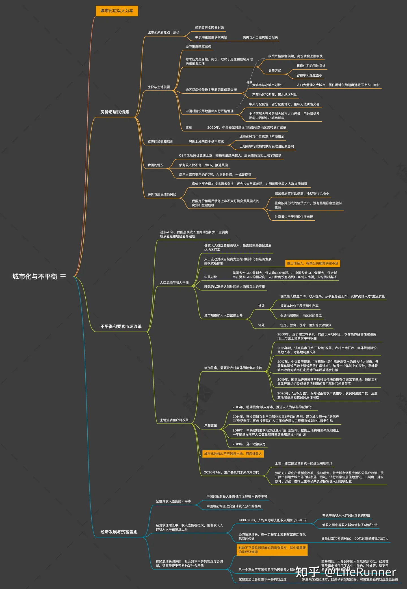

# 置身事内

《置身事内：中国政府与经济发展》是[兰小欢](https://baike.baidu.com/item/兰小欢/16246844?fromModule=lemma_inlink)编著的政治理论著作，首次出版于2021年8月。

兰小欢，2001年获得[东北财经大学](https://baike.baidu.com/item/东北财经大学/439055?fromModule=lemma_inlink)授予经济学学士学位，2006年获得中国社会科学院授予的经济学硕士学位，2012年获得美国[弗吉尼亚大学](https://baike.baidu.com/item/弗吉尼亚大学/9080085?fromModule=lemma_inlink)（University of Virginia）经济学博士学位，同年作为研究学者加入[长江商学院](https://baike.baidu.com/item/长江商学院/4427961?fromModule=lemma_inlink)。

## 思维导图

https://zhuanlan.zhihu.com/p/511717933

### 政府治理的特点

### 事权划分三原则

### 招商引资

### 分税制改革

### 土地财政

### 纵向、横向不平衡

### 城投公司与土地金融

### 地方政府债务

### 招商引资中的官员

### 京东方与政府投资

### 光伏发展与政府补贴

### 政府引导基金

### 城市化与不平衡

### 债务与风险

### 国内国际失衡

### 政府与经济发展

## 评论

通过本书可以了解，中央和地方的关系，和博弈。 政府也缺钱，政府也要赚钱。原来地方政府可以不怎么听中央的话，而中央的一切政策 也要考虑到地方。快速开放的代价 就是人们生活水平提高了，但是带来的压力和负债 确是一个定时炸弹，压在政府和人民的身上。

还有就是中国老百姓的储存和消费习惯 也是由于压力和传统导致。

1）计划生育，导致单个人要负担的，--》存款

2）房子压力 -->存款

3）经济不好-->存款