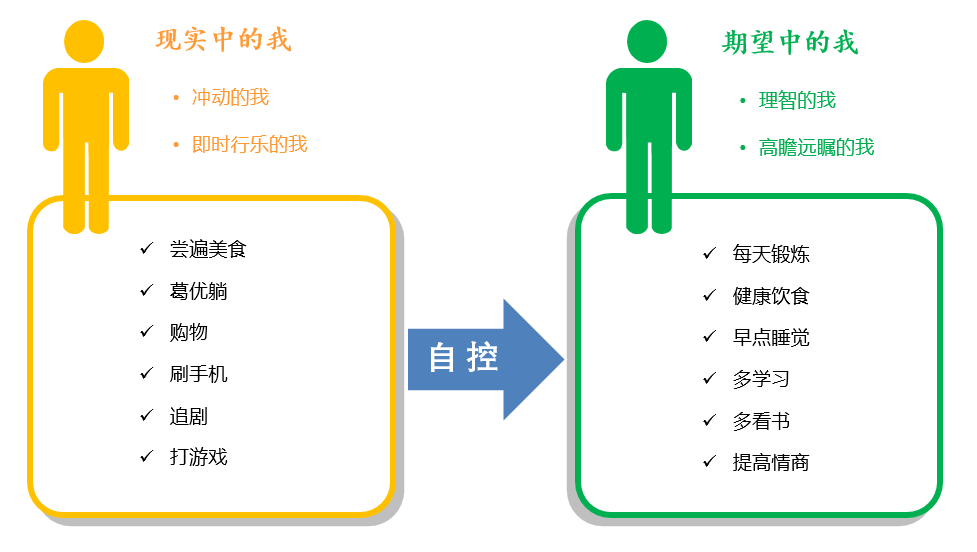

# 自控力

作者是（美）凯利·麦格尼格尔（Kelly McGonigal）。

## 什么是自控力

1. 理性控制自己的欲望的能力

2. 1. 控制欲望，让我们完成自己的理性计划

   2. 控制兽性，让我们拒绝自己的动物本能

   3. 理性思考，让我们践行并实现长远目标

   4. 

意志力让我们拥有**“我要做”、“我不要”和“我想要”**三种能力，让我们控制自己，完成自己的

### **两个自我导致的问题**

我们的脑袋里有两个自我。一个自我任意妄为、及时行乐，另一个自我则克服冲动、深谋远虑

合理的管理两种自我，他们的平衡的和谐相处，才是最合理的方式。

学会利用原始本能，而不是反抗这些本能。

意志力第一法则：认识你自己

- 人类还拥有自我意识。**当我们做一件事的时候，我们能意识到自己在做什么，也知道我们为什么这样做。但愿我们还能知道，在做这件事情之前我们需要做些什么，这样我们就会三思而后行**
- 注意力分散的人更容易向诱惑屈服

小实验：可以回忆一下自己的一些决定，看看自己受什么干扰了，为什么会这样决定

### **训练大脑，增强意志力**

通过对大脑的针对性训练，你的大脑不仅会觉得越来越容易，也会根据你的要求重新塑型。就像通过锻炼能增加肌肉一样，通过一定的训练，大脑中某些区域的密度会变大，会聚集更多的**灰质**

如何训练大脑？

1. **冥想**:如果你经常让大脑冥想，他不仅会变得擅长冥想，还会提升你的自控力，提醒你集中注意力、管理压力、克制冲动和认识自我的能力。
2. 给“我不要”设置障碍
3. 适当做一些“我要做”的事情

意志力实验：五分钟训练大脑冥想

- 总结：专心呼吸。

- 技巧：

- - 原地不动，安静做好。
  - 注意你的呼吸。
  - 感受呼吸，走神可以默念“呼”和“吸”

- 每天坚持五分钟，如果觉得很轻松，就尝试逐渐提高分钟数
- 目前我已经每天能坚持十分钟了，关于静坐或者说冥想，更详细介绍或是技巧等我推荐杨定一博士的《静坐的科学、医学与心里之旅》这本书

## 原因和应对方式

### **一、我们根本就没有意识到自己正在面临选择**

没有意识到自己在做选择，也就没有办法自控，因为自控就是选择放纵还是坚持目标。

大部分人做决定的时候就像开了自动挡一样，根本意识不到自己为什么做决定，也没有认真考虑这样做的后果。最可恨的是，我们有时候根本意识不到自己已经做了决定。比如，有一项研究调查人们每天做多少和食物相关的决定。人们平均会猜14个，但是我们真的去数的话，这种决定大约有227个，也就是说，人们在毫无意识的情况下做出了200多个选择，而这仅仅是与食物相关的决定，还不包括其他的决定。所以，你的失控，很可能是因为你没有意识到你在自控。

**应对措施：**

既然我们自控力计划失败的原因，是因为根本就没有意识到自己正在面临自控力挑战，也就是正在做选择，那么应对方法就是：**至少花费一天时间观察并记录自己做的决定，观察自己能否及早意识到自己在做什么，想些什么或者暗示什么最容易让你冲动**。

### **二、注意分散的人更容易屈服于诱惑**

在一项研究中，如果被试者的注意力不是集中在选择上，比如正在玩手机或者和别人聊天，那么他在选择午餐的时候，更容易选择不健康的食物，这违背了他的长期意愿。

**应对措施：**

1.**训练大脑，增强意志力**。让大脑进行专注力训练，他就会变得越来越专注。我们都知道，让大脑经常学习数学，它就会越来越擅长数学。那么，我们让大脑经常进行专注力很强的活动，它也就会变得越来越擅长专注。

2.**冥想**。冥想就是将注意力专注于呼吸上，它之所以可以增强自控力，是因为它让大脑专注于某件事，继而让大脑变得更专注。

### **三、问题出在我们自己身上**

我们总是认为诱惑和麻烦来自外部世界，其实问题出在我们身上，是我们的思想、欲望、冲动出了问题。因为诱惑无处不在，所以我们需要找到自己的原因。

我能举出很多例子证明这个观点，比如手机游戏、抖音应该算是浪费了青年人的大部分时间，我们不可能让游戏公司破产、也可能让别人不要拍抖音、发朋友圈，我们唯一能做的，就是卸载它们。

其实还是我们的思想决定了我们的行为。

**应对措施：**

从自己身上找原因，**找到诱惑源，然后把它从你的视线中挪开**。

### **四、心率变异度决定了你的自控能力**

书中提到了一个结论，当人们面对诱惑的时候，如果他心率加快，那么他更容易自控；如果他心率保持不变或放缓，他就会选择放纵。也就是说，一个人是否准备自控，从心率上，就可以看出来。

所以，自控能力强取决于心率变异度高。

**应对措施：**

提高心率变异度：

1.吃的食物，住的环境都会影响心率变异度，所以我们应该吃一些健康的食物，保持环境的整洁卫生。

2.**刻意降低呼吸频率，每次呼吸用10-15秒，有控制感，才能克制欲望**。

### **五、缺乏锻炼会降低自控力**

这只是一项研究的结果，至于为什么锻炼可以增强自控力，我也没有实验作为依据。但是我们可以观察到，经常锻炼的人，生活更有规律、饮食更加健康、对自己的生活有更高的规划和积极性。我们不妨动起来试试。

### **六、睡眠不足就别想自控**

睡眠不足会导致大脑受损，并且和醉酒的状态差不多，你总不可能要求一个醉汉有很高的自控力吧。

**应对措施：**

稍微补一下觉，意志力就会恢复。

### **七、不要试图控制生活的全部**

我们的意志力其实和肌肉的模式差不多，终会有能量耗尽的那一刻，也就是说，**意志力是有限的，只要你用了一次，就会少一次，能量的进度条就会减去一格。**

**所以，永远不要试图控制生活的所有方面，我们只需要关注那些重点目标就行了**。

过度自控，只会让你在很多事情上失控。但是好消息就是，当你自控力用完的时候，这种自控能量经过调整也会恢复。

比如在一项实验中，让受试者补充糖分，他们的意志力就会有提升。而另一组没有补充糖分，他们的状态并没有好转。

注：松弛有度

### **八、第一波疲惫，不是真的疲惫**

你是否有过这样的体验，当你在操场上跑了一圈半之后，发现自己已经非常累了，上气不接下气，身体已经很疲惫了，但是当你继续爬一会，你就会神奇的发现，自己没有那么累，反而轻松了很多。

这是为什么呢？这是因为我们的大脑天生就需要保存能量，他不可能让能量真的耗尽了，才告诉身体该停下来了，那个时候已经晚了。就像笔记本电脑不会等到电量全部用完了才关机一样，那时就是真的关机了，未保存的资料就不见了。

我们的大脑时刻在判断，我们的身体能量还剩余多少，然后给身体发指令，告诉身体是否继续。为了保存能量，防止能量耗尽，大脑会提前发号施令，所以，你遇到的第一波疲惫，不是真的疲惫，也就是说，你可以继续坚持，保持自控。

**应对措施：**

虽然人类的自控力不是无限的，但是我们的意志力比我们想象的要多得多，**下次当你觉得自己“疲惫”地无法自控的时候，试着挑战自己，挺过第一波疲惫**。

### **九、道德许可效应在阻碍你进行自控**

什么是道德许可效应？也就是说，如果一个人对于一件事情有“好”和“坏”的评价，那么“好”的行为就会触发人们去做“坏”的事情。比如，**一个减肥的人，会认为，我今天跑了好多圈了，既然今天这么幸苦，那就好好犒劳自己吧，然后吃掉了比消耗的卡路里多几倍的食物**。这也就意味着，我们很多时候，前进一小步，然后就会放纵，导致后退一大步。

那还不如保持原样呢！

书中有一个比较有趣的例子：研究显示，和那些记不起曾经做过善事的人相比，记得自己做过善事的人，在慈善活动中捐的钱要少60%。他们或许会觉得，既然我做了这么多好事，那我可以允许自己适当地做一点“坏”事。

所有被我们道德化的东西，都不可避免的受到了“道德许可效应”的影响。

**应对措施：**

1. 取消许可，牢记理由。**记住我们为什么要拒绝诱惑，而不是记住之前已经抵抗过的诱惑，这会让我们消除心中的道德审判**。善行会允许我们做坏事。忘掉美德，关注目标和价值观。

2.将你的自控目标作为一个独立的手段，他们是不能互换的善行，即使取得了一个成功，也不能放松要求。

### **十、总是期望明天的自己能有所改变**

当我们需要自控的时候，如果你想到，明天的自己能够有所改变，并且能够弥补今天的过错时，那么今天的放纵，就不会让你有那么大的负罪感。

比如：当一位戒烟的烟民拿起香烟时，他如果想到，明天再戒烟，那么抽这一只烟的压力就没有那么大。

**应对措施：**

明天和今天毫无区别。当你想改变某种行为的时候，试着减少行为的变化性，而不是减少那种行为。比如，让烟民保持每天抽同样数量的香烟，那么总体的吸烟量就会呈下降趋势。因为这打破了吸烟者通常认为的“明天会有所改变”的心理依赖。

### **十一、多巴胺在让你逐渐失控**

多巴胺是什么？它是大脑分泌的一种激素，然后流入到你的血液中，让你变得兴奋。

他有积极的一面，比如：当你知道自己以后有可能成为亿万富翁的时候，你就会非常卖力的工作。但是也有消极的一面，当你知道快手短视频有可能很有趣的时候，你就会非常兴奋，不停的刷手机，直到你将宝贵的几小时时间全部用完，你才发现，你的心还是空的。

追求奖励，是多巴胺的目标，他才不管你到底快不快乐，当它探索到接下来的事情有可能让你快乐的时候，或者即将获得一种奖励的时候，他就会被释放，让你兴奋起来，然后你就在它的驱使之下，逐渐失控。

**应对措施：**

\1. 测试奖励的承诺：找一个经常让你放纵的诱惑因素，关注放纵的过程，奖励的承诺给你什么感觉？在关注的过程中，你就会发现有了更强的自控力。你会发现，你实际上并不需要想象中的那么多东西，或者这种体验完全无法满足你。

\2. 我们需要奖励的承诺，它让我们保持对生活的兴趣，并继续生活下去。如果需要自控，我们就需要区分让我们的生活有意义的真实奖励和让我们分散精力、上瘾的虚假奖励。

### **十二、压力和恐惧会引发欲望**

一项研究表明：香烟盒上的死亡警告会让烟民感到压力和恐惧，这种焦虑会让吸烟者用默认的方法（抽烟）来缓解压力。而健康节目中播放的吸烟者的肺部图片，对吸烟者的感官冲击，也会导致他们故态重犯。

所以，当你感到压力的时候，比如学业压力很大的时候，你就很难自控，你需要一种放松的方式来缓解压力，而这种放松的方式，往往正是你需要自控的东西，也就是实际情况和你的目标相矛盾。

**应对措施：**

放松心态，想办法缓解压力。

### **十三、那又如何效应**

很多节食者因为一次失误，比如多吃了一块蛋糕，而感到情绪低落，他们会想，既然打破了节食计划，还不如把它们吃光算了。这个例子应该可以让你理解什么是“那又如何效应”。

因为一次小失误，而导致无法原谅，继而自暴自弃。

这样还有救吗？

**应对措施：**

\1. 解决办法是不要对自己太苛刻，摆脱罪恶感会人们不去放纵自己。

2.自我批评会降低积极性和自控力，相反，自我同情则会提高积极性。

### 十四、我现在就想要

人类总有各种各样的花招，让自己认为，抵抗诱惑是明天的事情。其实人类也知道6比2好，但是为了瞬间的快感，他们忘记了真正想要的东西。

而且厌恶损失的心理，也会让人们保留最初得到的东西，所以在眼前的诱惑与长期的利益之间，更容易受眼前的利益驱使。

**应对措施：**

1.其实这项研究同时也是一种解决方案，因为这对那些想要延迟快感的人来说，是个好消息，只要创造一点距离，就会让拒绝变得容易起来。比如，把糖果放在抽屉里面，会比放在桌面上少吃1/3。如果你知道什么会引起欲望，就把它放在视线之外，它就不再吸引你了。

\2. **等待 10分钟：如果获得即时的满足之前，必须等待10分钟，大脑就会把它看成是未来的奖励。如果没有了即时满足感的强烈生理冲动，奖励承诺就不会如此活跃**。“即时”二字劫持了你的大脑，扭转了你的偏好。如果需要获得一个清醒的头脑，就需要在诱惑面前安排10分钟的等待时间。如果十分钟之后，你还想要，那你就去做。

3.如何抵抗“即时的满足感”：**想想你现在就已经得到了长期的奖励，想象未来你正在享受这种奖励。**然后扪心自问，你是否愿意放弃它，来换取正在诱惑你的短暂快感吗？

### **十五、我们需要“破釜沉舟”**

比如：一个学生，他身边的诱惑源有很多，玩具、手机、电脑等等，这也只是我能想到的少数诱惑源，实际情况比这要复杂的多。如果能够限制他的选择，那么，他就有可能朝着正确的方向前进。

书中就有一个类似的例子:美国的一个作家在接受采访的时候说，他之前非常沉迷于电脑游戏，所以写作的目标被耽搁，他想尽一切办法，例如：剪掉网线、用胶水堵住网线口、拆掉无线网卡等等，目的就是限制自己的选择，逼迫自己写作。

**应对措施：**

如果要实现你的目标，你必须限制自己的选择，要有“破釜沉舟”的勇气。

### **十六、未来的自己相当于陌生人**

和陌生人的幸福比起来，我们更关心自己的幸福，这是人类的天性。而当你需要放弃眼前的快乐，为一个未来的自己着想的时候，你却很难做到。

就像很多人毫不在意自己的健康一样，认为现在身体非常好，不需要注意什么，总是觉得“未来的自己”和“现在的自己”没有关系，但是“现在的你”肆意挥霍，消耗的是“未来的你”的健康水平。

即，“现在的你”和“未来的你”，都是“你”。

**应对措施：**

遇见未来的自己：1.创造一个未来的记忆，想象的图景越生动，就越不会后悔。2.给未来的自己发一条信息3.想想未来的自己体弱多病。这样你就会重新审视自己现在的行为。

### **十七、意志力薄弱可以传染**

书中此章节讲到，2010年美国国家经济研究局的一个报告显示：体制虚弱就像传染病一样，在美国空军军官学校中蔓延。

经过四年的跟踪调查，中队中体质最弱的学员逐渐拉低了其他学员的体质。这是为什么呢？

因为我们的个人选择在很大程度上受到他人想法、意愿和行为的影响。甚至，我们认为他们想要我们做什么，这都会影响我们的选择。

而另外两位科学家也发现：肥胖也会传染，它会在家庭内部和朋友之间传染。同时，他们继而发现：自控力也可以传染。如果一个人戒烟了，那么他的家人和朋友戒烟的概率也会增加。

所以，社交圈子会影响个人的自控力表现。

**应对措施：**

研究发现，想到那些自控力强的人，就可以增强自己的意志力。你应该常常问自己，那个意志力强的人会怎么做？

### **十八、自豪感和羞愧感**

书中提到，自豪感和羞愧感的存在，都会让人们更加自控。

比如，当你完成了一个自控力挑战，被群体认可时，对你来说，是一件非常自豪的事情，继而，你就会为自己取得的成功感到高兴，就会更加自控。

当你将自己的自控力目标公之于众之后，就会有压力，如果没有完成，就会有羞愧感，这种感觉会让你遵守约定。

### **十九、放弃自控**

我想韦格纳的“白熊实验”很多人都听过，他的实验内容很简单：就是要求一群学生，不要去想那只白熊。但是当学生越是强迫自己不要去想白熊的时候，这只白熊却清晰地浮现在他们的意识中。并且对这只白熊的描述越具体，想到的频率就会越高。

韦格纳把这个效应称为“讽刺性反弹”，当人们试图摆脱某种想法的时候，它却会像飞镖一样飞回来。“讽刺性反弹”可以解释很多问题：失眠患者越是想入睡，就会发现自己越清醒；最想保守秘密的人，总是忍不住要泄密。

更有研究表明：**节食的人反弹最大**。这说明，越是想通过抑制想法来抵抗诱惑，受到的不良影响就越大。正如韦格纳的白熊实验预示的，压抑对食物的想法的节食者，面对食物时控制力最差，他们感受到对食物的渴望更强烈，因此比不控制想法的人更容易过度进食。

所以，当你极度想自控的时候，你的脑海中就都是这件事情，你不让自己去做的想法越强烈，你想做这件事的欲望就越强烈。

**应对措施：**

1.放弃自控：放弃控制内心的感受，反而能让我们更好地控制外在行为。

2.忠于你的感受，但别相信你的所有想法，遇到麻烦的时候，关注自己的想法，而不是转移注意力。