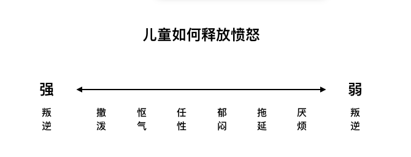
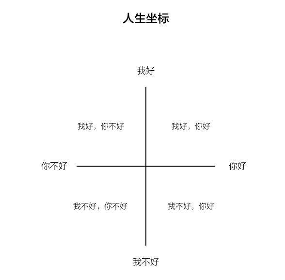

# 蛤蟆先生去看心理医生

《蛤蟆先生去看心理医生》是英国心理学家罗伯特·戴博德创作的心理学著作，首次出版于1997年。

该书借用《[柳林风声](https://baike.baidu.com/item/柳林风声/22867?fromModule=lemma_inlink)》的故事主角蛤蟆先生，讲述了他接受心理咨询的故事。作者通过陷入抑郁的蛤蟆先生和心理咨询师苍鹭的互动，探索蛤蟆先生爱炫耀、自卑性格和抑郁情绪的来源，指出童年经历会对人格产生深刻的影响，并阐释如何在心理上实现真正的自我成长，成为独立自信的人。

## 自我三个状态

### 儿童自我状态

```
1.自然型儿童（出生就拥有的基本情感：快乐和深情、愤怒、悲伤、恐惧）
2.适应型儿童（为了融入他人做出的顺从行为：同意、取悦、道歉、依赖）
```

有愤怒但为了在强者面前保护自己，儿童会选择压抑自己的愤怒，采取其他发泄方式缓解情绪：（以下由强至弱）撒泼、怄气、任性、郁闷、拖延、厌烦

```
PLOM（Poor Little Old Me）可怜弱小的我。游戏，每局都赢。因为对自己不诚实。
```



### 父母自我状态

由父母的言行，父母对孩子的方式形成。小时候我们会从父母那里学到的价值观、道德观，以及评判标准。

有些父母可能是愤怒、严厉，喜欢批评其他人，在这种影响下，我们可能变成易怒，喜欢批评别人的人，也就是“父母自我状态”主导的心理状态，在这种状态影响下，我们很有可能走上自我批判的道路，这点需要十分的警惕，因为自我厌恶是一种很危险的情绪，自救的方式就是，**去问自己，你能停止自我批判吗？你能对自己好一点吗？（最重要的）你能开始爱自己吗**？

1.挑剔型父母（爱批评人、愤怒、严厉）

2.养育型父母（我比你更心痛、我是为你好）

```
如果把“父母状态”比作一个法官，有时候我们会审判自己。而自我审判最严苛，折磨自己，甚至一辈子。为了避免让自己“无期徒刑”，所以，我们要爱自己。
```

### 成人状态

用理性非情绪化方式去行事，不再被脑子里父母过去的声音所驱使，也不被童年的情绪所围困

出生到4.5岁的时间段形成的“人生坐标”会影响人的一生，**当我们决定以什么态度和观点看待自己和他人，那在随后的人生中我们会始终坚持自己的选择，会“自证预言”**。

## 人生坐标



### 我不好，你好

低自尊的人认为自己是受害者，所以会玩那些会把他们变成受害者的游戏。**他们竭尽所能选择记住那些悲伤和不快乐的事件，或者忘记或忽略美好的时光**。（**我真不幸、PLOM(可能弱小的我)、**不论我做什么都要爱我……）最极端的行为是自杀。

### 我好，你不好

让自己对别人评头论足，感到愤怒。这类人通常会占据权力和权威的制高点。（NIGYYSOB-Now I've Got You, You Son of Bitch**我抓到了你，你个坏蛋**）（**你为什么总让我失望**）最极端行为是谋杀。（这类人因为愤怒不会内疚，总在怪罪人，所以他们从不会抑郁）

### 我好，你也好

对当下做出了选择，同时许下终生的承诺 一种发自内心信念的行为，即信自己，信他人。

### 我不好，你不好

..作者没谈，估计这种 应该是或不了吧

## 高情商的人

```
1.拥有强大的自我意识，了解自己的情感。能管理情绪，能从悲伤和不幸中重新振作。能控制冲动，也懂得延迟满足，从而避免轻率的决定和不妥的行为。
2.拥有“共情”能力，通过理解和回应对方的情感，与他人建立良好的关系。
```

## 总结

心理健康的改善，最主要是患者的愿意接受程度，全心投入程度，努力改变程度。一切治疗效果取决于患者本身。

成人的表现，有很重要的一部分是和小时候的成长经历密切联系的，即“儿童自我状态”是由童年残留的遗迹搭建而成。

明确自己的目标，保持成人状态。

## 摘录

“在我看来,**困惑是学习过程的第一阶段,这说明固有知识的局限开始被打破了**。你要直面新的信息,这些新的信息会挑战你现有的观念和行为模式。由此产生的焦虑是让你改变的动力,很可能也会开启你的创造力。”

可反过来，想到每一个全新的时刻都意味着独一无二的机会和挑战，又让人无比激动。蛤蟆认定，**所谓活得真实，就是真诚地回应当下的需求。这能打破从童年延续而来的因果循环，让真实的自己摆脱过去经历的束缚，在自由中成为真正的自己**。

**要充分理解自我，唯有通过和自己的情绪做联结。当你对情绪的感受越来越清晰时，就能明白它们并非可有可无，也不会对它们不闻不问，因为情绪正是自我的核心**。

人们太容易让重要的事件就这么过去，忘记关注或为它们庆祝，也许是因为我们通常都只在事后才明白它们有多重要。

## 感悟

自我欺骗，自我循环游戏，很多人无限的陷入在这种游戏中。改变的第一步，就是要认识到现在的这一切，都是你自己决定的，是你自己无意识影响的。理解自己，理解自己的情绪。而不要认为是别人在强加给你。爱自己

这本身对于抑郁症的人和经常认为自己被PUA的人来说是本很好的书，想想自己，不抑郁，很多时候通过伤害身边的人来满足自己，常常停留在父母的自我状态中，可是底层却又是一个儿童状态。

共情，了解自己，爱自己