# 认知升级

谢春霖

[从梦想到财富]https://www.zhihu.com/column/dream2riches

[认知红利]

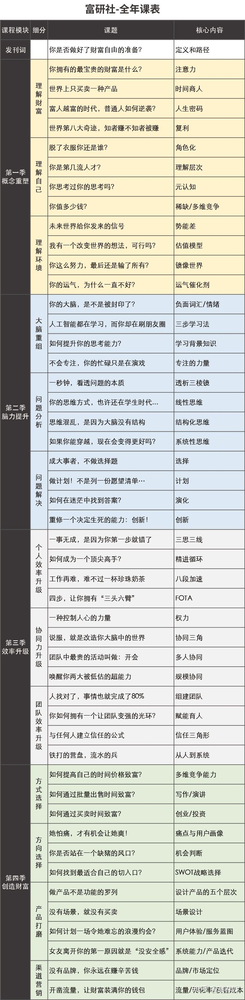

## 理解财富

1. 你拥有最宝贵的财富：**注意力**；
2. 世界上只买卖一种产品：**时间**；
3. 能让你脱颖而出的人生密码：**你的天赋**；
4. 财富快速增长的秘密：**复利**；

### 注意力

一切的价值创造活动，都将是你的注意力交换而来。

#### 注意力如何被花掉的

1）**被浪费**：八卦，国际新闻等

2）**被收割**：

既然你的注意力那么值钱，那么一定会有人利用这个来赚取暴利。

你看的报纸、看的电视节目、综艺节目、浏览的网页、追各种剧、阅读公众号….这些看似免费的内容不断的围绕在你的周围，几乎无死角的对你进行轰炸，24小时全天候的争夺着你的“注意力”。

一旦吸引到了你的注意力，马上就被无情的收割掉，然后和其他一起被收割的注意力打包卖给广告商，谋取暴利！

**3）被利用：**

你在互联网上的任何注意力投放，几乎都会被完整的**储存**下来，并通过对你的大量**注意力轨迹**进行分析，这样我们就能够更了解你，知道你更愿意把注意力花费在什么内容上，那么我们就可以针对你投放更多这方面的内容给你看，继续收割你更多的注意力…

**因此，在这样的一个注意力稀缺的时代，你不珍惜，自然有人会“替你珍惜”，你不管好自己的注意力，你的注意力就就会随时被其他人收割，利用…**

#### 如何合理利用自己的注意力

1）人际关系，特别是亲密的关系

亲密关系的破坏对自己各个方面都产生毁灭性的影响

2）新趋势

目的不仅仅是为了追随趋势脚步，更多的是为了不让自己落后

3）聚焦当下

4）自己的成长

### 时间

世界只交易一种产品：时间单价 * 能产生价值的时间

个人生成总值 = 时间

#### 时间商人：

**1）零售时间**（低效）

可以理解为打工，即出售自己的固定时间，换取金钱

解决方案：提高自己的单价(工资)，或者利用自己的多余时间。如8小时工作，还有3小时赚外快。

**2）批发时间**（效率高）

比如说你做一次2小时的演讲，你面对1个人的时候，需要花费2小时的时间，每小时收费100元，你的收入是200元；而如果你面对的是100人，你依然只需要花费2小时，但实际产生价值的时间，就变成了每人2小时，总共是200小时，你所产生的价值就是20000元！

这个就相当于你把自己的时间「批发」出去了！而通过批发的方式来「横向扩展」自己能产生价值的时间是无限的！

**3）买卖时间**（公司）

你在出售自己的时间，也免不了买他人的时间。

其实我们时时刻刻都在购买他人的时间，你正在使用的手机；你家里的水、电、煤气；你住的房子；你身边的那张桌子…..都是别人用自己的时间制作出来的。

理解为就是当老板，买他人的时间，做自己的事，然后出售。

##### 公司两大类员工：

1. 创造价值的员工

2. 提升效率的员工

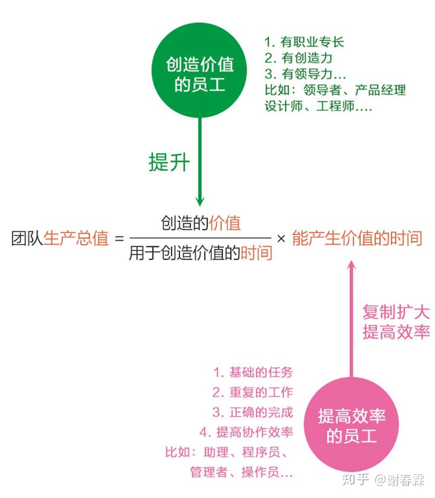

买卖时间的本质是一个种**放大器**，你首先需要确认自己要什么，你能创造什么价值，如何零售或者批发出去，你团队的目标在哪，当公司只有你一个人的时候，就应该把这个时间买卖的模式想清楚了。

4）**收时间税**(平台)

你并不需要出售时间，而是创造出一个平台，让其他人可以到你的平台上自由交易他们的时间，而你只需要对在这个平台里的每一笔交易收税即可。

平台成功的原因并不仅仅是网络效应，或者说**网络效应也是结果，而不是原因，真正的原因是你能不能对平台上的人「赋能」**

一个卖家，选择你的平台是希望通过这个平台来帮助他的个人生产总值变的更高，而不是一样，或者更低。

如何提高个人生产总值：

1）提高他单位时间内创造的价值

2）提高他的世界批发量

### 天赋

富者越富

努力？如果任何事情努力就能解决，那穷人就不会更穷了，因为他们看起来更努力

坚持？如果方向是错的，坚持的意义在哪里？

**我们要做的事情，不是把不喜欢的事坚持做下去，而是去找到自己真正喜欢的事，然后一生都为它乐此不疲！让自己“玩上瘾”！**

1）找到自己的天赋

在你有天赋的领域持续投入，回报率才是最大的！

其实还有一种天赋，是隐性天赋。你会对某些东西感到愉悦，这个东西持续给你满足感，你可以一直花时间在这里，不厌其烦。时间久了，其实你就会与众不同。 -->注意力

2）重新设计人生

如果你发现了你的“天赋”，千万别再只把它当成“兴趣”，它可能就是你“人生的密码”，你需要围绕它，开始重新设计自己的人生。

**1. 设定目标，并赋予伟大的意义**

**2. 思考商业化，把天赋变成事业**

**3. 刻意练习“套路”，完成一万小时的积累**

**4. 设立一个个小目标，逐个完成它们！**

### 复利

复利，就像是一把能开启爆炸式增长的钥匙，无论是财富，还是其他什么，一旦拥有复利效应，它就像拥有魔力一般飞速上扬，直到冲破天际

[国际象棋故事]1粒 + 2粒 + 4粒+ 8粒 + ……+2的63次方，当放满64个棋盘后，总麦粒数等于2的64次方-1 ≈ 1844亿亿（粒），相当于5500亿吨

所谓复利效应，就是可以把原来一个极小的数，通过一个简单的数学公式运算，每一次都在上一次的基础上，按一定比例的增长，在执行若干次之后，整个结果就会形成爆发式的快速上扬，最终变成一个天文数字！

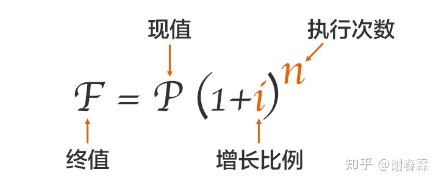

网站是复利增长：流量越多，搜索权重越高；搜索权重越高，流量越多；如此往复….

淘宝店是复利增长：销量越高，排名越高；排名越高，销量越高；如此往复….

#### 如何设计复利

1）找到必然关系，即支点

最高效的方式，就是去相关领域中，找到那些已经被验证过的结论，或者是一些基本常识，甚至是数学定律，来用作「支点」。

2）设计增强循环

促进支点增长，现成效益最大化，然后现成循环

3）重复与耐心

为什么很多人找到了复利效应，比如说花了10万元买了年化收益10%的理财，但是没坚持2、3年就坚持不下去了？

因为复利效应天然有个「缺陷」，就是在初期很漫长的一段时间段里，增效都非常低，低到你几乎感觉不到它在增长，甚至怀疑它的存在，因为几乎感觉不到有变化啊！

只有坚持走到某一个位置开始，可以称这个位置为「里程碑」，这个曲线才会急速上扬：

#### 两种特殊的复利

1）加法运算->加幂运算

如读书得到的知识量，如果一本本的独立阅读，那就是简单的加法运算。

但是如果你和其他的知识关联，即产生类似的复利循环，联结的数量越多，这个网络的信息含量增加的也就越多，那么你的知识量就会按复利的方式指数增长。

2）量变->质变

影响公众号阅读量高低的最核心因素就是分享率，而影响分享率的核心要素，就是你内容的质量。

注：理解复利是一个原理，也可以是一种手段，不管做什么，都应该采取复利的方式，这样才能快速增长，

## 理解自己

### 角色

角色就意味着：【规则】，你是这个角色的人，你就应该符合这个角色应有的行为准则和处事态度。

1）为什么角色需要规则？

**为了能够让你的行为可以被预期。**

你从事某项工作，你扮演某个角色，我大致是知道你会如何行事的，你会遵守哪些标准；我和你说什么话，你可能会如何反馈给我

2）如何能够让人被角色化？

教育；角色化的过程，就是被教育的过程。

3）为什么需要学习角色化？

角色化一面带来了规则和效率；而另外一面，则带来了边界和束缚。我们忘记了「真实」是什么。看不见真实的自己；看不见真实的对方；在做产品的时候，也看不见真实的用户

#### 理解人：

1）感知层：

就是对一个人的整体感觉，是高矮胖瘦，还是漂亮难看，「第一印象」

2）角色层：

我们每个人都生活在一个个角色里，并被这些角色所驯化。比如说你遇到一个银行职员、公务员、程序猿…你和他在打交道的时候，能够明显感觉到他身上这个角色的痕迹。

那什么是深层次关系？

那就必须再往下走一层，从第三层开始就是一个人的深层部分了

3）资源结构层

资源结构层是指你的财富资源、人脉资源、精神资源、等等…

4）能力圈

能力圈是指你的各种专业技能、管理能力、商业能力、沟通能力、等等…

5）存在感知层

第五层，就是对自己存在感的定义。说的通俗一点，你通过什么方式「刷存在感」？

有些人吃顿美食，发个朋友圈，收获100个点赞，就感觉很有存在感；

有些人拥有一段幸福的爱情，被心爱的人时刻惦记，内心就充满了存在感

**所以，你希望自己是一个怎么样的存在，就能驱动着你能走多远，你的边界就会被扩展到哪里。**

你想成为怎么样的一个人？你的人生使命是什么？

存在感没有被满足的时候，感受到的是痛苦。存在感的需求越高，没有被满足的落差越大，痛苦感也就越大。如果放弃了对存在感的追求，也许你超脱了，也许你也就此平庸了。

而你要想和一个优秀的人在一起，并和他建立深度关系，就既要懂他真实的快乐，更要懂他真实的痛苦，并且给予他能量，支持他的存在感，互相依赖共存，才能成为灵魂互相交织的伙伴或者伴侣。

**被动的人生是从外往内探寻的，**很多人被困在角色层，在角色下生活，一生都在寻找人生的意义；

**主动的人生是从内往外拓展的，**是去角色化的，一生都是在自我成长，没有边界的限制纵情向前；

注：理解角色，就是为了了解自己，了解对方，了解陌生人

### 人才分层

#### 5流-环境

- **别名：**怨妇
- **所处理解层次：**环境
- **典型思考模式：**都是你们的错！

什么是环境？就是除你自己之外的一切都算是环境：你身边的人；你的领导、同事；你的公司；你的竞争对手；市场环境；天气；大众舆论......等等诸如此类。

处在这个理解层次的人，当问题发生的时候，他首先会把问题归结成「因为环境的不好」而产生的问题。比如：

> 工作不顺利，是因为领导是个蠢蛋...
> 没有晋升机会，是因为公司的办公室政治严重，没有好的晋升机制...
> 房子太贵买不起，都是因为那些黑心炒房团、政府调控无能、没有一个富爸爸…

**而他寻找解决办法的路径，也会从改变环境的角度去思考。比如：**

> 这家公司不好，导致我没有晋升机会，那我就换个公司呗…
> 找了一个男朋友，他现在对我越来越差了，又是一个渣男，再换一个呗…

#### 4流-行动

- **别名：**行动派
- **所处理解层次：**行动
- **典型思考模式：**我还不够努力！

想要解决问题，那你就得开始行动啊！你不能改变环境，你能改变的只有你自己！你为什么还没有成功？就是因为你还不够努力！你不改变，环境如何改变？你不行动，环境如何改善？

**要解决问题，你就会从「行为」这个层面去寻找解决办法，看看还有什么事情是可以去做，去改变的？比如：**

> 都一年没涨工资了，今晚开始多加1个小时的班！
> 女朋友为什么最近对我变得冷淡了？我要多发些消息，多打些电话去关心她！
> 公司业绩变差了？一定是我睡觉睡的太多了，明天开始不睡觉！

#### 3流-能力

- **别名：**战术家
- **所处理解层次：**能力
- **典型思考模式：**方法总比问题多

**什么是能力？就是你能用更简单、更高效的方式解决同样的问题，有选择便是有能力。**

理解层次处在「能力」层次的人，当问题发生的时候，首先会把问题归结成是「因为我的能力不足」而产生的。

所以，他们也会在「能力」这个层次里去寻找更好的「方法」来解决问题。**比如：**

> 线下门店生意不好，是因为我的经营模式太陈旧，我需要学习新的方法…比如，可以通过社群经济的方式来降低我的获客成本，提高客户复购率….
> 和男朋友关系处理不好，一定是我的沟通能力有问题，我要去学习能改善亲密关系的沟通技巧，比如《关键对话》、《幸福的婚姻》….
> 以前我是做业务的，现在刚成为部门经理，团队业绩下滑，一定是我的管理能力有问题，我以前根本没有系统的学习过管理的方法，我得去报个MBA，从「古狄逊定理」开始学起…

**这类人有非常强大的学习能力和应用能力，能把学习到的知识，转化为可操作的方法，进而改善效率，解决问题。**

#### 2流-BVR信念/价值/规条

- **别名：**战略家
- **所处理解层次：**BVR（信念/价值观/规条）
- **典型思考模式：**什么才是更重要的？

**如果说「能力层」是做解答题的能力，「BVR层」就是做选择题的能力**，什么可以做，什么不可以做，什么更重要，什么可以忽略不管？

- **B（Believe）：信念**，你相信什么是对的？

你相信这个世界应该是怎么样的？从大了说可以是世界观，从小了说就是一个个概念。

- **V（Value）：价值观**，你认为A和B哪个更重要？

人生的不同是因为一次次选择的不同，那我们依靠什么来做选择的呢？就是我们的价值观。

- **R（Rule）：规条**，做人做事的原则。

这就像是公司的规章制度，每个人也有自己的规则，这些规则是怎么来的？就是来自于信念和价值观。

**「能力」层是让你把事情做对，而「BVR」层则是帮你选择做对的事情。**

处在「BVR层」的人，当问题发生的时候，首先会先思考「哪个是最重要的问题？」、「除了我看到的这些问题，还有什么更重要的问题是我没有看到的？」

#### 1流-身份

- **别名：**觉醒者
- **所处理解层次：**身份
- **典型思考模式：**因为我是XXX，所以我会XXX

**“你是谁？你想成为一个怎么样的人？”**

为什么身份层次那么高，因为不同的身份层次，就意味着拥有着不同的BVR，它决定了你当下的每次选择，决定了你未来的人生方向。

**你之所以有时候会不知道该如何选择，除了对某些概念不清楚之外，最重要的就是你不知道自己想成为怎么样的一个人。**

如果你不知道你想成为谁，你就不知道自己要什么，你不知道自己要什么，你就无法做出选择，你无法做出选择，你就什么也得不到。

角色是被动的，是别人给你的；身份是主动的，是你自己想成为的。

#### 顶级-精神/使命

- **别名：**领袖/伟人
- **所处理解层次：**精神/使命
- **典型思考模式：**人活着就是为了改变世界！

精神是什么意思？就是你与世界的关系。也就是我们经常听到的「人生使命」，你来到这个世界是为了什么？你能为别人，为社会，为整个人类带来什么？这个世界会因为你而有什么不同？

在这个层次，所有的思考，都围绕着2个字「利他」，我如何选择能够让更多的人获益？如何才能够推动时代的进步？如果能达成这些，我愿意用我的所有来交换，包括我的生命...

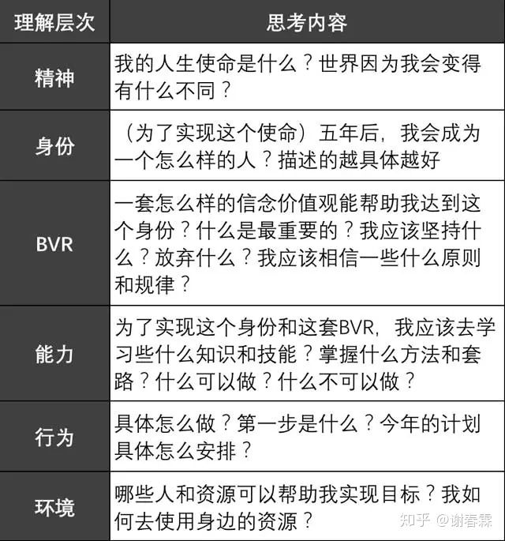

#### 人生规划

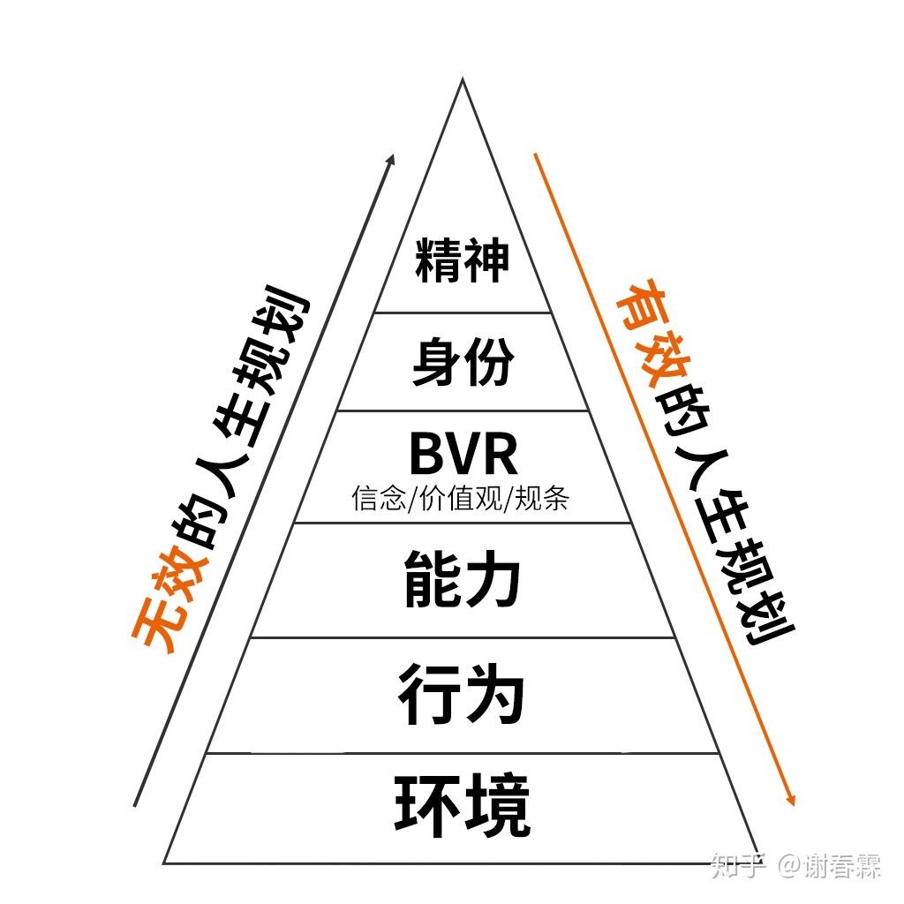

### 元认知

一种让你看见自己思考过程的能力

元认知，就是你“对自己思考过程的认知与理解。”

原来你的大脑运行方式是这样的：

发生了事件A ...→ 你有了反应B

但如果你的元认知能力被激活了了呢？你的大脑又是如何运行的？

发生了事件A ... → 你有了反应B → 我为什么会有反应B？反应B是对的吗？ → C 好像是更适合的反应 → 于是，你有了反应C

我们的大脑其实和计算机一样，简单来看它是通过听觉、味觉、视觉、嗅觉、触觉等「输入设备」将外界的信号传输到大脑进行处理，然后大脑把处理完的结果交给嘴巴，手，脚，这些「输出设备」输出给外部世界这么一个过程。

#### 控制输入

**控制注意力，就是控制了你大脑的「输入设备」。**

如今由于移动互联网的大爆发，内容创作和传播的门槛已大幅度降低，大量没用的、占你大脑内存的、有销售目的的、甚至是错误的知识；具有欺骗性的谣言；没有营养的八卦等信息随处可见，他们会像病毒一样蔓延在互联网，霸占着你的手机屏幕，期待着进入你的大脑，占领你的黑盒子，让你的思考变得浑浊，还很难被清理出去…...

久而久之，你大脑里能思考的内容就全部都是这些信息，思考的方式也开始变得越来越简单粗暴，浮于表面的情绪宣泄…...

所以，你必须启动「元认知」，让你的注意力像杀毒软件一样严格把关，对不合格的信息实行零容忍，一定坚决不让他们进入你的大脑

#### 控制大脑

丢失(过滤)，存储，处理

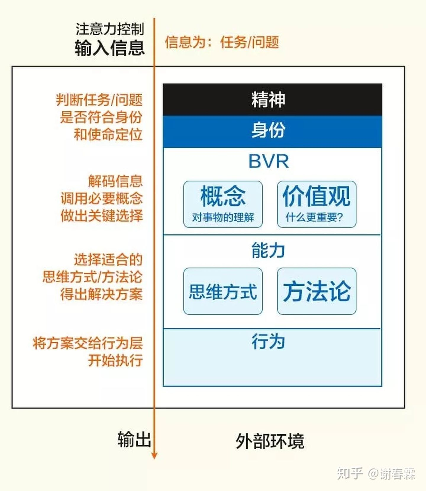

#### 输出控制

思考完之后，就要把思考的结果按计划执行了，也就是来到了与外部环境对接的「行为层」。然而**如果没有「元认知」的话，你就算知道该做什么，怎么做，你也可能会做不好。**

**想到却又无法做到，你的焦虑感越来越强...**

**因此，「元认知能力」的强弱，几乎决定了一个人每个方面的强弱。**

电脑能不能发挥作用，发挥什么作用，关键看背后的人如何使用，甚至改造；而你能否让自己的大脑发挥最大的作用，就得看你是如何使用大脑的，你能多大程度上控制并优化这3个关键环节。

#### 如何提高元认知

1）刻意练习-->套路

「一万小时定理」？

**很多人对此有很大的误解，以为只要持续做某件事情一万小时就一定能成高手了。**

可为什么有许多人踢了一辈子的足球，依然还是个业余爱好者？同样是花一万小时练习，他们和世界顶级职业运动员的差别在哪呢？

比如我们前面提到的很多种思维方式：正向、逆向、MECE、SCQA、决策树、KT、SWOT…..

**但这些方法你仅仅知道是没用的，当新的问题出现时，你还是会习惯性的用原来的方式去思考。**

**这个时候，你就需要练习调用「元认知」强迫自己用这个新的方式。**

一开始会很慢、很困难，很别扭，还会习惯性的回到原来的思维，这个时候你就需要再次调用「元认知」把自己拉回来…

只要你坚持用这种方式「刻意练习」，你大脑中的某些特定区域就会不断被强化，久而久之，你某方面的技能就会甩开普通人一条大街，元认知能力也因此得到了加强。

2）经常反思

每天晚上你可以花半个小时的时间，对今天遇到的事情，自己说过的话、做过的行为进行一次复盘，看看哪些事情做得好？哪些事情做的不好？下一次应该如何提高？哪些行为是被大脑「绑架」了？

这是非常好的锻炼元认知的方法，当然你也可以通过写日记来记录自己的这些思考。

这个和回忆不同，重点不是在叙事，而是去思考当时之所以会有这些思考和行为的「原因」是什么？以及「下一步该如何做」才能更好？

**除了这种「每日三省吾身」的方式，还有第二种方式就是「阅读」**

读文字，也是一个锻炼元认知非常好的方法。有些人阅读的收益不高，那是因为太关注内容本身了。

文字是什么？

文字是作者大脑思考结果的「输出」，文字是结果，而思考的过程才是原因。学习作者是如何思考才能得出这些结果的，则更为重要。

**因此，你应该阅读的是什么？是作者的思考方式。**

他为什么会这样写？他的思考方式是怎么样的？用到了哪些概念和价值观？有没有错误？

然后边读边调用你的「元认知」来对比自己：如果是自己来写这个内容的话会怎么写？他这种思维方式比自己好在哪里？

这样不断的和自己做对比，就像和一个人在对话一样，久而久之，你会慢慢发现你阅读的速度竟然变得更快了，而且学习效率也提高了很多，甚至读了一半，你就能猜到作者之后会写什么，如何写，甚至知道怎么样写才会更好，**你不再是被文字牵着走，而是陪着作者一起思考...**

3）练习冥想

- **第一步：**找一个安静的环境，以一个舒服的姿势坐好，不一定非要盘腿而坐，舒服的方式即可，挺直腰杆
- **第二步：**设定一个15分钟以上的闹铃（一开始15分钟为佳，之后可以慢慢增加），然后闭上眼睛
- **第三步：**也是最关键的一步，大脑放空，努力停止自己的一切思考，将所有的注意力都关注在自己的呼吸上，放慢呼吸速度，可以以5秒钟吸气，5秒钟呼气为节奏进行，感受每一次吸气和呼气的过程，感受空气流过你的鼻腔产生的温度差...
- **第四步：**过程中也许你会走神，也许你会睡着，没关系，当你意识到的时候，用「元认知」把自己的注意力拉回呼吸上即可。如此往复，直到闹铃响起。

可当你第一次坐下来，努力的让自己保持平静，将所有的注意力都关注到自己的呼吸上，准备开始冥想的时候，你竟然能非常清晰地看到，自己的内心其实是无比的混乱，像好莱坞大片一样，各种思想奔涌而出，毫无剧本，毫无章法，根本无法平静下来，你好不容易把他们都拉回来，回到了自己的呼吸上，可没过几秒钟，内心又开始万马奔腾...

这个时候，你会突然联想到我刚才说的话，原来大脑真的不是自己的，你想让他安静一会儿，他偏偏胡思乱想，你想让他只注意自己的呼吸，它偏偏给你来段高山流水….

它就像一个调皮的小孩，自顾自的玩耍，你呵斥他，他便乖乖听话，你一不留神，他又开始大闹天宫…

总之，你和他之间会有一场旷日持久的拉锯战，一会儿「元认知」胜出，把你拉回到呼吸上，一会儿「大脑」胜出，把你带入另一个万千世界…

### 价值

**1.** **需求**，需求决定有没有价值，场景决定是什么需求；

**第一，你有没有价值？你的能力是否是其他人需要的？**

你至少要有一技之长，是别人需要的，你可以因此加入到社会分工中去。如果你什么都不会？那你就只能先去再学习了…

**2.** **供给**，供给量决定价值的多少，越稀缺的东西越有价值。

**第二，更关键的是，你值多少钱是由你的能力是否是稀缺决定的！**

如何导致稀缺：成为第一或者成为唯一

#### 如何让自己更有价值

多维度能力

**第一，每个能力至少都是有价值的，也就是别人是需要的**

**第二，每个能力之间要有关联**

1）先把一个能力打造成自己的长版

2）让自己兴趣广泛

3）确定一个目标，并把多维度能力组合起来。

## 理解环境

### 趋势

造成趋势的2大原因：

第一，外力：

某个「突发事件」会导致新的趋势，比如特朗普的意外当选改变了美国多方面的发展趋势。

第二，势能差：

只要存在势能差，那么就必然会有趋势。

- 比如，大家都去买股票导致「买方势能 > 卖方势能」，因此股票上涨；
- 比如，大量人口流入一线城市导致「买房势能 > 卖房势能」，因此一线城市房价持续上涨…
- 比如，腾讯做个游戏和你做个游戏，势能也是不同的，他有庞大的用户基数为它赋能，能让他的游戏迅速流行起来。而你做完游戏的那一刻起，就面临三个天大的问题：**1.**推广怎么做？**2.**钱从哪来？**3.**腾讯做了怎么办？

那么你该如何找到未来的趋势呢？

产生趋势的原因有两个：1. 外力；2. 势能差。但是外力的发生不可预测，未来的趋势捉摸不定，因此我更推荐“寻找势能差”这个策略。

势能差一共分为四类：1.效率势能；2.规模势能；3. 认知势能；4.引力势能。

想要抓住由“势能差”带来的趋势，你可以通过“点、线、面、体”这个分析框架，立体的看待所处的环境，找到适合自己的势能高点，或成为他们，或想办法让他们为你赋能。

### 估值模型

项目估值 = (客户终生价值-获客成本)*用户规模 - 风险成本

**数学应该是一个思考工具，表达工具，而不是计算工具。**

我们应该要透过这个公式，来理解各个概念对你这个项目的影响关系，帮助你更客观的来评判自己的项目是否可行，如果沙盘上都没推演成功，实战中又怎么可能有奇迹发生？

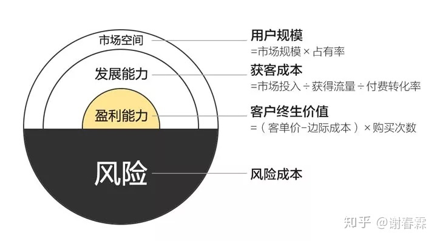

1. 这个项目的盈利能力如何？用户是不是真的需要我？客户的终生价值是多少？
2. 这个项目的发展能力如何？我有没有存量的资源可以用？能否找到降低获客成本的方式？
3. 这个项目的市场空间如何？是个没人竞争的小赛道？还是有想象力的大赛道？
4. 这个项目如果赔钱了咋办？我能不能承受得起这个损失？是否可以融资来为风险买个保险？
5. 你自己有没有准备好？有没有相关的经验？商业知识够不够？
6. 这个项目是否在目前的趋势里？有哪些高势能的平台能为我的团队附能？
7. 你团队成员都有哪些人？他们的战斗力如何？是否能够齐心协力？是否拥有「创新」和「效率」这两把武器？

### 镜像世界

有些事情，你只要通过刻意练习，提高技能，就能完成预想的结果，比如说考试，跑步，只要足够努力，就会有收获，和运气没啥关系。

可是，有些事情，我们再怎么练习技巧，对结果的影响其实很小。

比如说你想要在老虎机上拉出3个7，几乎100%是靠运气的，你改变拉的动作、拉的力度、拉的角度…都完全没用。

**所以，成功=技能+运气**

○ 因果世界：事物之间有必然的逻辑关系
○ 玄学世界：事物之间无逻辑关系，存在概率关系
• 综合已知与未知概念
○ 因果世界：盲域（未知）、掌控域（已知）
○ 玄学世界：风险域（未知）、概率区域（已知）

#### 各区域生存法则：

○ 因果：
§ 掌控域：已了解区域
□ 通过教育、自身努力提升技能水平
§ 盲域：不了解，但知道区域
□ 承认无知，接受未知，转未知为已知
○ 玄学：
§ 概率区域：顾名思义
□ 大数据冲击，基数到了，概率也会相应大一些
§ 风险区域：不可知
□ 1.避免进入
□ 2.狡兔三窟
® 个人：增加多维能力
® 小企业：快速试错
® 大企业：广撒网
□ 3.彩票
○ 各区域通用法则：
§ 守株待兔：追本溯源，探索未知，知行合一，顺其自然
□ 株：真理，永恒的规律
□ 兔：机缘
□ 必要准备：
® 1.发展有效人脉：自身层级决定人脉层次
® 2.学习跨领域知识：多元思维模型
® 3.投资成长性资产：小而散

### 运气

环顾四周，能对结果产生影响的，无非就三类：

- 人：获得其他人的帮助。
- 事：有些事情的发生，增加了你目标事件的成功概率。
- 物：周围的物理环境，能使用的物品道具，天时地利的变化。比如刚才钻木取火里那个干燥的环境。

接下来，我就基于这3个方向，来和你说一下提升运气的具体办法。

#### 运气催化剂

**1）人**

我们可以尝试着逆向思考：就是先分析，我们会主动去帮助哪些人？

知道这个原因后，我们再反过来推导，那些被帮助的人身上，有哪些特质是我们可以学习的。

这样我们就知道，什么样的人才更容易获得贵人的帮助了。

帮助人的理由：投资，扶弱，还债

什么人容易获得帮助？

1，才华出众，-->投资青睐

2，低调，谦虚，知恩图报，人们喜欢帮助弱者，其实是源于内心的一种存在感的满足。就是看到对方，因为自己的帮助，而变的更好，内心会有一种开心的满足感。

3，广结善缘，吃亏是福-->还债

与别人交往、合作，也要想办法让对方多赚一点，占自己一点便宜，要懂得进四出六...

这样，他们都会带着一些「亏欠你」的心态与你交往，会更愿意帮助你，愿意介绍自己的朋友给你认识，介绍更多的生意与你合作

**2）事**

就是要让你做的每一件事，都产生「积累」的效果，前一件事是后一件事的预动作，过去的经验是今天的铺路石，让时间成为你的朋友，产生复利效应。

就像把一壶水烧开的过程，你必须持续对水加热，水温每升高一度，都让下一秒钟的加热，有了更高的起点，这样温度就能持续升高，直到某一刻的到来，量变到质变。【积少成多】

**3）物**

特斯拉，开源代码

## 大脑重组

### 负面情绪

**当我们使用「负面词语」来思考问题的时候，我们大脑状态就是停滞的。**

比如你读下面几句话：

- 我没有朋友..
- 这个没办法..
- 我不想那么穷..

**你的大脑在读这些话的时候，有什么感受？**

除了感受到孤独、无奈、悲伤之外，你可能什么都没有想到，你的大脑就停在了那里，像在自己身边画了一个圈，把自己困在中间无法动弹...

负面词语是困境，当你使用了正面词语后，就是跳出了困境，开始寻求更多的可能性。**你只需要更换一种正面的表达方式来描述同一件事情，就能将你的思维引向截然不同的方向。**

1. **发泄**，对他人和自己都造成了二次伤害，也许还带来了不可挽回的后果...
2. **隐忍**，长期隐忍将造成严重的心理问题，比如抑郁症，比如自残行为...
3. **转移**，虽然白天能够短暂的忘却，而一到晚上，剩下自己一个人的时候，负面情绪又会反客为主，造成严重的失眠…

照成的原因：

1）信念不匹配

2）能力不足够

所以，情绪并不是什么外在事件导致的！情绪也从来不是问题！

你的信念系统（BVR）无法理解眼前这个世界了，才是问题！你的能力无法处理眼前的这件事了，才是原因！

如何解决？

1）长期调养

**提升解决问题的能力，**随着你能力的提升，当你遇到同样的状况，你的情绪状态会发生变化。

**建立正面的信念系统**信念，就是你理解世界的方式。你认为这个世界「应该」是怎么样的？你的朋友或者爱人「应该」是如何对待你的？你做了某些动作「应该」得到什么样的反馈？

2）紧急处理

自觉：比如你在发火，你要心里默念：我现在正在愤怒的状态。

理解：我为什么愤怒？我的动机是什么？我想通过愤怒得到什么？有没有更好的方式来获得？

转换：我的情绪表达里有没有负面词语？试着转换成正面的语句..12条前提假设里，哪一条可以解释目前状况的？哪一条能给我力量的？用它来替换自己原有的信念...

#### NLP12条前提假设

1）没有两个人是一样的

2）一个人不能够控制另外一个人

3）有效果比有道理更重要

4）只有由感官经验塑造出来的世界，没有绝对的真实世界

我们了解世界的过程，是通过视觉、听觉、嗅觉、味觉、触觉等，捕捉外界信息输入到我们的大脑里，构建出的一幅世界的样子，而一个人的经历是有限的，你永远不可能看完世界上所有的角落，了解每个人遇到的每件事，过程中也会缺失很多信息。就算是进入了大脑的信息，也会被你的信念系统给重新编码，被赋予新的意义。

所以，你脑海中的这个世界不是绝对真实客观的，而是主观的，你遇到的所有事情，本身其实都是没有意义的，所有的意义都是我们根据自己的信念系统，人为给加上去的。

5）沟通的意义在于对方的回应

每个人大脑里的世界由于都是主观的，对外界输入的信息会按自己的理解重新编码，所以，你说的一句话，在对方听起来也许就是另外一个意思。

因此，在和对方沟通的时候，你不应该只关注自己说了什么，而是要关注对方听到了什么，理解的程度到哪里，对方的回应，才是你这次沟通的效果。

6）重复旧的做法，只会得到旧的结果

你如果想要得到从未得到过的东西，就要去做从未做过的事情。

7）凡事必有至少三个解决方案

当你感到无计可施了，只是说已知的办法都行不通而已。因此，你只要相信一定还有未知的方法存在，那么总有一天，问题会被你解决。

8）每个人都选择给自己最佳利益的行为

每个人都想有更好的明天，他的所作所为，都是他认为在当时的环境下，做出的最有利于他自己的恰当选择。

因此，每个人的行为背后，一定有他的正面动机。如果你了解和接受了他的正面动机，他就会觉得你接受他这个人，你就更容易引导他做出有效的改善。

9）每个人都已经具备使自己成功快乐的资源

你的快乐取决于你自己是怎么看待眼前发生的事情，而不是眼前的这件事决定你快不快乐。你遇到的每一件事里，正面和负面的意义都是同时存在的，至于你想看到事物的哪一面，赋予它什么意义，由你自己决定，你可以通过改变自己的信念，来改变对它的理解，从而改变自己的情绪和行为。

10）在任何一个系统里，最灵活的部分便最能影响大局的部分

能有一个以上的选择，便是灵活；能容纳别人不同的意见，便是灵活；灵活并不代表放弃自己的立场，而是寻求双赢、多赢的可能性；

灵活也代表你足够的自信，自信度越是不够，越容易在某个角落认死理，态度强硬；而强硬的态度会让周围的人感到紧张，灵活却能让人放松。

11）没有失败，只有反馈

失败是只有在事情画上句号的时候才能使用的，只要事情还将继续，只要你不想放弃，就不能使用失败来形容。失败只是一种反馈信号，告诉我们之前的尝试没有用而已。它是提醒你，你需要改变了，需要寻找一种新的方式继续。

12）动机和情绪总不会错，只是行为没有效果而已

因为男朋友迟到而发怒，是因为希望有一个完美的约会；因为担心明天的演讲而焦虑，是因为希望发挥出色；我们情绪的背后藏着动机，动机总是正面的，因为潜意识从来不会伤害自己，只是误以为某些行为可以满足自己的这份动机。

所以，我们可以接受自己的动机和情绪，同时改变自己的行为方式。

### 三步学习法

#### 1）打开大脑

不知道自己不知道，知道自己不知道，知道自己知道，不知道自己知道

**什么是达克效应？**
它是一种认知偏差现象，指的是能力欠缺的人在自己欠考虑的决定的基础上得出错误结论，但是无法正确认识到自身的不足，辨别错误行为。这些能力欠缺者们沉浸在自我营造的虚幻的优势之中，常常高估自己的能力水平，却无法客观评价他人的能力

小时候，我们知道自己什么都不懂，我们对身边的一切事物怀有好奇之心，我们对触碰到的每一件事物都想去摸一下，拿到嘴里去感受一下；我们并不知道该如何说话，但嘴里却总是咿咿呀呀的说个没完，我们从来就不害怕说错话；我们总喜欢问为什么，我们总喜欢把旧玩具玩出新的故事...

这个状态叫什么？

这个状态叫：初心！

##### 初心

初心是禅修里的一个概念，意为「一颗初学者的心」，像一个孩子一样，对一切事物充满好奇的心。

但是现在，很多人都把「初心」这两个字给误读了。以为初心是指你最初做某件事情的那个起心动念，不忘初心是指你不要忘记最初出发时的那个愿….那个不叫初心，那个叫初衷。

不忘初衷，是到不了始终的，因为市场是变化无常的，你最初的想法，很可能没过几个月就过时了，你必须得调整，认死理是会撞南墙的！

只有「保持初心」，也就是保持一颗初学者的心，在变化的市场里，永远保持好奇心，持续学习，不断调整，你才能「方得始终」。

就是承认自己的「无知」，就是不要分辨什么是知道的，什么是不知道的，而是要对所有的事情都充满好奇，让自己回到孩子的状态，让自己唯一知道的事情，就是「我什么都不知道」！

但「保持初心」并不是「空杯心态」，两者有区别的，空杯心态是指「被动」接受所有的信息，而保持初心是保持好奇心「主动」的学习新知识，是主动的，是有选择的。

##### 过滤器

1）区分信息与知识

所谓知识，就是指那些被验证过的、正确的、被人们相信的概念、规律、方法论。

2）区分经验和规律

3）区分优质和劣质

见真识假！

#### 2）放入知识

1. **自我学习循环**

经验不能指导行动，因为经验有很多的偶然性，第一次成功了，第二次不一定能成功；别人成功了，同样的方式自己未必可以。只有把经验升华成了知识、规律，才能指导我们的行动，这就是著名的库博学习圈。

**2. 向巨人学习**

通过自我实践获得的经验，再把经验提炼成知识的方式非常好，有切身的体会，有自我的案例作证，但是效率太低。

一个人的时间是有限的，你不可能把所有的经验都自己经历一遍。

你所遇到的99%的问题，前人们基本都已遇到过，并且已经将他们的经验总结成了知识，变成了一本本图书，你只需要拿来学习即可。

3建立自己的大脑图书馆

记笔记，存储

把知识分类，方便查找

把知识结构化，

#### 3）提取使用

学了很多知识，当然是过不好一生的！

要过好一生，你得「使用」知识！

知识「没有用」，是因为你没「用」；不是因为你「没用」，而是因为你没「用」！

知行合一

### 学习背景知识

人类的思考过程，看似无法捉摸，深入剖析，其实就这2步

1. 连接-背景知识
2. 梳理-背景知识

**因此，当你拥有不同知识背景的时候，你的思考过程和结果，也会截然不同。**

- 当别人还在思考问题中的名词是什么含义时，你已经开始给建议了；
- 当别人还在零碎的给建议时，你已经可以把完整方案抛出…

所以，思考的过程，有点像玩乐高积木，**决定你思考质量的，一个是你拥有的积木数量和种类，一个是你拼接的技巧和创意**。

1）增加背景知识量

思考的基础是背景知识拥有量。增加背景知识量，就是增加乐高积木里的积木数量和种类。

**看似我们是在思考问题，其实大部分时间，我们是在回忆。**

2）提高连接强度

连接强度，就是指熟悉程度，就像我让你用乐高积木搭出一个房子，你能瞬间想到需要用到哪些积木，而不需要在一大堆积木里，一个个比对，一次次尝试…

为什么有些专家，当你的问题刚抛出，他的答案也几乎可以马上脱口而出？

是他拥有一颗超级大脑吗？还是思考速度能快出天际？

并不是！

**而是你的问题所需要用到的这些背景知识，对于他来说，已经成为了条件反射级的连接强度。**

- **第一步：建立初次连接**

学习的过程是连接，而不是记忆。

所以你每次学习了一个新概念、新方法，并不是把他背出来，或者存入收藏夹，而是让它和你的旧知识发生连接，用旧的知识来理解这个新概念，让这个新概念从你的原有知识里长出来。

**比如，今天你学习了「背景知识」和「思考区域」这两个新概念，它们是什么意思呢？**

不要死记硬背定义，那样很快就会忘记，因为没有发生连接，我们可以用我们熟悉的其他知识来理解它，比如电脑里的硬盘和内存：

- **第二步：重复，再重复，形成条件反射级的连接**

知识也是一样，经常用到某个知识，就会切实改变大脑中神经细胞彼此的连接强度，当强度到达一定程度后，就会呈现出条件反射级的连接。

3）增强知识的结构性

对于思考能力的提升，结构化的知识还有一个好处，就是当你联想到某个背景知识的时候，不是一个个想到的，而是一整片一整片，可以一次性拿到一串背景知识，甚至是一整套完整的方案，大大提高了你的思考效率。

4）提高对背景知识的梳理能力

- 整理背景知识的：MECE法则；
- 提升沟通效果的：SCQA结构化表达；
- 用于策略选择的：SWOT分析；
- 正向演绎推理的：三段论；
- 用于创新思考的：加减乘除排列组合；
- ….

#### MECE法则

MECE，是Mutually Exclusive Collectively Exhaustive的缩写，中文意思是“相互独立，完全穷尽”。 也就是对于一个重大的议题，能够做到不重叠、不遗漏的分类，而且能够借此有效把握问题的核心，并成为有效解决问题的方法。

（1）各部分之间相互独立 （Mutually Exclusive）

（2）所有部分完全穷尽 （Collectively Exhaustive）

注：就是知识分类标准

**没有连接，学习就不曾发生；没有连接，你的思考也无从开始。**

### 专注

如何专注

#### 控制内心

1）恐惧且时间紧迫的时候

只有内心感觉到恐惧，才会专注。

2）心情愉悦的时候

比如玩游戏，刷抖音，玩音乐，体育竞技…

当我们在谈论专注的时候，有提到过做这些事需要专心吗？比如教你如何在玩游戏的时候保持专心？

不会啊！因为完全没必要！做这些事的时候，我们自然就会很专心！

所以，你说你无法集中注意力？怎么可能，只是这件事情你不感兴趣，不能给你带来愉悦感而已！

**那什么事情会给我们带来愉悦感呢？**

1. 确定性的满足；
2. 不确定的奖励；

**持续获得确定性的满足+不确定的奖励=上瘾！**

专注的极致，就是上瘾！ 就是你身体的每一个细胞，都在渴求继续做这件事，期待下一秒，继续获得满足与惊喜！

**当然，触发这种专注也有一个限制条件：能力匹配。**

#### 控制外在

1）隔离噪音，即寻找安静的环境，减少被干扰

2）调控信道，就听觉，视觉，触觉，

你每次点击鼠标，滑动屏幕，你的触觉都能从眼中的画面，耳中的声音那里获得及时反馈，这就足以让你深陷其中。

**所以，当你想要专注一件事情的时候，能否够调用多个信道来一起完成它？**

比如看书的时候，别只是用眼睛看，你可以用手指，随着视线一起滑动，或用笔在书上写写画画，如果环境允许，还可以大声读出声来，让听觉、视觉、触觉都围绕一件事情展开，理解和记忆的效果就会明显提升。

注：如听觉的白噪音，即阅读的时候，放下雨声音，这样就相当于把听觉给自我屏蔽。

3）摒除杂念

第一，主动进入受拘束的环境：

我们在家很容易分心，那是因为在家我们可以想干嘛就干嘛，渴了泡壶功夫茶，累了床上睡一觉，这是一个极度自由的环境。

太自由的环境，会让想法和行动离得太近，你可以任性而为，这不利于专心，你需要主动进入办公室、咖啡厅等公共场合，从一定程度上限制自己的自由。

第二，平时少看不相关的内容：

任何信息进入你的大脑，都会留下记忆的灰烬，虽然说，你看一部《延禧攻略》和你第二天的工作没有任何关系，但是看到的内容，会留存在你的大脑中，时不时的冒出来，叨扰你一下。

第三，冒出一个不相关的好想法怎么办？

停下手中的工作，转而思考这个新想法么吗？当然不行，这会切换背景知识，降低你的工作效率。

#### 注意休息

**良好的休息，是你最重要的后勤保障。**

## 问题分析

### 问题的本质

如何描述一个问题？

1）明确期望值B

2）精准定位现状B'

3）用B’-B 这个落差，进准描述问题

你的业绩那么差，打算怎么办？X

你之前三个月的业绩分别是100万，110万，105万，而这个月变成了80万，我们来讨论一下，下个月如何能做到120万？

#### 透析三棱镜

**首先，你要建立一个寻找问题的基本思考框架，叫做：象、数、理。**

这三个词出自于《易经》，不过可以用作分析问题的口诀，「象、数、理」是什么意思？

意思是：**任何一个「现象」背后一定有「数据」，任何「数据」的变动，背后一定有「道理」。**

**第一步，校准目标B**

目标要符合SMART原则，同时要避免把手段当成目标；

**第二步，重构方法A**

现状是由原来的方法导致的，因此，想要改变现状，不是从现状出发，添加一个新的解决方案，而是回过头，重构原来的方法系统。

**第三步，消除变量C**

如果AB都没有问题，问题依然存在，一定存在着变量，你可以通过「象、数、理」这个基本框架来寻找它，并通过5Why的提问方法，挖掘真正的原因。

### 线性思维

**谓「零维」的思考方式就是：点状思维**

就是学习和思考的过程中，知识点并没有发生「连接」，而是像一个一个孤岛一样，单独的存在于你的大脑之中…

所谓线性思维，**就是将两件事，两个概念，像一条线一样串联起来，彼此关联，相互连接**。

那为什么会有「零维」的状态呢？

因为，我们使用了独特的学习方式：死记硬背。

如何建立线性连接

#### 1）演绎法

演绎法，就是由「因」推导出「果」，由一般推导出特殊的思维方式。

让自己的逻辑变得无懈可击，你就需要学习演绎法中的核心思维方式：三段论。

**什么是三段论？**

简单来说，这是一种「大前提 → 小前提 → 结论」式的推理过程。

其基本逻辑是：如果大前提是什么，且小前提是大前提的一部分，那么小前提也是什么；

比如，著名的「苏格拉底三段论」：

- （大前提）所有的人都是要死的
- （小前提）苏格拉底是人
- （结论）所以苏格拉底是要死的

#### 2）归纳法

所谓归纳法，就是由「结果」出发，寻找「原因」；通过观察、比对、分析，找到事物之间的因果关联的过程。

1）求同法，多件事件，总结其中相同点

2）求异法，相同条件情况下的变量

3）并用法，多组合事件下出现的共同情况

4）公变法，一件事件中，某事物变化带动另一件事物的变化

旁观者效应。意思是，当受害者周围的旁观者越多的时候，帮助别人的责任就被分摊了，每个人都会觉得别人会去帮助她，最后，却谁也没有伸出援手..

5）剩余法，去掉所有不可能，剩下的一定是真相

#### 3）类比法

类比法，就是拿一件事来理解另一件事。

它不像「演绎法」那样，是从一般到特殊；也不像「归纳法」那样，是从特殊到一般，它是从特殊到特殊。

就比如说：人就像一瓶饮料，你别看他外表有多么靓丽，朋友圈的动态有多么令人羡慕，他到底是怎么样的人，是烈酒还是苦水，你只有打开瓶盖，和他深度接触一次才知道。

### 结构化思维

结构化思维，关键就在于「结构」二字，如果你能找到复杂问题背后的结构，就能像修车师傅那样，将问题化繁为简，变成若干个小问题，从而更快速的找到解决方案。

1）明确目的，找到分解角度

2）按MECE原则，组成结构

3）调整结构，给出方案

如何将思维结构化
○ 1.根据某一目的，将问题拆分
○ 2.将问题拆分成完全穷尽又相互独立的若干问题
○ 3.按某种特性划分等级，查漏补缺
• 方法论（本质是为了引导思维，切勿舍本逐末）
○ 平面切割法
§ 即按照某种规则拆分纸面区域，再根据问题等级部署细分的问题，达到可视化目的
§ 拆分规则举例：swot分析、5w2h、乔韩窗口理论等
○ 思维导图
§ 按照某一中心，不断细分，头脑风暴

### 系统性思维

这个世界没有简单的因果关系，也绝对孤立的个体，更不是永恒不变的静止状态
• 系统的要点

1. 因素
2. 不同因素的组合关系
3. 不同因素的功能
4. 因素们组成的形式是更大形式中的因素
5. • 如何维持系统
   1. 增强：联系两个以上正反馈因素，强强结合
   2. 调整：出现负反馈时，增加合适数量的正反馈因素抑制
   3. • 如何加强系统
      1. 解决增长上限限制因素
      2. 寻找不同因素间最合适的联系方式，抓住主要矛盾
      3.  如何把握系统关系
         1. 从已知的使用范围内的最大形式出发
         2. 根据系统要点4～1的顺序逆推，这也是思维导图的原理
         3. 持系统的稳定：在任何个体发生改变时，灵活调整其他相关个体

## 问题解决

### 选择

- **第一步：**紧盯核心目标，过滤大多数问题，不在小事上纠缠；
- **第二步：**面对关键问题，不要纠结于仅有的选项，要找到核心目标，将问题转化成简答题，并寻找第三选择；
- **第三步：**绕开认知偏误，开启系统2，进入慢思考；
- **第四步：**制定标准，给所有的选项打分，量化结果比大小。

### 计划

- **EASY模式：执行**
  在这个模式下，完成任务并不难，核心是如何管理它们，你应该是使用GTD任务管理方式，将大脑清空，通过外接一个硬盘来管理自己的日常事务。

- **NORMAL模式：执行 × 计划**
  在这个模式下，直接开干已经行不通了，你需要提前做计划，计划的方式共分成4步：

  1.设定一个目标；

  2.将大目标分解成小目标；

  3.将目标分解成任务；

  4.放入GTD开始执行，善用PDCA循环，提高完成质量。

- **HARD模式：执行 × 计划 × 协作**
  在这个模式下，你只做个人计划已经不能胜任，你需要借助团队的力量。而管理团队，你需要先管理他们的脑，才能调动他们的手，因此，在你制定团队计划时可以使用N计划，共分成6步：

  1. 为目标赋予意义，统一共识；
  2. 确认领袖，组建核心班底；
  3. 制定团队的行事原则；
  4. 配置人力财力物力；
  5. 计划分工与执行；
  6.  找势能高地借力。

### 演化

第一，从0到1，开启初始状态；
第二，置入一个充满竞争的环境，让内部和外部两把自然剪刀轮流的摧残自己；
第三，除了摧残后的小修小补，你还需要来一次基因重组或者基因突变，让自己脱胎换骨；
第四，将这一轮演化中总结的经验、找到的优势，积累起来，遗传到下一代中，并开启下一轮的演化，不断循环。

总结一下自我演化的四个步骤：
1：保持初心，空杯理论。之前讲过
2：环境影响着一个人，同时自己也要不断对自身去其糟粕，外部代表对外的一切行为，比如待人处事，一言一行等；内部代表大脑的思维体系，思考方式，学习方式等。之前讲过
3：不断的保持自己的学习能力，吸收别人的经验，输出自己的经验，都是一种基因重组，通过别人的经验，加上自己对事物的不断思考研究试错，产生基因突变的概率会大大增加，提高基数，来增加中奖率。之前讲过
4：除了不断学习外，你还要把你学到的东西记录下来，因为大脑的容量有限，并且记录出来的东西，更容易总结归纳，从而可以不断的对优秀内容进行练习，运用，甚至是突变。之前也讲到过

### 创新

创新并不等于创意，并不是有了新样式、新功能就叫创新，它必须得符合创新三要素：新元素、价值增量、可实现。这三个要素就像是三角形的三条边，缺一不可。

**其次**，创新并不是去等待所谓的灵感降临，而是有一定的方法和套路，能够将其批量生产的。创新的方法主要分为两类：

**第一类，重组式创新：**

它的方式是把各种旧元素，用新的方式组合起来，形成一个新个体。它分成三步：

1. 创造一个具备多样性和能产生高效连接的环境；
2. 使用创新寻宝图去收集创新元素，寻宝图共有5个层次：同行层、异业层、原型层、环境层、时空层；
3. 把找到的新元素进行重组，并验证可行性，完成创新。

**第二类，突变式创新：**

它与重组式创新相反，它不向外寻找，而是向内探求，与错误为伴，对自身进行框架内的修改来实现创新。它也分三步：

1. 将产品拆解成元素；
2. 修改元素，方式有4种，分别是：减去一个元素、复制一个元素、重新组合元素、改变元素的特性；

## 个人效率升级

### 三思三线

所谓效率，并不是一味地追求“快”，你的一脚油门，也许并不会让你取得领先，而是会让你撞上南墙！

因此，在提速之前，你必须先做好另外两件事，它们才是你成事的前提、效率的基础：

第一，三思而后行-->确保目标的正确

**1）对方能获得什么？**

你所有的成功，最终都是别人给的，因此你的思考就得从对方的需求出发，这是一切的起点；

**2）我能获得什么？**

自己有回报，这件事才能持续，回报分成两类：

a）打猎式回报，优点是当下就有收获，缺点是缺乏增长性；

b）种田式回报，优点是成型后收益巨大，缺点是中途容易饿死；

你想要让自己的财富或者成就实现质的飞跃，就至少得获得一次“种田式的回报”，你可以通过“积累存量、变换模式、活到秋收”这三步来实现。

**3）时机到了吗？**

事欲善其功，必先顺其势，时机不对，费力不讨好，你得按我们在第9课里说的方式，找到“势能高地”并顺势而为。

第二，画出三条线，让事情能够落地

**1）始于“基线”：**

基线是指你目前做这件事情“马上就能用的能力和资源”，你的行动应该是从“基线”出发的，有了基线，你就知道该做什么；

**2）远离“边线”：**

边线规定了你的活动范围，一旦“出界”你就会受到惩罚，边线有三条：**理论边线、能力边线和法律边线**，有了边线，你就知道不该做什么；

**3）忠于“路线”：**

路线就是指向目标的导航，跟着导航走你才不会绕远路，有了路线，你就知道具体该怎么做，有两种路线图：

a）目标明确的时候，用“计划”冲刺；

b）目标不明确的时候，用“演化”推进。

### 精进循环

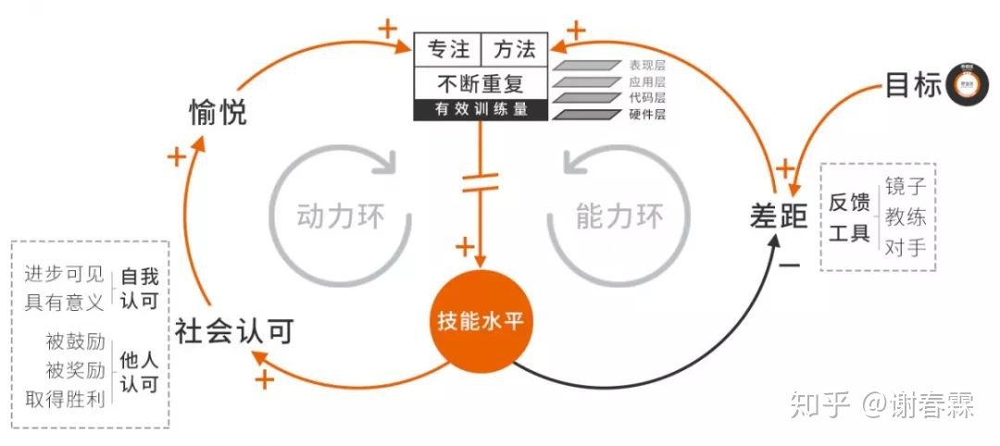

那你该如何成为某项技能的高手呢？

**答：积累足够多的有效训练量。**

技能水平的高低，最终只和你的有效训练量成正比。有效训练量需要同时满足三个条件：**专注的训练状态、有效的训练方法、以及不断的重复**。

**想要持续满足这三个条件，你需要进入精进循环，具体怎么做？**

**第一步：开启增强回路。**

通过不断获得社会认可，持续给训练提供动力，让自己专注其中，乐此不疲。获得社会认可的方式有两类：

1. 自我认可：让进步可视化，并为技能赋予使命，让训练更有意义；
2. 他人认可：让身边的人鼓励你，让更多的人奖励你，让自己不停地取得小胜利；

**第二步：开启调节回路。**

进入刻意练习的训练模式，让技能保持高速增长。刻意练习有三个要点：

1. 训练必须要有目标，目标必须在学习区；
2. 要有及时有效的反馈让自己看见差距，反馈工具有三种：镜子、教练、对手；
3. 训练的方法要有针对性，你可以通过技能分层图来寻找，从下往上分为四个层次：硬件层、代码层、应用层和表现层，下层的能力越夯实，技能的整体表现就越出色。

最后请记得，精进是个慢功夫，想要成为高手，你必须得有一点耐心，不经一番寒彻骨，怎得梅花扑鼻香。

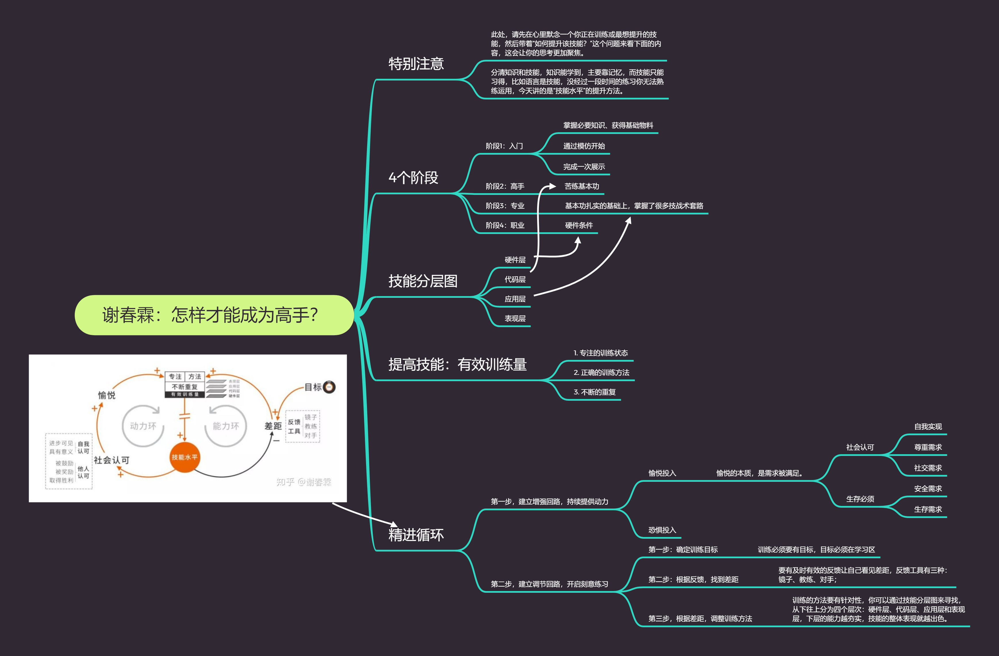

### 八段加速

- **第1级加速：理解。**想要提高某项任务的速度，你就必须先理解这项任务，“会”是“快”的第一步。这个阶段不求快，而是要在一堆未知中，找出实现目标的关键要素，先让这个结果可实现。
- **第2级加速：SOP。**理解任务之后，你要把这些无序的关键要素，变成有序、可量化的标准动作，固定成标准作业程序SOP，并每次都按此执行。
- **第3级加速：优化SOP。**有了SOP还不够，你还需要不断优化它，因为SOP没有最好，只有更好，你可以通过“精简”、“替换”、“合并”这三种方式来不断完善。
- **第4级加速：剪去低效时间。**为了让SOP中的每一分钟都具备生产力，你需要剪去其中低效的时间。你可以通过“专注”剪去分心的时间；通过“并行”和“短路”剪去等待的时间；通过“机器替代”剪去休息的时间。
- **第5级加速：逐步提高效率。**为了进一步压缩整个SOP的耗时，你可以通过“刻意练习”、“工具替代人力”的方式，逐步提高每一步的效率。
- **第6级加速：提前压缩步骤。**将SOP中的那些耗时较长的重复步骤提前执行，“压缩”成一个个模块，等需要用的时候，再将模块放入新的流程进行“解压”。
- **第7级加速：购买生产力。**当个人效率已优化到极致，你就需要招募帮手，基于SOP通过分工协作来提高效率，但切不可让成本失控，要确保你的“边际收益”≥“边际成本”。
- **第8级加速：技术进步。**在现有条件下，“边际收益=边际成本”是你加速的极限值，想要突破这个瓶颈，唯有依赖技术的进步，科学技术才是第一生产力。

### FOTA

**第一步：聚焦要事（Focus）**

任务太多，是因为你不知道什么事情重要，因此你什么都做，最后把自己忙得不可开交。想要提高多任务的处理效率，首先要拥有“识别重要性”的能力，精简任务。那什么任务才是重要的呢？有三类：

1. 建设类的任务，特别是前三层：战略层、范围层、结构层的任务；
2. 能推动增强回路的任务，它决定了你能走多快；
3. 能消除风险因素的任务，它决定了你能走多远。

如果你发现自己手头并没有这3类任务，那你每天可能正身陷各种琐事，多年不得成长了。现在，你最重要的任务，就是去找到或开启它们。

**第二步：梳理日程（Ordering）**

知道了什么事情重要，你就可以把它们放入“时间管理优先矩阵”进行分类处理。

但同一时刻你依然只能处理一件事情，想要让多任务处理变得高效，你必须把它们先排列成一个有序的队列，放入自己的日程安排，然后挨个执行。具体怎么做？

1. 用GTD，梳理任务的顺序；
2. 理解自己的生物钟，设定不同任务的执行时段，将执行效率最大化。

**第三步：三线并进（Three Timelines）**

如果任务量还是太大，怎么办？你可以开启三条“时间线”并行推进它们：

1. 专注“主干线”，这是你每天效率最高的时段，需要用来专注处理最重要的任务；
2. 占用“自动线”，当某个任务你不需要思考也能自动完成，你就可以占用它的额外带宽来同时处理其他任务；
3. 购买“第三线”，你还可以购买两类人的时间来提高自己的效率：一是能为你创造额外价值的人，二是能帮助你提高效率的人；

**第四步：随机应变（Adapt to Change）**

最后，你还需要拥有“应对意外”的能力、“锁定方向”的能力、“不忘初心”的能力来应对过程中的各种变化，让自己忙于事而不陷于事，面向目标，灵动前行。

## 协同力升级

### 权力

**奖励资本×可信度=吸引力**

**惩罚资本×可信度=威慑力**

**吸引力+威慑力=权力**

吸引力，让人主动追随；威慑力，让人不敢违抗。当你能兼具这两股力量时，你便拥有了权力。

**那你该如何提升权力呢？**

**第一，提升威慑力：**

你可以从提升自身实力、抓住对方软肋、提前设立规则签订契约、借助文化道德之力这4个方面入手来提升威慑力。

**第二，提升吸引力：**

提升吸引力的方法分为三步，从表达善意到给予奖励、从展现能力到共享资源、从言行一致到始终如一。

**第三，组成联盟：**

一个人的力量是有限的，如果你能和其他有权力的人组合在一起，就能把你们的吸引力和威慑力叠加起来，对外变成一个更有权力的个体。

权力虽然能提升你的协同力，但它也有三个副作用，分别是：事实隔离、权力寻租和违法犯罪。

### 说服攻略

如何说服一个人

**第一关：不想听**

想要说服对方，首先对方得愿意听。而当“你的信任度不够、或选择的时机不对、或对方的情绪不好、或你未获得授权、或讲的内容不恰当”时，对方便不愿意听你说，怎么办？

你可以通过“**寻找信任背书、另觅良机、认可动机、提供对方获益的有偿建议**”来让对方打开心扉，由此攻破此关。

**第二关：听不懂**

对方愿意听你讲还不够，还得听得懂。而当你们“认知不同”时，虽然看起来在沟通，事实上却是在鸡同鸭讲，怎么办？

你可以通过“**提前教育、简化认知、结构化表达**”的方式来让内容更易理解，由此攻破此关。

**第三关：不认同**

能听懂，就会认同你吗？当然不会，因为大多数人都存在“确认偏误”，他只会为自己已有的结论辩护，结果越辩越对立，怎么办？

你可以通过“**提出一个好问题、讲述一个好故事、设计一次认知失调**”来引导他自己说服自己，由此攻破此关。

**第四关：不行动**

认同之后，你就可以高枕无忧了吗？还不行，说服的终点是行动，而他可能患有严重的“拖延症”，嘴上说可以，身体一动不动，怎么办？

你可以通过“**让他明天更糟、为他消除顾虑、降低他的行动门槛**”这3个方式来促使他采取行动，由此攻破此关。

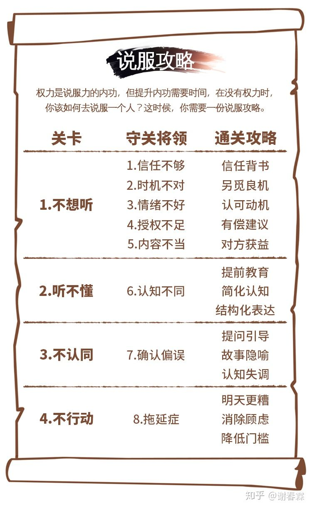

### 角色立场

说服他的脑袋，不如挪动他的屁股，注，有时候能说服力以及足够，但是立场不同，即角色不同，所以最终还是可能失败，这个时候就要给他换个"角色"

**改变角色**

所谓角色，其实是在描述一段关系。因此，想要改变角色，就是要改变与他相关的4段关系：

1. **改变他和自己的关系，**用“贴标签”的方式来改变他的自我认知；
2. **改变他和人的关系，**用“离间计”切断他原有的关系，通过“寻找共性、统一目标”来把他变成自己人；
3. **改变他和事的关系，**通过“降低这件事的回报，或加入一件更有意义的事”来让原来的事情没有做的必要了，或让他“先参与进来”，用新的角色慢慢驯化对方；
4. **改变他和物的关系，**通过“补贴、降低学习成本，以及供一个更好的东西”去替换，或者通过“扩大”事物的边界，让他觉得，原来在意的那些东西，其实微不足道。

**锁定角色**

角色，既然会固化一个人，那么，我们也可以反过来运用这个特性，通过锁定这4段关系，把一个人角色化，从而锁定他之后的所思所想所言所行。

1. **锁定他和自己的关系，**用“强化标签、激将法，以及赋予对方使命”的方式，来强化他的自我认知；
2. **锁定他和人的关系，**通过“仪式感的结盟、白纸黑字的签约，或与对方成为家人”的方式，来把他变成真正的自己人；
3. **锁定他和事的关系，**用“变动奖励”让对方从“可做可不做”变成“我想做”，用“规则制度+固定报酬”的方式，让对方从“懒得做”变成“必须做！”
4. **锁定他和物的关系，**通过“赠送使用权、出售所有权，或者纳入共同体”的方式，让他拥有“主人翁意识”，从而自觉自愿的对这件事负起责任，并全力以赴。

### 协同三角

而提高协同力的方法，就是运用「协同三角」这个工具，将团队中每个成员的“本我、自我、超我”都调向目标。具体可以细分成五个步骤：

- 第1步，明确目标；
- 第2步，获得权力；
- 第3步，调整角色；
- 第4步，统一认知；
- 第5步，锁定行动。

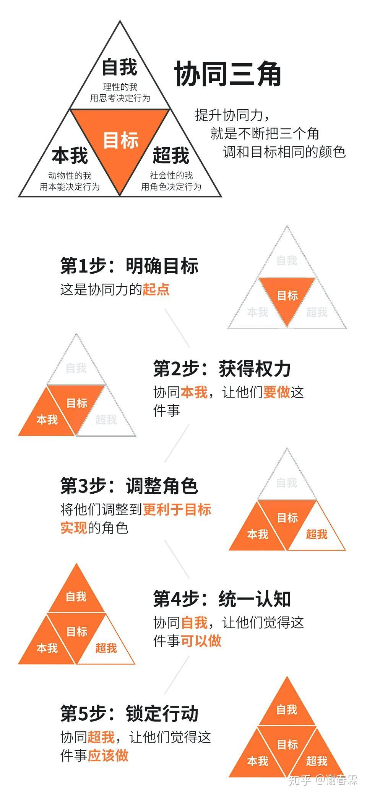

## 团队效率升级

团队效率=目标×能力×速度

### 组建团队

**组建一个有战斗力的团队一共分为四步：**

**第一步：瞄准**

你需要瞄准四类人来组建自己团队，他们分别是：高手、顾问、帮手和管理者。高手和顾问是为你创造价值的人；而帮手和管理者是为你提升效率的人。

初创期团队要以“高手”为主，发展期和成熟期以“管理者+帮手”为主，而到了转型期，团队则需要回到“高手+顾问”搭配。

**第二步：吸引**

在你的团队还很小的时候，人才不是招聘来的，而是吸引来的，具体分为三步：

1.打造独特卖点，让人才们感受到你的独特魅力；

2.建立信任，不能光画大饼，要通过具体的描述、面对面的沟通、附上信任背书来与他们建立信任；

3.发出邀约，不仅要让他们心动，更要让他行动起来。

**第三步：筛选**

吸引来的人要进行一轮面试筛选，把不适合的人挡在门外。但你不能听他们怎么说，而要看他们怎么做，具体的面试方法有三种：

1.看经历，不要相信他的潜力，而要看他已经把潜力兑现了的经历；

2.做试验，脑洞题脱离实际，你要回到真实的工作场景中测试他的能力；

3.测反应，向他提出目标类或看法类的问题，迅速了解他平日的知识储备和思考深度。

**第四步：进化**

好团队不是拼出来的，而是进化出来的，因此你不仅要学会如何招人，还要学会如何裁人，让团队始终保持活力。具体可分为三步：

1.打开瓶颈，替换掉无法再有突破的带头大哥；

2.砍掉尾部，淘汰10%的末尾员工；

3.清除病毒，再痛也要切掉价值观错误、破坏规则、给公司带来负能量的人。

### 培训团队

一想到要提升团队的能力，很多人就会想到要给员工培训，但效果往往不好，那是因为培训并不能直接提升员工的能力，能力，是因为一个人要适应环境，或要达成自己的目标而被迫提升的。

**第一步，定目标。**

你可以通过“面试时筛选、使用任期制、设定清晰的职业路径”这三个方法，让他自己逼着自己进步。

**第二步，搞竞争。**

你可以通过“设置末尾淘汰，举办内部竞赛”的方式，让别人逼着他进步。

**第三步，教方法。**

当员工有了要进步的意愿之后，你就可以通过“师徒制、培训、流程化”这3个方式将能力传授予他。

**第四步，给反馈。**

仅仅传授还不够，这只是开始，还需要在师徒制里不断给出反馈，培训后持续跟进辅导，将流程不断优化调整，以此来保证效果的达成。

**第五步，多磨练。**

当一个员工已不满足于成为合格人才，想有更高的突破，那么你就可以往“更深、更广、更厚”这三个方向，给他更多的磨练，帮助他成为一名专才、将才或者帅才。

### 个体产能

**1. 做什么？**

回答这个问题，是为了要让团队里的每一个人，在任何时候，都清楚自己应该去干嘛。

回答一共分成6个步骤：1.将目标分解成任务；2.将任务责任到人；3.明确方法的边界和结果的标准；4.设定截止时间；5.设置中间节点；6.跟进与反馈。

**2. 怎么做？**

回答这个问题，是要让团队成员在执行过程中，解决问题的效率变得更高，而想要提高这个效率，除了提升员工的能力之外，你还需要做好授权，让员工自己决定该采用什么样的解决方案，以此来缩短决策时间。

合理的授权有4点要求：1.选对人；2.划出边界；3.责权利对等；4.保留知情权。

**3. 为什么要做？**

回答好这个问题，员工便会把自己的一切压上，在这里拼尽全力，回答分成三个部分：

1.为目标赋予意义。其中包括对他个人的意义，对别人的意义，以及目标本身能否实现。

2.为行动提供保障。又想马儿跑，又想马儿不吃草，这是妄念，要戒！

3.为绩效进行奖励。主要有三种方式，分别是：提成制、奖金制和对赌制。

### 团队协作

**1. 微观视角**

在这个角度下，你会看到“沟通”是协作的基石，想要提升人与人之间的协作效率，首先得提升他们之间的沟通效率。

而沟通的本质是信息的传递，因此我们可以从信息论的角度，找到4条提高沟通效率的办法：第一，统一信息编码；第二，增加互信息；第三，提高置信度；第四，减少噪音。

**2. 中观视角**

在这个角度下，你看到了团队的整个协作关系，由“分工协作”和“组织结构”组成。

分工之所以会产生“1+1>2”的效果，是因为所有人都在做自己擅长的事，而且更专注了，所以你可以从3个方面来提升分工的效率：第一，基于擅长进行分工；第二，先分赃，再分工；第三，不断优化团队的短板；

组织结构是协作关系的表现形式，它有“职能型、项目型、矩阵型...”等等不同的形态，但他们不是设计出来的，而是根据“团队遇到的效率问题”不断演化出来的。

演化要遵循三个原则：第一，沟通便利原则；第二，资源复用原则；第三，战略跟随原则。

**3. 宏观视角**

在这个角度下，你看到的不再是团队中的一个个人，而是一个整体如何在一个更大的环境中行动。因此，你需要做好两件事：

首先，要用ORK来粘合团队，让大家变成一个整体。在团队中推行OKR时要注意三点：第一，目标的设定要有挑战性，结果要可以衡量；第二，从上至下层层分解，但每个目标都需要由沟通产生；第三，所有人的OKR都必须公开透明，并做好定期回顾。

其次，要重点关注资源的引入与分配。对外，你要引入资源，为团队赋能；但资源总是有限的，因此对内，你要学会取舍与平衡，在空间上要有侧重，在时间上要有远近，把好钢用在刀刃上。

