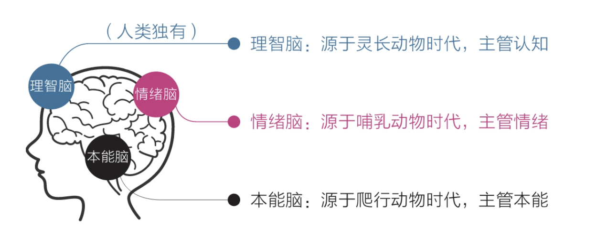
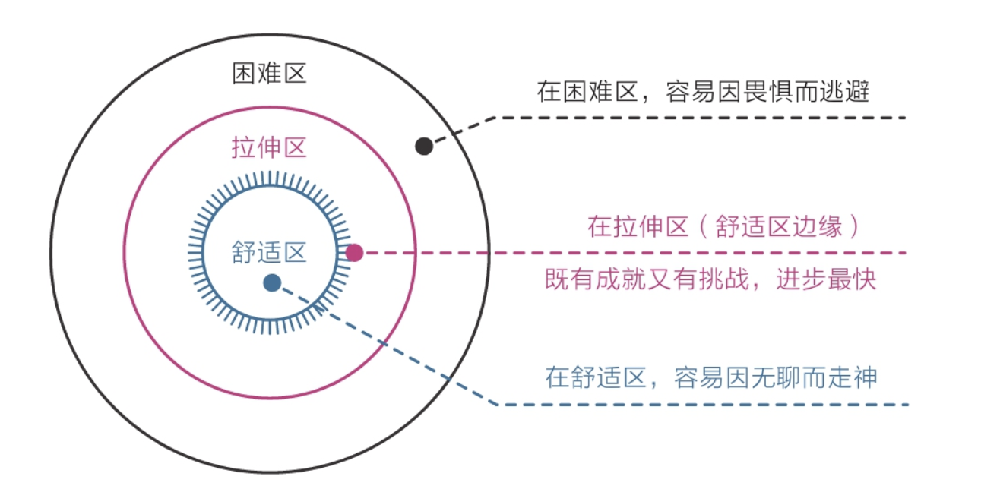
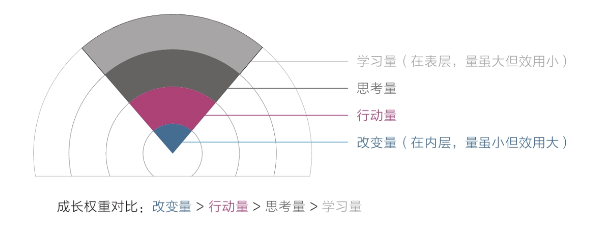
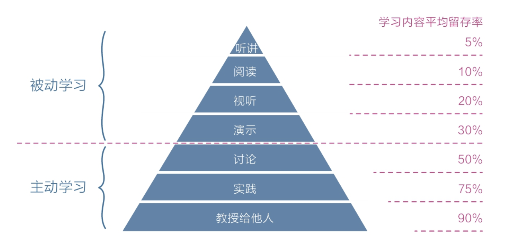
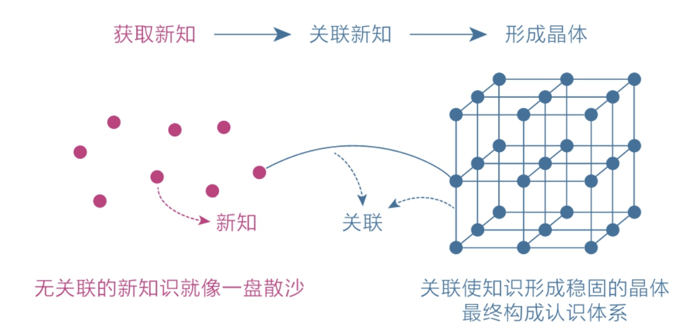

# 认知觉醒

**《认知觉醒：开启自我改变的原动力》是****[人民邮电出版社](https://baike.baidu.com/item/人民邮电出版社/905716?fromModule=lemma_inlink)****出版的图书，作者是周岭，**这是一部可以[穿透时间](https://baike.baidu.com/item/穿透时间/10363236?fromModule=lemma_inlink)的个人成长方法论。通过“大脑构造、[潜意识](https://baike.baidu.com/item/潜意识/65867?fromModule=lemma_inlink)、[元认知](https://baike.baidu.com/item/元认知/16999231?fromModule=lemma_inlink)”等[思维规律](https://baike.baidu.com/item/思维规律/4062707?fromModule=lemma_inlink)，你将真正看清自己；通过“[深度学习](https://baike.baidu.com/item/深度学习/3729729?fromModule=lemma_inlink)、关联、反馈”事物规律，你将洞悉如何真正成事！

如果对自己不了解，我们就会被人的原始天性束缚，这往往会让我们感到很痛苦。然而，如果了解大脑知识，我们就可以观察并指导自己，运用认知的力量去克服天性，从而获得长久而清晰的内在动力，让我们告别绝大多数人生痛苦。

## 摘录

所谓心智，通俗地说，就是我们看待人和事的态度，以及由此做出的判断与选择。

### 三重脑

**本能脑和情绪脑的基因一直被生存压力塑造着，所以它们的天性自然成了目光短浅、即时满足**。

### 本能驱动

·`避难趋易`——只做简单和舒适的事，喜欢在核心区域周边打转，待在舒适区内逃避真正的困难；

·`急于求成`——凡事希望立即看到结果，对不能马上看到结果的事往往缺乏耐心，非常容易放弃。

这样的大脑构造导致我们总是陷入“明明知道，但就是做不到；特别想要，但就是得不到”的怪圈

大多数时候我们以为自己在思考，**其实都是在对自身的行为和欲望进行合理化**，这正是人类被称作“`自我解释的动物`”的原因。

习惯之所以难以改变，就是因为它是自我巩固的——越用越强，越强越用。要想从既有的习惯中跳出来，最好的方法不是依靠自制力，而是依靠知识

理智脑不是直接干活的，干活是本能脑和情绪脑的事情，因为它们的“力气”大；上天赋予理智脑智慧，是让它驱动本能和情绪，而不是直接取代它们。

### 克服

立足长远，主动走出舒适区；

为潜在的风险克制自己，为可能的收益延时满足；

保持耐心，坚持做那些短期内看不到效果的“无用之事”；

抵制诱惑，面对舒适和娱乐时，做出与其他人不同的选择……

### 焦虑

无论个体还是群体，人类的安全感都源于自己在某一方面拥有的独特优势：或能力，或财富，或权力，或影响力。

做总比不做强

归结起来，焦虑的原因就两条：**想同时做很多事，又想立即看到效果**。王小波说：**人的一切痛苦，本质上都是对自己无能的愤怒。焦虑的本质也契合这一观点：自己的欲望大于能力，又极度缺乏耐心。焦虑就是因为欲望与能力之间差距过大**。

**急于求成，想同时做很多事；避难趋易，想不怎么努力就立即看到效果**。

克制欲望，不要让自己同时做很多事；

·面对现实，看清自己真实的能力水平；

·要事优先，想办法只做最重要的事情；

·接受环境，在局限中做力所能及的事；

·直面核心，狠狠逼自己一把去突破它。

### 拉伸区

很多人之所以痛苦焦虑，就是因为**只盯着表层的学习量**。他们读了很多书、报了很多课，天天打卡、日日坚持，努力到感动自己，但就是没有深入关注过自己的思考、行动和改变，所以总是感到学无所获，甚至会认为是自己不够努力，应该继续加大学习量，结果陷入了“**越学越焦虑，越焦虑越学**”的恶性循环。

停在表层，我们就会陷入欲望漩涡，什么都想学、什么都想要，忙忙碌碌却收效甚微；若是能深入底层，盯住实际改变，我们就能跳出盲目、焦虑、浮躁的怪圈。

### 如何变得耐心

1）面对天性，放下心理包袱，坦然接纳自己。

不要自责，要给自己打气

2）面对诱惑，学会延迟满足，变对抗为沟通。

劝导自己，温和地告诉它们：“该有的享受一点都不会少，只是不是现在享受，而是在完成重要的事情之后。”

最后，面对困难，主动改变视角，赋予行动意义。

欺骗自己，想办法让本能脑和情绪脑感受到困难事物的乐趣并上瘾，才是理智脑的最高级的策略

### 潜意识

意识分层在给人类带来巨大好处的同时也带来了副作用——模糊。因为处理各种信息的速度不对等，意识很难介入潜意识，而潜意识却能轻易左右意识，所以人们总是做着自己不理解的事，比如明明想去学习，结果转身就拿起了手机；明明知道有些担忧毫无意义，却总是忍不住陷入焦虑，就像身后有个影子，它能影响你，但你不知道它是什么，回头看去一片模糊。这种模糊让人心生迷茫和恐惧，而迷茫和恐惧又使我们的认知、情绪和行动遭遇各种困扰，继而影响人生的走向。

**学习知识的目的是“消除模糊”，而获取知识的方法也是“消除模糊”，目的和方法相统一**

《思考力》一书的作者上田正仁提示：思考力的本质就是“丢弃所有已经消化的信息，让问题的核心浮出水面”；

《刻意练习》中的核心方法论是：不要重复练习已经会的，要不断寻找那些稍有难度的部分;

《原则》一书的作者瑞·达利欧罗列了工作和生活中的原则，用以清晰地指导自己行事；

《超越感觉》一书告诉我们，想拥有清晰的逻辑，就坚持一点：凡事不要凭模糊的感觉判断，要寻找清晰的证据。

**提升思考能力的方法正是不断明确核心困难和心得感悟，并专注于此。**

行动力不足的真正原因是选择模糊。所谓选择模糊，**就是我们在面对众多可能性时无法做出清晰、明确的选择**。这样的情况很常见，比如当你心中有很多欲望、脑中有很多头绪，或者拥有可自由支配的时间时，你就会进入“既想做这个，又想做那个；既可以做这个，又可以做那个”的状态，就像自己始终站在十字路口，却不知道该往哪里去，从而使自己陷入一种不确定性之中。

这就是高手学习的方法：**先用感性能力帮助自己选择，再用理性能力帮助自己思考**。

注：潜意识做选择，每日反省自己的时候，注意思考印象深刻的事情，是什么触动了它。

#### 捕捉感性

(1)“最”字法

(2)“总”字法。平时脑子里总是不自觉地跳出来的某些重复念头，或是心里总是挥之不去的事，这些通常都是我们心中最放不下的事，是情绪波动的源头。

(3)无意识的第一反应。

(4)梦境。梦境是潜意识传递信息的一种方式，它可能是内心真实想法的展示，也可能是灵感的启发。

(5)身体。

(6)直觉。

### 元认知

元认知能力就是我们习以为常、见怪不怪的反思能力。就是时刻有另外一个自己在审视自己做的一切

你能意识到自己在想什么，进而意识到这些想法是否明智，再进一步纠正那些不明智的想法，最终做出更好的选择。

我们总是这样，一开始只想找一根绳子，最后却牵出一头大象。

元认知能力就是觉察力和自控力的组合。所以从实用角度讲，元认知能力可以被重新定义为：自我审视、主动控制，防止被潜意识左右的能力。

每当遇到需要选择的情况时，我们要是能先停留几秒思考一下，就有可能激活自己的理智脑，启用元认知来审视当前的思维，然后做出不一样的选择。

### 专注力

这种“做A想B”的行为模式却实实在在地影响着我们，使我们在不知不觉中徒生烦恼、渐生愚钝。从某种意义上说，它正是我们烦恼和无能的来源。

分心走神的原因无非两个：

一是觉得当下太无聊，所以追求更有意思的事情；

二是觉得当下太痛苦，于是追求更舒适的事情。因为身体受困于现实，只好让思想天马行空。

慢慢练习收回感受，让注意力回到当下，我们的烦恼就会慢慢减少，精力就会更加旺盛，情绪就会更加平和，身体就会更加柔软，感知就会更加灵敏，思考就会更加深入……这个习惯涉及生活的方方面面，改变它就相当于改变了自己的底层行为模式，其力量不可小觑。

#### 深度沉浸的方法

一，有定义明确的目标。

二，练习时极度专注。

三，能获得有效的反馈。

四，始终在拉伸区练习。一味重复已经掌握的事情是没有意义的，但挑战太难的任务也会让自己感到挫败，二者都无法使人进入沉浸状态，好的状态应该介于二者之间。

### 学习力

专注于深度学习，同时对浅学习保持开放。

**无关联，不学习**;关联是种底层能力，它不仅体现在高层，也体现在低处，与人们的日常生活息息相关。

无反馈，不学习

### 行动力

清晰力才是行动力

清晰力，也就是把目标细化、具体化的能力——行动力只有在清晰力的支撑下才能得到重构。

道理再好，如果不去刻意练习，不去刺激相关神经元的强关联，这些美好的认知将永远不会真正对自己产生影响。

## 总结思考

很多时候，都是在修心，修行。人的自身障碍，避难趋易，急于求成，认识到自己内心的缺陷，我们下一步就是欺骗，诱导自己，使自己达到正念。修行的目的就是修心，踏出自己的舒适区。扩大自己的舒适区。聚焦(Focusing)，反馈(feedback)，改正（fixing）通过复利不断提升。