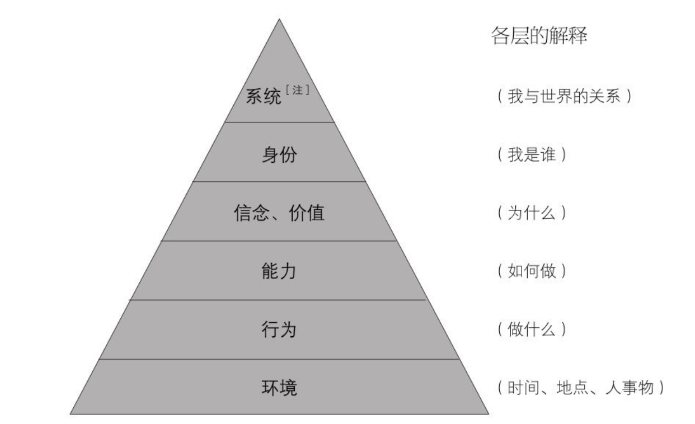

# 重塑心灵

李中莹老师生于1946年，香港人。李中莹老师有三十年的企业管理及经营经验，曾在多个[欧美](https://baike.baidu.com/item/欧美/9729175?fromModule=lemma_inlink)跨国集团和上市公司担任[高层管理](https://baike.baidu.com/item/高层管理/10725725?fromModule=lemma_inlink)职务，从事过[生产管理](https://baike.baidu.com/item/生产管理/1291801?fromModule=lemma_inlink)、贸易、销售、统筹、人力资源、[合并改组](https://baike.baidu.com/item/合并改组/12742156?fromModule=lemma_inlink)、流程改革、市场开拓和[企业策划](https://baike.baidu.com/item/企业策划/9248277?fromModule=lemma_inlink)等多种性质管理工作。在七、八十年代，在[东南亚](https://baike.baidu.com/item/东南亚/390261?fromModule=lemma_inlink)地区出任地区高层负责人。

**华人世界的国际级[NLP](https://baike.baidu.com/item/NLP/1515237?fromModule=lemma_inlink)大师**

除了最早把NLP完整全面地介绍入国内之外，李中莹老师被认为是华人界[NLP](https://baike.baidu.com/item/NLP/1515237?fromModule=lemma_inlink)学问功力最高的导师之一，他在NLP方面的功力也是被认为是首屈一指的，被誉为“华人世界的国际级NLP大师”。他在NLP的领域里，特别是关于一个人的身份(自我)，及操纵他在生活里的态度的[信念系统](https://baike.baidu.com/item/信念系统/15646994?fromModule=lemma_inlink)(信念、价值观、规条)，发展出大量独到有效的思想技巧和行为技巧。这些技巧，在帮助一个人培养出良好的[心理素质](https://baike.baidu.com/item/心理素质/361382?fromModule=lemma_inlink)和精神健康方面非常有效。

## NLP

NLP 指的是神经语言程序（Neuro-Linguistic Programming），它是一种人类行为、语言和思维模式的研究，旨在了解人类如何感知信息，并将这种信息转化为行为和思维模式。

通过研究人们的语言、身体语言、信念和价值观等方面，NLP 尝试建立有效的沟通技巧、改变不良习惯、提高自我意识和情商等。NLP 的核心理念之一就是“地图不等于领域”，即每个人对世界的感知和理解都是不同的，因此 NLP 希望通过帮助人们掌握自己的思维方式和行为模式，来达到实现个人目标和发挥潜能的目的。

其实我们每个人每天都会做出很多成功的事情。我们也可以总结自己成功的身心经验，从而拥有更多的成功快乐。

NLP三个字母代表着如下意思：

N=Neuro（直译为“神经”，意译为“身心”）指的是我们的头脑负责思想，身体负责执行，头脑和身体由神经系统连结在一起，我们的神经系统控制我们的感觉器官和功能系统去维持与世界的联系。

L=Linguistic（语法）指的是我们的头脑与身体之间的联系机制所用的语言模式和语法规则。我们运用语言与别人相互影响，并经由身姿、手势、行为和习惯等无声语言显示我们的思考模式、信念及内心种种状态。

P=Programming（程序或程式）指的是借用计算机科学术语“程序”去指出我们的意念、感觉和行为只不过是习惯性的模式，可以经由提升我们“思想”的软件而得以改善。通过改变我们思想和行为的习惯性模式，我们便能在生活中取得更满意的效果。

### 12条

1．没有两个人是一样的No two persons are the same．

2．一个人不能控制另外一个人One person cannot change another person．

3．有效果比有道理更重要Usefulness is more important．

4．只有由感官经验塑造出来的世界，没有绝对的真实世界The map is not territory．

5．沟通的意义决定于对方的回应The meaning of communication is the response one gets．

6．重复旧的做法，只会得到旧的结果Repeating the same behavior will repeat the same result．

7．凡事必有至少三个解决方法There are at least three solutions to every situation．

8．每一个人都选择给自己最佳利益的行为Every one chooses the best behavior at the moment．

每一个人做任何事都是为了满足自己内心的一些需要。每一个人的行为，对他的潜意识来说，都是当时环境里最符合自己利益的做法。因此，每个行为的背后，都必定有正面的动机。

9．每个人都已经具备使自己成功快乐的资源Every one already possesses all the resources needed．

10．在任何一个系统里，最灵活的部分便是最能影响大局的部分In any system, the most flexible person has the control．

11．没有挫败，只有反馈信息There is no failure, only feedback．

12．动机和情绪总不会错，只是行为没有效果而已Intentions and emotions are never wrong, only the behavior has not been effective.

动机在潜意识里总是正面的。潜意识从来都不会有伤害自己的动机，只是误会地以为某行为可以满足某些需要，而又不知有其他做法的可能。情绪总是给我们一份推动力，让我们在事情中有所学习。学到了，情绪便会消失。没有学到，同样的事情还会再来。我们可以接受一个人的动机和情绪，同时不接受他的行为。接受动机和情绪，便是接受那个人。那个人也会感觉出你对他的接受，因而更愿意让你去引导他做出改变。任何一次行为不等于一个人。行为不能接受，是因为没有效果；找出更好的做法，把这当作两人的共同目标，便能使两人有更好的沟通和关系。找出更好做法的方法之一是追查动机背后的价值观。

## 信念系统

信念、价值观和规条统称为“信念系统”。所有人的内心困扰或者是人与人之间的矛盾，都是来自信念系统的冲突，但这并不是一成不变的，它随着生活体验的改变处在不断变化之中，我们的人生要做到三赢，感受应有的成功快乐，必须建立更有效的信念，即建立新的神经元网络，改进对待同类事情的想法与做法。

人之所以不同，除了遗传基因的巨大差异外，还与他在成长过程中所形成的信念系统有很大关系。

维持这个人在这个世界生活下去的内在法则就是他的信念系统，而这个信念系统的运作模式便决定了这个人的人生是否成功和快乐。信念系统（beliefs system）其实可以分开为**信念（believes）、价值（values）和规条（rules）**。

### 信念

信念就是“事情应该是怎样的”或者“事情就是这样的”的主观判断，是我们认为维持世界运作下去的法则（这是来自说话者脑里认知的世界，也即是主观的法则），是解释和支持行动或没有行动的理由，是解释和支持变化或没有变化的理由，是对于这个世界各种关系的主观逻辑定律。

信念是绝对的。这点也是很多人的迷惘和困扰的来源。信念是本人认为世事应该是怎样的，但并不能说真理便一定是这样。能够把主观信念和客观真理分开并且认为它们是两回事，便是一个人已经达到一定智慧水平的认证。

每个人拥有的信念数以百万计，无法完全说清楚，因为绝大部分信念都存于潜意识里，不能全部呈现，也不会轻易地在意识层呈现出来。它们在潜意识里默默地照顾我们，支持我们的生活。如果没有信念的支持，我们就会不知如何是好。

#### 种类

1．定义式（相等式）

确定事物之意义，一项事物与另一项事物的意义相同。常见的用词包括：XX是YY、即是、等于、就是、便是等。例：沉默就是投降。

2．因果式

一项事物导致另一项事物的产生。可以是直接明确的，例：因为你没有来，所以我失败了；也可以是隐藏的，例：我很累，不能帮你。

常见的用词包括：引起、使得、迫使、造成、以致、导致、如果、因此、因为……所以、终会、终于、结果、将会、只会等。例：不良沟通造成婚姻失败；如果你不开口便不会这样了。

3．规条式

事物中的选择性受到限制。常常表现为一个人或一件事的能力水平或限制，常见的用字包括：能/不能、可以/不可以、可能/不可能、需要/不需要、应该/不应该、必须/必须不、不得/不得不、认为……必要/认为……不必要等。例：他需要培训才能胜任；他不可以这样就离开。

4．判断式

事实上，所有的信念都是判断。这里指的可以算是最简单明确的判断模式，就是把对事物的主观猜测当作必然。判断式的信念往往没有特定的用词，而只是带着肯定语气来描述事物。例：他不成；我输了；三次才对。

#### 形成途径

1．本人的亲身经验，例如，曾被火烫伤而知道火能伤人。

2．观察他人的经验，例如，见到同学顽皮而受罚，因而知道某些行为不可以在上课时做。

3．接受信任之人的灌输，例如，父母说要提防陌生人，所以我们对不熟悉的人有抗拒之心。

4．自我思考做出的总结，例如，某人总是拒绝我的善意，苦思之下，终于认定是因为他妒忌我升迁比他快。

#### 妨碍成长的信念

1．使自己失去学习机会，因而不能有所提升的信念。例如：“他哪里会有什么好主意！”“你没有资格教我！”“你是什么身份，竟敢对我提出意见！”“这样做不会有用。”

2．使自己留在原地、停滞不前的信念。例如：“现在已经够好了，不敢妄想得到更多。”“在这个环境里，我们应该知足。”“今天已经这么辛苦，哪有时间去想明天的事。”“保持这个状态便已经够好了。”

3．减少自己有更多选择的可能性，限制本人能力发挥的信念。例如：“我不应该那样冒险。”“我不应该这样贪心。”“这样太过分了，我不允许自己这样想。”“以我的身份，怎能随便上前跟他谈话？”“我不敢去尝试，我怕失败。”“做人应该满足，不要妄想。”

4．把责任交给其他的人事物，因而自己无能为力。例如：“是他们不对嘛，为什么要我改变？”“人在江湖，身不由己！”“这样的环境，我还能做些什么？”“事情这样发展，我只能叹息！”“他们不做，我也没有办法！”

5．把原因归结为一些不能够控制的因素，因而不能挑战或者改变。例如：“这是天意，没有办法！”“我天生就是这样，怎么办？”“你不能改变世界的定律！”“那是超自然现象，科学没法解释。”“你不能解释的便不应该做！”（这里我们不需要把焦点放在科学能否解释上，而应注意我们能够控制的无数选择。）

6．维持自己一个“没有资格”身份的信念。例如：“我只希望我的人生能安稳，从没想过会有大富大贵的日子。”“我哪会有那么幸运？”“做到像他那样成功？你不是说笑吧？”“有做老总的一天？从来没有想过。”

关于身份的局限性信念

一个人最严重的“局限性信念”是三类关于“身份”的信念：

1.“能力性”的局限信念，即“我没有能力”（helplessness）。例：“我不能放松。”解决的方向是认识本有的庞大能力（capability）。

2.“可能性”的局限信念，即“我没有可能……”（hopelessness）。例：“我这个病不会好了。”解决的方向是看到希望（hope）。

3.“资格性”的局限信念，即“我没有资格拥有美好快乐的人生”（worthlessness）。例：“我的命生成这样，是应该受苦的。”解决的方向是感觉到他也可以有美好的人生（deserving）。

杀伤力最大的一个就是“我没有资格”。假如一个人认定了自己是一个不会成功、不能有快乐的人，那么，无论别人怎样说、自己怎样做，在心灵深处都只会找寻自己不会成功、不能快乐的证明。

### 价值

价值是事情的意义和一个人能够在事情里得到的好处。

如果在一件事里有两个高低不同的价值，我们容易取舍，但是如果这两个价值是同等轻重而我们只能争取其中一项时，我们就会感到困难。这时，我们便踌躇不决了。所以，如果一个人有清晰的价值观（在乎些什么价值、每一项价值是什么意思、一件事里有哪些价值），处理事情和做出决定时便能爽快利落。**NLP有一个技巧：“价值定位法”，能够把一件事里面的价值（本人在乎的价值）清晰化和按其轻重排列出来**。

价值观随着环境、经验、思想和情绪而不断地改变。价值也可以人为地被创造、增大和转移。

**创造价值**：把重复和沉闷的工作分开为几个分量相等的部分，每完成一个部分时都计算一下速度，尝试不断地打破完成上个部分的速度；或者与同伴比赛，谁先完成任务便给对方电话；又或者告诉更多人你准备完成某件事，因此你会更用心地把事情做好：因为你在乎众人对你的肯定。

**增大价值**：怎样在每天的工作中学习到一些新的东西？在见到每个人的时候，试着找出他有些什么专长，或者找出一些他处事的信念基础。下次在哪里、怎样做可以有所突破？正在做的事情对你未来的长远目标会有怎样的贡献？

**转移价值**：不再为上级的肯定，而是为了提升自己的水平而做好工作；把销售人寿保险的目的从赚钱改为帮助别人并使其家庭得到保障。不再想眼前的事对一年后的目标有些什么作用，把注意力集中在怎样使当前的顾客满意。

推动或者激励一个人，就是找出他所注重的价值，并且创造、增大和转移这些价值。这样，这个人便对那件事情有兴趣，会自动、积极和认真地去做。有一些价值，是每个人都会在乎的。

### 规条

规条是事情的安排方式，也就是做法。规条的存在，完全是为了取得事情中所体现的价值和实现一些信念。规条会涉及人事物的组织安排和活动，因此，有清晰的动词在其中。

当一个做法无效时，我们便要在坚持信念与价值，或者坚持规条（做法）之间做出选择。本来，怎样选择是很明显的：既然规条是为了取得价值和实现信念，当规条无效时，我们应当坚持信念与价值，而改变规条。

坚持无效的规条而忽略了所追求的价值和所信奉的信念，在很多人的生活里、很多企业的经营里经常出现。这样的情况，使当事人很困扰：辛苦努力但总是徒劳无功。

坚持规条而忽略了信念价值的人，通常有两个特征，第一个特征是过分地强调原则和理论

第二个特征是这些人有一个很深层的、关于“身份”的“我没有资格”的障碍性信念。

### 信念、价值观、规条的相互关系

信念就像一幢建筑在浅水处的房屋，由一根一根柱子支撑着。房屋是信念，而柱子就是价值。这就是说，价值是支持信念的东西。信念改变了，就如房屋的位置改变了，水里支撑的柱子一定有了改变。也可以说是：改变价值，信念便能改变。

信念和规条往往容易混淆，因为两者都常常会有“应该”二字出现。其实，它们不难分辨。因为规条总是为了实现信念。所以，规条是在信念之下，在支持信念。

### 总结

1．信念、价值观和规条统称为“信念系统”，是一个人的人生观、意念行为的思想基础。信念系统操纵着我们人生里的每一件事，是做或不做任何事的基本决定因素。信念系统也是我们对事物做出判断的基础和依据。信念系统使我们的大脑能自动地去思考和行动。自动的意思是由潜意识完全控制，由意识去注意环境出现的信息。

2．人是不会也不可能没有信念、价值观和规条而生存的。事实上，只要一个人处于他不大熟悉的环境里，他便会忐忑不安，就是因为他缺乏应对该环境的某些信念、价值观和规条。

3．信念系统有一个外壳，就是态度。所以，态度其实是BVR（Believes-Values-Rules）的表征。只有当一个人的信念、价值观或规条有所改变时，他的态度才会改变。

4．一个人的信念系统加上态度，简单地说便是此人的性格。

5．信念是事情应该是怎样的，是事情的原因；价值是事情的意义，其中什么重要、可得到怎样的好处等；规条是事情怎样安排才能取得价值，实现信念。其实，价值和规条也是信念的一部分，是具有特别性质的两个信念部分。

6．信念系统是生活经验总结出来的处世模式，让我们无须每件事每次都重新学习而知道怎样应付。因为信念系统的存在，我们可以运用过去的经验有效率地处理当前情况，因而使我们有更多时间去做更多的事。

7．一个人在出生时是没有信念系统的。所有的信念、价值观和规条，都是在他成长的过程中经由生活体验而产生的。因为永远都有新的生活体验，所以一个人的信念系统也从不停留在静止状态，而是不断地处在改变之中。一个人的性格是可以改变的，也因为没有两个人的全部生活经验会一样，因此没有两个人的信念系统是一样的。

8．每个人的信念、价值观和规条的数量极为庞大，但是绝大部分储留在潜意识里。在任何时间中，一个正常的人，只有极少数的信念、价值观和规条存在于意识层次。每当某些信念、价值观或规条受到了冒犯，负面情绪出现时，受到冒犯的信念、价值观或规条便会清晰地在意识层次出现（可以说出来）。

9．所有人的内心困扰，都是来自一些信念、价值观或规条的冲突。而人与人之间的冲突，也是起源于两者内心的信念、价值观或规条的冲突。

### 改变的方法

#### 松动信念的方法

1．改变标签。

例：“不等待他回来便吃东西是不尊重他。”（标签）“不等待他回来便吃东西是照顾自己。”（新标签）

2．改变标签的定义。

例：“自己因为太饿而没有气力，从而产生抱怨情绪，他回来后你不能给他好的照顾，这才是不尊重他呢！”

3．审视背后的动机。

找出事情背后的正面动机，这往往需要找出更高的理解层次，即更大的意义、更广的覆盖面或范畴。可以问：“这样做会让你变得怎么样？会给你一些什么重要的东西？”这样有可能让这个主妇看到改变的好处。例：“不等待他回来便吃东西，使我有气力做好家务，进而把东西收拾好，怀着轻松愉快的心情等待他回来。”

4．极度延伸。

把维持旧信念的终极结果明显化。引导她自问，或者对她说：“你继续这样做，最终会有什么结果？例：“继续这样做，偶然的胃痛会变成长期的胃病，身体坏了，什么事情都做不好，情绪也会越来越坏，两人的关系会越来越紧张。”

以上的过程，最好是引导对方制造一些有视觉、听觉和感觉元素的未来景象，这会产生支持改变信念的动力。

#### 破框法

如想人生有更好的效果出现，必须先改变这些信念。需要改变的信念，也就是日常嘴边挂着的“思想框架”了。

最妨碍我们在今天充满挑战的环境中找到突破的三个思想框架是：“应该如此”“托付心态”和“没有办法”。这三个信念之间有关联，往往也会一并出现。

1.“应该如此”的办法：我们无法知道世界上所有的事，发生了的都是应该发生的。我们不应坐在那里抱怨，而应接受并根据现有的情况做最好的配合。

2.“托付心态”的办法：每个人照顾自己的人生，不假手他人。

3.“没有办法”的办法：凡事有至少三个解决方法，我总有选择。

#### 意义换框法

“意义换框法”是NLP技巧“换框法”中最常用和最好用的技巧。它完全只凭言语和思想模式而产生效果，是NLP的改变信念技巧中最快速最容易的一个。

“意义换框法”是找出一个负面经验中的正面意义。它的概念基础是：世界上所有的事情本身是没有意义的，所有的意义都只是人加诸的。既然是人加上去的意义，则一件事情——

◇ 可以有其他的意义，也可以有更多的意义；

◇ 可以有不好的意义，也可以有好的意义。

#### 环境换框法

同样的一件东西或一件事情，在不同的环境里其价值会有所不同。找出更有利的环境，便能改变对这件东西或这个情况的价值，因而改变了有关的信念。

中国传统思想中有很多表面上绝对正确的说法（其实都是规条），把人们牢牢地束缚着，运用环境换框法，可以把它们打破。很多信念的确对自己的成长和处事很重要，但是没有一个信念在所有情况中都是绝对有效的。信念是人生的一部分，是帮助我们做到三赢和获得成功快乐的人生的工具之一，但是要记得它们也是我们自己制造出来的。工具不应操控我们，所以我们不应把信念变成我们的“神”去绝对地维护。当某些信念妨碍我们达到上述人生目标时，我们可以将它们修正、移开（暂时）、扩充（兼容）甚至改变

#### 价值定位法

一个人对某一件事的价值观，即是希望该件事给他的各项价值，需要按大小轻重做出排列。但是他的意识和潜意识，常常有不一样的排列。意识的价值观，可以因为环境因素受到其他人的影响，或者通过自我思考而修正；而潜意识的价值观，受到内心深层的一些因素的操控（包括系统层次、身份层次和一些重大的信念），往往会与意识的排列不同。意识与潜意识的价值排列差异越大，这个人的内心矛盾和无力感会越大。“价值定位法”能帮助一个人找出潜意识里的价值排列。

潜意识不能处理两项以上的选择（那是意识和理性负责的工作），所以每次给它两项价值的比较，它会很快让我们知道内心什么才是更重要的。这个简单的技巧曾经帮助很多人解决很困扰的情况。(引导对比2件事情的价值，层层对比，挖掘下去)

### 轻松管理的十大要诀

1．不要跟企业谈恋爱。

2．企业不是员工的父母。“以人为本”的意思是：商机←企业←制度←人。

3．最好的管理效果，只能在三赢的平台上出现。

4．言出必行、言出必准。

5．企业的不成功，99%的原因来自没有做该做的事；只有1%是做了不该做的事。

6．三个必须：管理转变、学习型企业文化、快速和准确的企业信息。

7．资金流动力比营业额更重要。规模大不是必须，而是一个负担。

8．维持勇气去改变必须改变的、平静心境去接受不能改变的，以及拥有能够区分两者的智慧。

9．凡事都有至少三个不同做法，任何问题都有至少三个解决方法。

10．管理应该是轻松、开心和有效的。如果不是，原因必在以下的三点里面：对事情的看法不正确，定下的目标不正确，做法不正确。

很认真地做一些事，维持一些行为模式或者习惯，其实为的是什么并说不出来，来源也不清楚，只是有人这样说这样做，或者已经习惯了，又或者看见人人都这样想、说或者做，自己也就跟随了。既无法得知其中的原因，又没有想过对自己有什么意义或好坏。慢慢地，它们成为了根深蒂固的东西，在内心中支配着自己，从而妨碍了自己在人生中本来可得的提升和突破。

## 自我价值

自信、自爱和自尊，统称为“自我价值”，是每一个人建立成功快乐的人生的本钱：没有它们，建立成功快乐的人生只是梦想。这三项也是心理素质的基本核心，有了足够的自信、自爱和自尊，一个人才能发展出其他的心理素质来。对于自我价值不足的人，帮助他们重新培养出自我价值，只一个方法：制造机会，让他自己多做点事，并帮助他（让他自己）做好，让他得到多些肯定。无论小孩或成人，这个方法都一样有效。

在我们短暂的生命历程中，自我价值的建立，即做到自信、自爱、自尊，决定了我们一生的成功与快乐。其中，自信是最可宝贵的一笔精神财富，也是拥有健康心理的重要标志之一。

任何人，无论正在做什么事，其终极目标都是人生的成功快乐。

### 身份、角色与自我价值

身份是一个人心理活动的最核心部分，管理的是这个人关于“我是谁”和“我的人生是怎样的”的事情。这个人做或不做些什么、有什么计划、内心在隐藏或者逃避些什么，全部都是为了满足这个人的“身份”需要。

一个人在他的人生里只有一个“身份”，却可以有很多个“角色”。“身份”照顾的是在所处的任何环境里的整个人，而“角色”照顾的则是这个人针对某些人事物的他。

在每个角色里，一个人都有他的一套信念、价值观和规条，跟另一个角色里的一套有所不同

一个角色的信念、价值观与规条可能与另一个角色的有冲突。也许有人这样问过你：“当你的妈妈和爱人同时掉落水里，你会去救哪一个？这个问题就是把两个角色之信念、价值观和规条的冲突呈现出来。也许当你单独跟妈妈在一起时，你认为妈妈就是最重要的，比本人还更重要；而当你单独跟你的爱人在一起时，你也认为他/她是最重要的。现在，有人要你把两个角色里的信念对比，你便感觉到其中的矛盾了。

### 自信、自爱与自尊的关系

自信就是，信赖自己有足够的能力取得所追求的价值，这些价值不断地累积，到了足够多的时候，便会感觉人生是成功快乐的。

自信是信赖自己有足够的能力。当一个人信赖自己有足够的力量时，他便无须经常显露力量出来。反过来说，当一个人感到力量不足，他便自然地经常呈现出“我有能力”的示威行为。这些示威行为就是一般人说的过分自信了。

我们就必须先有“自信”才会有“自爱”；同时，我们必须有更大的“自信”才会有更大的“自爱”。

有了足够的自爱，才能培养出足够的自尊，自尊就是“尊重自己”。

当今社会上有很多人的行为被认为是缺乏心理素质的表现，也就是不会让人有想尊重他们的感觉。原因就是这些人没有足够的自信，因而不能培养出足够的自爱，也因而没有足够的自尊。没有足够的自尊，使他们不能尊重别人，因而别人也不能尊重他们。

### 自尊与人生

满意的生活质量，意味着在生活中得到别人的接受和尊重，做事时爽快利落、得心应手。这样的人自然感到轻松开心、成功满足。这样的生活质量，与自尊有莫大的关系。

### 最快建立自我价值的方法

#### 言出必行，言出必准

坚持每天每件事做到“言出必行，言出必准”，便能使自己的自信在一两个月内有明显提升——不论是自己内心还是别人，都能明显感受到你多了自信。

“言出必行”是说过的话一定要去做出来。自己答应过的事，别人尽可放心，因为自己一定完成。就算是答应自己的事也一样对待。

第一，就算自己控制不了的，仍属自己的责任，因为那仍是自己人生的一部分。

第二，没有把握的事不要做出承诺。

“言出必准”的另一个意思是：说的话完全符合内心的情绪感觉。当你心里感到不好意思，便把“对不起”说出口；当你不愿答应，便老实说“我不愿答应”。这样便做到了心口一致。

一个做到“言出必行”和“言出必准”的人，身心合一，也与所处环境中的人事物有最好的关系，所以内心的力量很大。这两点并不难做到，由此刻开始，每说一句话的时候都先提醒自己，很快效果便会出现。

#### 有所不为，有所必为

1.“三赢”是第一个标准，也是必须坚持的标准。只要是符合“我好、你好、世界好”的事，不妨做，总错不了。

2．自身的“建设性”。“建设性”是事情能够产生累积的正面效果，每重复一次，自己的成长、学习和未来的成功快乐便多一分。

3.“量力而为”就是按自己的能力去决定做什么、做多少。这是爱护自己、尊重自己的表现。

#### 接受自己、肯定自己

接受自己就是不要否定自己。否定自己的人，会容易否定别人、妒忌别人、对别人的成就看不过眼。否定自己的人，总会找机会去证明自己不够好，否定自己的成就，或者事事要求完美，不允许自己有错。一个否定自己的人，总有非常大的一份无力感，因为这个人的大部分力量，就是在那个被否定的“自己”里面。

“我”不够好，但是明天可以更好。人生本来就是这样的一个过程：每天都做到比昨天更好，每天有收获、有提升、有更多成功快乐。否定了自我，每天的成功快乐自然很少。

#### 唯一的方程式

**因为自信就是“信赖自己有足够的能力取得所追求的价值”，所以自信的基础是“能力”。“能力”的基础是“经验”, “经验”的基础是“尝试”, “尝试”的基础是“感觉”。“感觉”就是想去尝试的内心状态，也就是自信最基本的原动力**。

感觉→尝试→经验→能力→（肯定）→自信→自爱→自尊

如果孩子在成长过程中得到足够的肯定，他便能培养出足够的自信、自爱和自尊，反之，他便总是自信、自爱和自尊不足。

对于自我价值不足的人，帮助他们重新培养出自我价值，只一个方法：便是制造机会，让他自己多做点事，并帮助他（让他自己）做好，让他得到多些肯定。

多做→多做到→因多做到而得到肯定

所以，最能帮助一个人提升自我价值的方法是制造机会，让他多做、做好、因做好而得到肯定。

### 健康心理的思想和行为模式

A．思想态度——处理生活中各种事情的态度

1．面对所有的人事物都抱着“三赢”的态度：我好、你好、世界好。

2．经常怀着“我如何能做得更好？”的态度。

3．经常思考如何提升自己的能力。

4．在困难时能够刻苦坚持。

5．保持灵活的态度。

6．有创意和幽默感。

B．学习提升——保持与时共进、乘风驭浪的能力

7．对很多的事物都有兴趣。

8．有效运用本人的思考模式（NLP中的“内感官”部分）做学习工作。

9．努力掌握各种学问和知识。

10．多问“为什么……”和“如何……”。

11．不满足于简单答案而想了解更多。

12．有尝试的勇气和行动。

C．自我管理——有效率地照顾自己的人生

13．自己可以做的不假手他人。

14．自己想要的自己去争取、创造。

15．以自己能够照顾自己为荣。

16．在思想和行为上爱护和尊重自己。

17．良好的时间管理能力。

18．有效安排自己要做的事情。

D．人格发展——在这个世界里有效地对自己进行定位

19．认识自己拥有和未拥有的能力。

20．能够改变妨碍自己成长的信念。

21．具备有效思维的能力——总是维持着可以接受、学习与成长的空间。

22．肯定自己的资格与别人的一样，也肯定别人的资格与自己的一样。

23．尊重每一个人，包括本人的能力界限。

24．认识和珍惜自己能够影响这个世界的能力。

E．情绪智能——做自己情绪的主人

25．明白情绪实则来自本人的信念系统。

26．认识和接受自己的情绪。

27．具备管理自己情绪的能力。

28．关心别人的感受。

29．明白负面情绪的正面意义。

30．能够接受“失去”（loss）。

F．人际沟通——有效地与其他人相处

31．具备有效表达自己意思的能力。

32．能够主动与他人接触。

33．接受其他人跟自己的不同之处。

34．能够妥善处理别人的不良行为。

35．能够面对公众说话。

36．良好的谈判辩论能力。

## 系统与理解层次

本人内心的完整性：我是否身心一致、内外如一？例如，很多人不能成功戒掉抽烟的习惯，就是因为内心总有一个部分在坚持下去，尽管其他部分认同抽烟对健康不好、应该戒掉。

对方的完整性：有没有给对方足够的空间，允许他有与你不一致的部分？例如，我是否坚持对方去做他不愿意做的事？

NLP假设一个人的潜意识有很多个部分，各有其用途，但全部都是为了让这个人得到更多更好的东西（NLP称之为“正面动机”）。有些时候，潜意识会误用一些得不到良好效果的做法，去企图实现那些正面动机，在没有更好的做法出现之前，潜意识会坚持那无效的做法。

运用我发展出来的“自我整合法”，我们可以干脆地接受这两个部分的存在，找出这两个部分的正面动机的一致性，因而使这两股力量从对抗变成联手，这样，我们便会变得更积极、更有力量，因而，会做得更多更好。

一般的情况下，如果只牵涉到个人方面，我们只会用到较低的五个层次。当一个人觉得有困难时，我们若能够找出困难在哪一个层次的话，便能更快、更有效地帮他找出解决办法。

层次越低的问题，越容易解决。当问题升至信念或身份的层次时，解决便会困难得多。一般来说，一个低层次的问题，在更高层次里容易找到解决方法。反过来说，一个高层次的问题，用一个较低层次的解决方法，难以产生效果。

例如：孩子考试成绩不好，老师不同层次的看法：

环境：“这不是他的错，教室里的噪声很多，而学校总有些使学生分神的事情发生！”（对孩子的影响力最小）

行为：“他这次准备得不好。”（把责任推给孩子了）

能力：“他对数学一向都领悟得很慢。”（不只是这次的问题，而是上升到一般的能力、意义的层次，范围大了）

信念：“考试不大重要，重要的是他对学习有兴趣。”（范围更大，涉及价值观了）

身份：“他不适合学数学，他太蠢了。”（这个层次比刚才四个更高，是因为所说的指向他的人的本质：他是一个怎样的人）

一个群体的文化，其实就是其成员的BVR（Believe、values、rules）重叠所得出的结果，也就是他们的共同信念、价值观和规条。领导者的BVR对群体的文化有决定性的影响力。

有了足够的共同信念和价值，在需要配合、协调、相互支持的环境里，个人才会发挥所长，自发地把事情做到最好。

## 脑的运作与潜意识

个人的整体能力均由大脑控制。大脑的能力可以分成意识和潜意识两个部分，它们相互配合，亦相互制约。潜意识总是不断地为使一个人得到更多更好而努力，它所具备的“自动选择最好”机制，每天都在脑中运用上千千万万次。只要引导人们相信有解决的可能和解决的可能方向，人们的潜意识便会主动地找出解决办法。

潜意识则负责：

1．所有记忆、知识和能力的储存。

2．对所接收的信息进行认知和定下意义的过程。

3．身体各部分和系统的运作与协调，生命和身体健康的维持。

4．思考过程，支持逻辑分析、推理等意识运作。

5．心理状态的各种功能，包括情绪和感觉的转变及运用。

6．其他尚未能清晰解释的功能。

1．脑神经科学。因为潜意识与大脑功能有关。

2．心理学。因为潜意识与我们的行为表现有关。

你在看、听、说和思考，同时你又知道你在看、听、说和思考时，你便是在运用你脑中的意识部分了。而同时维持你生存的种种功能、自出生至今的经验记忆、学过的所有知识与掌握的所有技能，了解和运用身体的每个部分的能力等工作，都是你的潜意识的工作，而且正在控制得很好。意识则负责维持我们与外界的联系：简单地说，就是从外界收取信息、思考如何更有效地处理、做出响应等。

1．一个儿童成长过程中某些负面的人生体验会演变为长大后的心理障碍，因为所有已有的网络都只给他类似的负面情绪，没有例外。

2．有适当的培训或辅导，这个人可以凭引导改变思考模式而改变大脑网络，因而改变那些心理障碍。

3．信念可以凭自我有意识地思考而建立，我们固然可以凭有效的技巧使我们提升信念，但是无效的、妨碍一个人健康成长的信念也可以因此而建成。所以，有效的、正面的思考技巧是很重要的。

**只要引导人们相信有解决的可能和注意解决的可能方向，人们的潜意识便会主动地去找出解决办法**。英文的一句成语：When you know the question, you have half the solution already（当你知道你的问题，问题便解决了一半）正符合人脑的运作模式。

压力的简单解释是：当你认为处理事情所需的能力超越你拥有的能力，你便感到有压力。请注意“你认为”这三个字，很多人在压力之下完成很多很多的事，这证明他们其实没有能力不够的问题。

### 如何消除压力

1．运动是最好的“治标式”消除压力办法，因为运动就等同于古代逃生的过程，能够消耗储备的能量，并且增加脑中前额叶的工作能力，前额叶的主要功能是负责解决问题、想出突破方法、策划未来。

2．我很鼓励有压力的人去唱卡拉OK，因为唱歌（完全投入的唱法）也能消耗不少的储备能量。

3．一些内心的修炼也很有效，例如瑜珈、静坐等。

5．运用NLP的思维技巧，能够容易把问题的盲点找出加以改变，例如“换框法”“破框法”“理解层次”的提升层次、“检定语言模式”“12条前提假设”等，都很有帮助。

6．很多人习惯用找人诉说困扰的方式去消除压力，这样的方法效果不大，甚至有负面的效果，因为一个人若多次重复一套话语，很容易便在脑里把它固化了。那样的一套话语，代表他对事情无效的看法，固化之后便更难改变。另外，听你诉说的人往往会引导你想出更多的问题，因而增加了困扰。

7．任性地购物、过度饮食、酗酒等，不但没有任何有益的效果，同时，还必然会制造出更多更大的问题来，使你更难重新起步。

8．情绪上的发泄，只会使身边的人远离自己，也是只能增加问题的方法。

9．寄情于睡眠，每当睡醒仍需面对问题，所以只能使身体得到错误的信息，以为躲避是唯一的方法。如此，身体会越来越想睡得更多，而睡醒时身体的活动能力更少。

1．如果因为未来的一件事情意义重大（例如，移民、结婚等）而感到压力过大，用“逐步抽离法”“建立未来成功景象”和“借力法”便会有很好的效果。若有需要，可加上“信念种入法”便已足够了。

2．如果压力只出现于个别情况，可能只是由对本人能力的一些障碍性信念引起的，例如我没有念大学，怎么可以坐这个位置？技巧提示：“建立未来成功景象”“借力法”“信念种入法”“换框法”“感知位置平衡法”“逐步抽离法”“反败为胜法”等。

3．若压力重复出现在特别性质的环境里，例如：无论在什么公司上班都感到很大的压力，问题可能来自一些创伤经验，例如在第一份工作里得到很多否定而没有肯定。技巧提示：“改变经验元素法”“眼球快速转动脱敏法”“重塑印记法”“信念种入法”“消除恐惧法”等。

4．第四类是在所有的事情上都感到有很大的压力，辅导者需要这样看问题：认为自己能力不足够的主观判断必然有一些局限性的信念支持。这些信念往往涉及本人“身份”的一些问题。根源可能就是未曾充分成长、幼时父母的照顾不足而产生“中断向外联系”的问题、不接受父母等。技巧提示：“重塑印记法”“眼球快速转动脱敏法”“信念种入法”“感知位置平衡法”和一些运用“家庭系统排列”的概念而设计的处理方法。

### 儿童学习的苦与乐

1．学习是随时随地进行的，而不是只在课堂里才做的工作。

2．少变化、少尝试、少活动的孩子的能力也会少，因为脑中可供选择的网络少。

3．用恐惧、羞愧、犯罪感推动的孩子活动会少，会对学习没有兴趣，因为进化过程中这些情绪会引导我们产生逃避。

当一个人感到快乐时，体内释出的神经传递素包括一种称为“脑内啡”的物质。脑内啡除了给我们轻松、舒适的美好感觉外，同时还使我们渴望重复这种感觉，因而会推动我们去重复能导致脑内啡再释出的行为。所以，在痛苦（恐惧）和快乐之间，痛苦有即时的推动力，而快乐的推动力则更长效，因为人总是在不断地追求快乐。所以，使孩子更喜欢学习的秘诀是增加乐趣。

## 内感官与经验元素

大千世界的一切，都通过五个感觉器官——视觉、听觉、嗅觉、味觉和触觉传达到我们的大脑中，所有的人生经验便由此而产生。我们通过外感官来认知并感觉这个世界，相应的内感官继续认知、感觉并储存了所有的经验元素。

内感觉：嗅觉、味觉和触觉

内视觉：视觉

内听觉：听觉

内感官：内感觉，内视觉，内听觉

### 三个内感官的强弱倾向

◇ 内视觉强而内听觉弱的人，因为习惯快速处事，所以在成长过程中培养出的行为处事模式是性急没耐心、不听别人讲话或者听的时候不专心、自以为是、不注重细节、容易出错。

◇ 内听觉强而内视觉弱的人，容易在事情未看清楚前便妄下判断，往往急于对事情下结论而罔顾一些显而易见的现象。

◇ 内视觉强而内感觉弱的人，容易只强调行动快捷而忽略了别人的感受。他甚至会压抑自己的感受去促使事情继续快速进行。

◇ 内听觉强而内感觉弱的人，容易强调理据规条而忽略了别人的感受。他会振振有词地去为自己或事情辩护而不顾众人之间的感情和关系。

◇ 内感觉强而内视觉弱的人容易冲动，往往因为事情而引起情绪，而忽视一些明显的因素，指出事情实际不是那样的。这类人多会与自己的感觉紧密拥抱，而看不到别人已经表现出的不满。

### 判定内感官类型的意义

一个人惯用某个内感官，并非代表他其他的内感官不足或者有问题，只可以说手中经常拿着那个惯用内感官的遥控器，而其他内感官的遥控器不在身边，但是运作是正常的。

#### 与惯用内视觉的人配合

这样的人是“凭着眼睛做人”的，即一切都以眼见为先。当我们想一下什么最能照顾到他们眼睛的需要，便不难设计出一些与之配合的语言和行为了：

1．他较难长时间集中注意力，所以说话应扼要、简短、保持轻快节奏。

2．多用手势配合所说的话，尤其是用手势显示出事情的立体情况。

3．线条生动、变化多端的事物较易吸引他。

4．多用图画、图表、相片、样本。动的比静的东西更能吸引他。

5．多用颜色，色彩鲜明更能吸引他。

6．多用事例去鼓励他想象情景。

7．注意布置及装饰对象的整齐摆放。

8．给他指示或解释时，多做示范，少说道理。

9．少用文字，避免冗长文章。

10．多用视觉型词语。

11．美丽的人事物会吸引他的注意力。

12．送花、送卡会使他开心。

13．讨论事情时，问他：“你有什么看法？”“能看清楚吗？”“看看还有什么遗漏的。”

#### 与惯用内听觉的人配合

惯用内听觉的人，即事事都会以耳朵先行，并且脑里经常有文字语言。凭此我们也可以设计出一些配合的语言和行为：

1．多与他倾谈，当他说话时，点头表现出你是在用心聆听。

2．用有变化的语气、语调和语速表达出你的意思。

3．保持环境的宁静，或配上柔和的音乐。

4．说话和讨论事情，要一步一步地说明白，并且把其中的先后次序排列清楚。

5．把规则、做法写清楚、齐全。复杂的内容分点写出。

6．请他重复一次你说过的指示，也经常重复他说过的话。

7．多写信、写字条给他，或者用电话、传真来保持联络。

8．多引用规则、指示及权威人士说过的话。

9．讨论后补上一封信或会议记录。

10．用押韵的口号、顺口的词语。

11．声调优美、说话得体的人最能吸引他的注意力。

12．书信里、语言里的优美文字会使他开心。13．讨论事情时，问他：“规定是怎样说的？”“还有什么可以补充的？”“想想还有什么可以谈的？”

#### 与惯用内感觉的人配合

惯用内感觉的人凭内心感觉去处理世界上的事，所以需要优先考虑照顾他们的感觉，我们可以凭此设计出一些配合的语言和行为：

1．尽量多安排与他见面倾谈，并且尽量多地用悠闲的态度对他。

2．多询问他的感受，因为他渴望被了解、被接受。

3．多提及过去的经验及心得。

4．他不在乎看起来或听起来怎样，而在乎事情给他的感觉。

5．他注重荣誉、名声、安全、有把握、踏实、持久力量。

6．多谈人生经验及感受。

7．强调对人的注重及关怀，强调人的价值。

8．让他接触实例，及与有关的人直接接触。

9．他喜欢用手接触事物，喜欢亲手做时的感觉。

10．说话的语调应较为缓慢、低沉。

11．高雅和有气质的人最能吸引他的注意力。

12．如何会使他开心：熟悉的人——身体接触，例如拥抱、吻脸、牵手等；不熟悉的人——送意想不到的小礼物，尤其是物轻意重、难得的礼物。

13．讨论事情时，问他：“你觉得怎么样？”“感觉会顺利吗？”“还有什么担心的地方吗？”

### 内感官能力提升方法

#### 提升内视觉的方法：

◇ 在环境里找一些可以计数的东西，例如台阶、天花板上的电灯、百叶窗的条子等，用眼去计算。在上课时用眼去数座位上的人数。

◇ 坐公交车时，先有意识地看看眼前的景象，然后闭上眼睛，在脑里把景象里的事物逐一呈现，每有困难便睁开眼睛看一眼，再闭眼在脑里描画出来。

◇ 每有休息的时间便用内视觉想象某些人或物的模样，细节越多越好。

#### 提升内听觉的方法：

◇ 在任何地方，每有机会便注意环境里的声音，逐一分辨那是什么声音。

◇ 说话时，有意识地注意本人的声调。

◇ 听别人说话时，有意识地从说话者的声调中感觉他内心的情绪状态。

#### 提升内感觉的方法：

◇ 每有机会便注意本人内心的情绪感受状态，并且在心里用文字进行描述。

◇ 注意本人身体的本体感觉。开始尝试这个练习时，可以一处一处地与身体各处的感觉联系起来（例如首先注意鼻尖的感觉，然后左边膝盖的感觉，然后右手拇指的感觉……）

◇ 与众人同处的时候，注意你的身体对每一个在你身旁的人的感觉及反应。

### 经验元素

内视觉的经验元素包括：光亮度、大小（形状）、颜色、距离、清晰度、位置、对比、动或静、全画面或有框架（如电视机）、速度、闪动或连续、光的角度等。

内听觉的经验元素包括：来源方向、距离、速度、音量、声调、清晰度、位置、节拍、对比、持续或间断等。

内感觉的经验元素包括：压力、位置、范围、强度、温度、频率、期间、形状、粗/滑、重量等。

## 沟通

两个人之间的沟通问题和冲突，只有这两个人可以真正解决。沟通方式没有对与错之分，而沟通效果则有好与坏之别，决定于对方的回应。强调说的对不对没有意义，说得有好效果才重要。坦白、诚恳、关怀的态度，便是在乎两人的关系而不是强调本人的优越地位，更能给对方空间。在这个基础上，可以直接谈的不要经由第三者，带着坦白、诚恳、关怀的心，什么都可谈。

沟通的前提条件之一是有效地表达自己的信息。

沟通的前提条件之二是建立和谐气氛。

沟通的前提条件之三是给别人一些空间。

沟通的前提条件之四是学会倾听。

一位美国心理学家多年前发表过一份研究心得。他认为沟通效果的来源是：

文字意义 → 7%（说话用字的内容）

语音语调 → 38%（说话声音的高低、强弱、粗细、快慢及各种语气）

身体语言 → 55%（面部表情、头与身躯的姿势、手势等）

希望别人改变是不切实际的，至少你需要自己先做出一些改变。某些改变会触动对方的内心某处，因而引起他想改变的念头。因为没有两个人是一样的，所以，你必须不断尝试去找出另一个人怎样才会改变的关键。

### 沟通中需要注意的问题

1）建立共同信念和共同价值

2）清晰的身份定位

身份定位对沟通效果有着重要的影响。在沟通的时候，你的内心认定对方的身份是什么，决定了你对他的态度和说话行为模式。所以，最快最简单同时又是最本质的改善沟通效果的技巧，就是改变对方在你心里的身份定位。例如，准备去接待一个投诉的顾客，你把他的身份定为“给我麻烦的人”还是“最能帮助我们有效提升的人”？

3）改变内心的BVR

沟通中不能“强人所难”。很多时候，我们凭着一些正面的动机，就以为可以代别人决定什么是对他最好的，不仅为他安排了事情，而且强逼他接受。当对方不接受时，我们埋怨他辜负了自己的一番好意，甚至责怪他不爱惜自己、自暴自弃。这种现象，最常出现于家庭中，对家人的一份爱心，往往使自己盲目而看不清什么才是对所有人最好的。

一份诚意，几分觉察，些许技巧，点滴宽容。轻松地面对沟通、智慧地处理沟通吧。一旦学会了沟通，整个世界都会对我们微笑。

### 有效沟通的八点启示

1．有效的双向沟通的先决条件是和谐气氛。

2．没有两个人是一样的，没有一个人在前后两分钟里是一样的，因此，沟通的方式不能一成不变。3．一个人不能控制另一个人，也因此不能推动另一个人。每个人都只能自己推动自己。所以，应给别人一些空间。

4．沟通的意义取决于对方的回应。强调说得对不对没有意义，说得有效果才重要。

5．对方是否是这个意思或者是否已经明白你的心意，只有对方才能决定。不要假设，若不肯定，找他谈谈。

6．可以直接谈的不要经由第三者。带着坦白、诚恳、关怀的心，什么都可以谈。

7．两人之间的共同信念与共同价值越多，沟通会越有效果。

8．凡事至少有三个解决方法。若已知的方法不管用，总可以找出变化和突破。

## 检定语言模式

语言显露一个人心态和思想的深层内涵，同时我们可以运用语言去改善自己及别人的心态和思想，因而改变行为和结果。“良言一句三冬暖，恶语伤人六月寒”说的正是这个道理。**恰当使用正面词语，利用大脑接收语言的规律，能够让我们目标明确、内心清晰、拥有力量感，因此活得更阳光、更积极**。

**我们的脑袋凡是收到含有“不”字的指令，总是把它删除**。

这样的结果只有两点：

1．你不想对方做的事，他偏偏就做了。

2．他不会去做你想让他做的事，因为你还没有告诉他。

ps：人的大脑只会接收正面词，不能理解否定词

### 检定语言模式

所有的话语，都始于内心深层的一些意念（深层结构），经过扭曲、归纳和删减三个程序的不断运用，终于形成一些文字语言。因为来自内心深层，所以一个人的话语总是在显示他的身份、信念、价值观和规条。

扭曲类（distortion）1．猜臆式（mind reading）2．因果式（cause-effect）3．相等式（complex-equivalent）4．假设式（presuppositions）5．虚泛词式（nominalization）包括“单一价值词”（one-value terms或static words）“虚假词”（pseudo-words）

归纳类（generalization）6．以偏概全式（universal quantifiers）7．能力限制式（modal operators）包括“可能性”（modal operators of possibility）“需要性”（modal operators of necessity）8．价值判断式（judgement或lost performative）

删减类（deletion）9．名词不明确式（unspecified nouns）包括“主语不明确”（lack of referential index）“宾语不明确”（unspecified nouns）“身份词不明确”（identity/identifications）“定义不明确”（over/under-defined terms）“形容词不明确”（unspecified adjustives）10．动词不明确式（unspecified verbs）包括“副词不明确”（unspecified adverbs）11．简单删减式（simple deletion）12．比较删减式（comparative deletion）

#### 扭曲类语式

猜臆式

说话者以为知道另一个人的内心看法或感受，其实只是主观地猜臆。猜臆式很容易辨认，因为说话的内容明显地只有另一个人才能决定。例如，男士对女士说：“你这件衣服很难看！”这是男士主观的判断，他自己可以决定。但如果他说：“你一定后悔买了这件衣服！”这便是猜臆式，因为男士不能决定女士是否后悔，这完全只有那位女士才可以决定。

因果式

因果式涉及“责任”上的问题。说话者认为一件事情的出现导致另外一件事情的产生。其实二者之间可能绝无关系，或者第二件事情根本不会发生。因果式往往由于以下文字的存在而显露出来：因为、所以、故此、于是、使、令等。有时也不需要这类的连接词，句子的意思本身已很明显。例如：“他没有来，你这次输定了！”“没有他的帮助，我怎会成功？”

相等式

句子中有两个意思，说话者认为它们是相等的。往往其中一个是可见的行为，而另一个则是不可见的感觉或意义。（从理解层次的角度看，前者是环境/行为，而后者是能力或信念价值，而硬要把它们定为相等。例如：“你今天没有给我电话，一定是你不再爱我了！”）相等式往往有这些字出现：就是、等于、即是、是……就，或者干脆不用连接词。

假设式

句子意思的成立取决于一个没有说出的假设基础。假设式的话语透露说话者的一些信念（关于人生、世界、自己、别人、神等）。因此聆听假设式的话语会让我们知道说话者的人生观。化解的方法是找出那没有说出的假设。很多假设式的话语往往用“为什么”三字开始，这些都是埋怨的说法。其实假设式经常出现，尤其是商业广告里面有很多，例如：

#### 归纳类语式

以偏概全式

说话者以一种经验去认定所有类似情况都会同样如此。这使说话者看不到事情有种种不同的可能性和机会，因而不能发展出解决或者突破的思想和行为，这个模式的话语表现出一份“绝对”的意思，以偏概全式常有以下的文字出现：所有、永远、永没有、每一个、没有一个、总是、从来、向来、经常、完全、绝对、时时、日日、常常等。化解的方法是找出例外，或者顺其意而夸大至可笑的程度。

#### 删减类语式

名词不明确式一句之中的主语、宾语或形容词（包括了名词或代名词，除了“虚泛词”）不够清晰。这个模式包括以下的不同性质。

例子“他们希望我死！”“谁都会这样想啦！”“这生意有的做！”化解“谁希望你死？”“你说的‘谁’指什么人？”“你指的是什么生意？

## 情绪

情绪并不单纯因为外界的人事物产生，而是本人的信念系统与外界的人事物共同作用的产物，它绝对诚实可靠和正确，最能体现我们真正的感觉，把自己的情绪感应幅度尽量扩大，正面情绪我们充分享受、完全拥有，负面情绪我们通过方法去处理，不断进步，享受人生。

情绪是内心的感受经由身体表现出来的状态。

### 情绪的意义

1．情绪是生命不可分割的一部分。

2．情绪绝对诚实可靠和正确。

3．情绪从来都不是问题。

4．情绪教导了我们在事情中该有所学习、有所收获。

5．情绪应该为我们服务，而不应成为我们的主人。

6．情绪是经验记忆的必需部分。

7．情绪就是我们的能力。

### 如何管理情绪

情绪是本人的信念系统与外界的人事物共同作用的产物

世上所有的情绪可以被分为两类：“开心”与“不开心”。这种现象让我们更加明了人们过去很少注意自己的情绪感受，而且也更加清楚人们对自己内心究竟是怎么回事所知很少。

引导人们更准确地体会和说出内心的情绪感受，我惯用的说法是：

◇ “不开心的背后，是一些什么情绪？”

◇ “不开心一般不会单独存在，与它在一起的是些什么情绪？”

◇ “你还可以用什么其他文字去描述这份情绪？”

1．自觉力：随时随地都能清楚地知道自己处于怎样的情绪状态，也就是总与自己的感觉在一起。

2．理解力：明白情绪的来源不是外界的人事物，而是自己内心的信念系统。也就是清楚了解自己的信念、价值观与规条里什么地方受到冒犯，因而产生情绪。这点也就决定了一个被环境所控制的人，如果产生了无力感，首先要做的是把自己的人生放在自己的手里。因为信念系统是自己可以改变的东西，而外面的人事物则是一个人无法控制的。

3．运用力：认识负面情绪的正面价值和意义，因而可以在三赢（我好、你好、世界好）的基础上运用它，去获得更多的成功快乐。这使负面情绪总具备正面情绪的性质和价值。

4．摆脱力：当某种负面情绪不能帮助自己获得更多的成功快乐时，能够使自己从这种情绪中摆脱出来，进入另外一种更有帮助的情绪状态中。

### 处理本人情绪的方式

1．消除——把事情引起的情绪消除掉，再回忆那件事情，内心感到平静。这类技巧包括：快速眼球转动脱敏法、消除因亲人去世的悲伤法、改变经验元素法等。比较复杂的技巧有消除恐惧法、重塑印记法、化解情感痴缠法等。

2．淡化——把内心的大部分情绪感受化解，只剩余轻微的感觉。这类技巧包括现场抽离法、逐步抽离法、生理平衡法、混合法、海灵格法等。减压法能减轻因压力而产生的紧张状态。如果情绪来自本人的能力欠缺，则可以运用可增添能力的各种技巧。

3．运用——几乎所有的负面情绪都有其正面的意义和价值，不是给我们力量便是指引我们行动方向。所以，凭着内心的情绪，我们可以做很多使自己提升、三赢的事。

4．配合——接受内心的情绪，做最能配合它的事。就如疲倦时不应开车，心情不好时避免做出重要的决定，愤怒和有压力时去运动而不要谈判，担忧和伤感时把需处理的事减到最少。

1．改变本人的信念、价值观和规条——因为情绪的真正来源是一个人的信念、价值观和规条，当它们改变了，同样的事情出现时，这个人的情绪状态便有不同。这类技巧包括换框法、信念种入法、价值定位法等。如果所涉及的信念属于“身份”的层次，则自我整合法、接受自己法等会很有效。

2．处理涉及本人身份层次的问题——这可以是一些关于身份的局限性信念，或者与家族系统有关的身份问题。可以运用家庭系统排列方面的概念和技巧做出处理。

3．提升本人的思维处理能力——这类技巧，在于增加一个人的智慧，不能寄希望于学习一两个专题技巧便能达到完满的境界，而需要不断地修炼。NLP的十二条前提假设便是属于这个范畴，若能在每一件事中都充分地实现这些前提假设，人生里绝大部分的困扰都不会出现。

## 缔造成功快乐的人生

在个人成长的过程中，我们不断提升自我整合的方法与力量，对个人时间进行有效管理，同时不断制定新的人生目标，通过这些人生策划和实施的技巧，我们可以拥有更多的成功快乐。

虽然来到这个世界上只是一种偶然，但冥冥中总会有一种力量牵引着每个人向着更快乐、更成功的彼岸泅渡。

自我整合的方法——接受自己法内心

产生矛盾和冲突的原因是潜意识的不同部分各持己见，但是动机都是良好的：都是想这个人得到更多更好。在这样的情况里，这个人的力量无法完全集中于处理需要处理的事情上。反之，他内心的力量往往放在“内耗”上，就是一股力量与另一股力量对抗而互相抵消掉。这个人会很辛苦、很累、无力感很强。

自我审查的技巧

人类能够超越其他所有物种，成为万物之灵，最重要的因素就是人类有自我察觉的能力，就是我在看书（投入的状态），同时我知道我在看书（抽离的状态）；我心里感到愤怒，同时我知道我感到愤怒。

添增本人的力量——洒金粉法

由于一些人在成长的过程中，未能培养出足够的自我价值（自信、自爱、自尊），所以他们总是觉得自己没有足够的力量去处理人生里的种种事情。因此，“添增力量”的技巧不仅本人需要，在辅导工作中也经常需要用到。事实上，一个人本来便有这些力量，所以“添增”只不过是帮助人们重新发现和运用他们这些本有的能力。之前说过，每个人都需要完成“充分得到肯定”的路程，才能建立出足够的自信，而在这个过程中若得到教练或辅导者帮助添增力量，路程便会更快走完。

若想做得更细致一些，可以考虑每个选择都做一次“强弱危机分析”，即是SWOT Test——把这个选择的优点、缺点、可带来的机会和可能出现的威胁都一条一条地列出，每条都按其可能性打分：l～5分，以5分为最高可能性，总分的计算是：总分=“优点”+“机会”-“弱点”-“威胁”

除了因为有太多的选择不能做决定之外，另外一种使自己停滞不前的情况就是对事情有一份焦虑。这个情况刚好是太多选择的相反，太多选择是在“趋前”的状态，要取得想要的价值，焦虑的情况则是在“退缩”的状态：不想一些自己担忧的情况出现

### 清单管理法

1．把手上的事项按急缓的先后次序写在一张白纸上，每完成一项便在纸上把它删掉，每有新的事项出现便添加上去。督促自己按清单上的次序逐一完成事项（这是重要的一点），每天工作结束时便重写一张等待完成、按急缓先后次序排列的清单。光是这第一步便能大大削减心中的焦虑和压力。

2．对清单上的每项事情做出时间估计，即需要多少时间才能完成，写在清单上。然后统计完成清单上全部事项所需要的时间。再估计本人每天工作时间中可以用来处理这些事项的时间有多少。

3．可以用一张清单记录工作上的待完成事项，用另一张清单记录生活上和家庭里的待完成事项。

4．用其他适当的技巧处理对自己能力的怀疑、情绪压力等问题。

### 风险量化法

人生之中很多时候我们不敢有所突破，是因为害怕其结果对我们不利。但是在事前我们往往并不知悉结果会怎样，就是说我们不知道结果会对我们怎样不利，但只是害怕那份“不利”难以承受。若能把它量化计算出来，那么我们会更清晰地知道是否有所行动做出突破了。

### 时间管理的方法

若把你每天睡眠以外的时间所做的事情用以下的四种性质分开，每种事情占多大的百分比？

A．重要并急于处理

B．重要而不急于处理

C．不重要而急于处理

D．不重要也不急于处理

### 目标与人生

想要人生实现成功，需要不断地选择和达到新的目标，而达到每一个目标，需要具备五个因素：

1．一个有效的目标

2．清楚了解自己现状

3．驱除一些障碍

4．添加一些能力和资源

5．划出一条从现状到达目标的途径

一个有效的目标必须具备以下七项元素，合起来是英文字PE-SMART：

1．用正面词语组成（positively phrased）

2．符合整体平衡（ecologically sound）

3．清楚明确（specific）

4．可以量度（measurable）

5．自力可成（achievable）

6．成功时有足够的满足感（rewarding）

7．有时间限期（time-frame set）

人们普遍认为逆境的定义是“事情不如己愿般发生。”逆境是一份主观的感觉，原因就是“己愿”二字。逆境的产生，由“己愿”开始。把“己愿”定得很窄，逆境便容易出现；把要求的条件定得很松，逆境便不易出现。如果心中没有预设的条件或要求，何来逆境？逆境的确是一种感觉。不同的看法，便有不同的感觉，也就有不同的判断和行动了。

## 总结

本书信息比较多，特别是提到的NLP，收益很大，最近学习正念，看佛经，学心学。从本质上看都是在探索心的本质。书中说的信念系统，信念，价值，规条，很是受用。什么是修行？应该是不断的反省和检视自身，感觉→尝试→经验→能力→（肯定）→自信→自爱→自尊。个人价值的提示，自尊心的提升，才是快乐的根本。如何省查自身？通过理解不同层面的自己，找到根本问题。

书中很科学很系统的说明了心灵的情况，后续也简易的提供了一些方法。包括很多NLP手段，算是属于心理治疗手段，个人的话，建议理清楚，认识自己的本心，不断的修行即可。其他的各种方法多了，基本上都是大同小异。佛家，提出的，定，戒，慧其实很不错。正念，正信，正心。