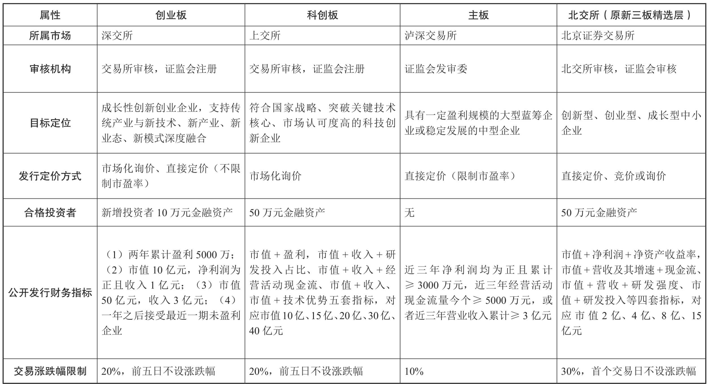
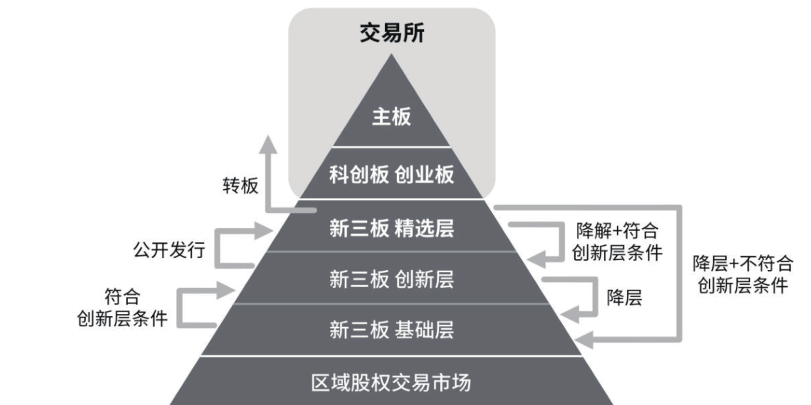

# 金融知识

## 复利

所谓复利，就是不光本金要计算利息，本金生出来的利息也要计算利息。

### 72定律：

如果利率是x% ,那么 经过 72/x 年后，本利之和就会翻翻。如1万元贷款，年利率 是10%，那么只需要7.2年，原先的1万元贷款，就变成了2万元，再经过7.2年，就会变成4万元。

## 贷款

### 贷款风险5层级

正常贷款

关注贷款：存在潜在问题，如果发展下去，可能影响贷款偿还

次级贷款：正常经营收入已经不足以保证还款，需要通过出售，变卖资产或执行抵押担保来还款。

可疑贷款：已经肯定贷款要发生一定的损失，只是存在抵押物处理和诉讼未决因素，损失金额还不能确定。

损失贷款：大部分已经无法收回，即使执行破产清算，贷款然会全部或大部分损失。

## 股票

### 优先股和普通股：

优先股的“优先”二字，主要体现在利润分红和公司剩余财产分配权上优于普通股。优先股股东每年收取固定的股息率，不参与上市公司管理，没有选举和被选举权，对公司重大经营事项无投票权，在某些特定的关系到优先股股东相关事项上有受严格限制的投票权；而普通股股东有着正常公司股东所应有的一切权利。但在公司经营不善的情况下，普通股股东的分红权利要次于优先股，破产清算时对剩余财产的分配上，优先股股东优先于普通股股东。

中小散户在二级市场买卖的股票基本都是普通股，优先股在极特殊情况下才能够进入二级市场流通，所以人们日常所说的“炒股”，炒的就是普通股

### A股和B股

A股、B股都在中国内地注册并上市，A股以人民币认购和交易，参与者为内资机构和个人；B股以人民币标明面值，只能以外币认购和交易，参与者主要为港澳台居民及外国人。

### H股和N股

H、S、N、T、L股分别代表的是内地注册，在香港（Hong Kong）、新加坡（Singapore）、纽约（NewYork）、东京（Tokyo）和伦敦（London）上市的外资股。有重点关注价值的是H股和N股，即港股和美股。

很多大型金融和能源企业在内地、香港两地上市（也称“**红筹股**”），但A股较H股溢价较多，从长期持有的角度看港股更为合适。

### 上市板块

比如同样是针对创新型企业的科创板和创业板，科创板瞄准的目标企业是硬科技企业，从事的是技术创新发展，而创业板除了包含科技企业，还接纳“科技+”或“模式创新”企业，显示出更大的包容性。

总体方向是主板上市要求更严，财务指标的标准更高。科创板、创业板已经实行注册制，涨跌停幅度已经放宽至20%，未来“T+0”等与国际市场接轨的交易规则也会逐步上线，主板也会往这方面过渡变革。还需要注意的是，在某些情况下，各板块股票也会发生“升级式”的转换。例如新三板精选层的挂牌公司，在精选层连续挂牌一年以上，如果符合上交所科创板或深交所创业板的上市条件，那么就可以申请转板至后者相关板块。

### 其他分类

根据行业不同可分为金融股、消费股、医药股、科技股、有色股、化工股等

根据市值大小可分为大盘股（蓝筹股）和中小盘股；

根据业绩优秀还是纯炒概念，可分为白马股和题材股；

根据企业风格又能分成价值股和成长股

根据行业周期或特性还可分为周期股、防御股和进攻股等。

### 龙虎榜

龙虎榜是A股市场中每天统计交易中涨跌幅、换手率、成交量等数据的股票统计榜单，还可以通过它关注到证券营业部、机构、游资等的买卖成交量和个股情况。通常只有日内股票价格涨跌幅7%以上、股票价格日内换手率超过20%、股票价格日内上行振幅15%以上，或者连续三日内涨跌幅偏离值超过20%，数据处于前三的股票才有资格上榜。

### 名称概论

#### 多头（多方）：

对股市未来行情乐观，预计股价还会继续节节攀升的人。看好的人

多头的标准动作是低价买入股票（做多），以待未来股价上涨时卖出。

#### 空头（空方）：

对股市前景悲观，预计股价会下跌的人。不看好的人

空头则是抛售股票（做空），未来股价下跌到比现价更低的某个价格时再重新买入。

#### 大户：

资金实力雄厚、投资金额巨大、大批量买卖股票，甚至能够影响某只个股涨跌的投资者。

#### 庄家：

庄家必然是大户，但大户不一定是庄家。庄家是通过刻意买入大量股票，在一段时间内操纵股价涨跌，以达到某种特定目的的资金大户。

#### 散户：

这是与大户、庄家对应的概念，从“股市博弈的主要参与力量”一节中，我们知道，中国股票市场是一个典型的散户市，散户资金占比极高。但散户和“韭菜”不能画等号，在“七亏二平一赚”的A股中，还是有小部分散户能够脱颖而出，有的甚至能成长为“牛散”。

#### 夹头：

这是对价值投资者简称的谐音调侃。“在别人贪婪的时候恐惧，在别人恐惧的时候贪婪”是价值投资派信奉的巴菲特的名言。人多的地方不去，在市场逆向而行，价值投资者也会为此付出“代价”——在2015年和2020年中小市值股票动辄翻倍的成长风格市场中，坚守基本面良好，低估值高分红的银行、保险、地产股票的价值投资者，也会自我戏谑为被价值投资之门“夹住了头”。但真正的价投者会坚定信奉价格终向价值回归。切忌在长期投资和短线投机之间摇摆不定，骑墙派会被市场教训得体无完肤，那才是真的“夹头”。

#### 白衣骑士：

股海如战场，商战时常发生。当成为他人的并购目标后（一般为恶意收购），上市公司的控股方或管理层会寻找友好人士或其他企业的帮助，达到驱逐恶意收购者的目的。这提供资金或其他资源，帮忙解救危难的第三方，便是财经报道中经常出现的“白衣骑士”。

#### 猴市和羊市：

典型的牛市和熊市之间，更多时候是涨跌互相交织的震荡市。也就是说大盘没有一个明确的上涨或下跌方向，市场分化比较严重。当震荡幅度较大，指数和股价动辄上蹿下跳时，被人们称为“猴市”；而指数窄幅波动，股价温和整理的市场，则被称为“羊市”。

#### 结构性牛市：

猴市和羊市中，也会存在某些特定行业、板块走得比其他行业板块明显更强的情况

#### 技术性牛市：

2020年始料未及的新冠肺炎疫情对全球股市在短期内造成重创，但在各国央行大手笔货币宽松和财政放水后，多个市场都进入了“技术性牛市”。但严格意义上这并不是真牛市，站在技术分析的角度，从大盘指数最低点算起涨幅超过20%时，才可以称之为技术性牛市。也有人将大盘稳定站上60日均线并且拐头向上定性为技术性牛市

#### 盘整/横盘：

在多数时候，指数会在某一段区间内上下波动，并无明显趋势性行情，这被称为盘整（或曰“横盘”）。盘整期间，投资者应静观其变，短线操作意义有限

#### 吸货和出货：

“货”即股票，吸货和出货就是买入和卖出股票的意思。

#### 和“仓”有关的术语：

货物储存的地方，就是仓库。交易账户中储存股票的地方，被人们形象地称为“仓”。

开始有计划地买入股票的过程是**“建仓”**，建仓后持有股票的状态，被称作**“持仓”**。持仓三成以内是**“轻仓”**，五成时是**“半仓”**，超过七成是**“重仓”**。现金全部买入，仓库里堆满股票后，就是传说中的**“满仓”**。有计划地抛售股票的过程，叫**“减仓”**，因某种原因被迫把账户内的股票全部卖出，叫**“平仓”**，主动把剩余全部股票一次性卖出的行为叫**“清仓**”，如果是赔本卖出的，也可以称为**“斩仓”**。整体仓位不变，但调换股票的行为，被称为**“调仓”**。出现浮亏，为降低持仓成本再次买入股票的行为叫**“补仓”**。本有浮盈，因看好某只股票选择再次买入的行为叫“**加仓**”。

#### 踏空：

投资者本来持仓成本不高，但因为看空某只股票的后市表现选择卖出，结果此后股价一路上扬，只能眼巴巴看着别人赚钱，自己却守着一堆现金吃活期利息，被江湖侠客们戏称为“踏空”。

#### 做T：

是指通过先低买再高卖或先高卖再低买的交易手法，以达到赚取买卖价差、降低持仓成本等目的，过去老股民也俗称“抢帽子”。根据做T的顺序不同，可以分为“正T”和“倒T”（也称“负T”）。上涨趋势中的个股可以在分时低点先买入，然后在后面的分时高点卖出，这是做正T；反之，下降趋势中的个股可以在分时高点先卖出，待股价下跌后再在分时低点接回，是为倒T

#### 对倒：

游资、庄家开立多个账户自买自卖，让股票成交量和换手率升高，显得股性活跃，以达到吸引散户注意入场参与买卖股票的行为。

#### 坐轿子和抬轿子：

庄家通常会选择在某些小众低位股，将其股价抬升至高位后卖出盈利。普通投资者通过某些内幕信息，或技术图形预判股价会涨，在拉升之前提前买入股票，这样的行为就是“坐轿子”。股价拉高后，庄家为了更好地出货，会通过刻意构造走势较好的技术图形，或在出货前散布利好消息，吸引投资者跟风买入。如果投资者不幸中招，很可能面临亏损，沦为“抬轿子”的轿夫。

#### 戴帽子和摘帽子：

因财务或其他状况出现异常（如连续两年亏损）的上市公司股票交易，会被交易所进行特别处理（Special Treatment），具体的措施包括股价涨跌幅限制为5%，股票名称前加“ST”，以及上市公司的中期报告必须经过审计等。被冠以ST“荣誉称号”的动作，就叫“戴帽子”。如果业绩持续无法改善，ST股还会被再戴一个“*型帽子”（所以也叫“戴星”），*ST股风险更大，投资者务必谨慎参与，新手应该回避这类绩差股的炒作。考察期内业绩改善，经营状况回归正常后，ST股和*ST股也有去除股票名前加冠的字母符号的机会，这个动作被称为“摘帽子”或“摘星”。一旦提前有摘帽子的消息发布，股价很可能迎来一波上涨行情。

#### 打板和翘板：

在我国，除新股上市当天外，普通单日交易都有10%或20%的涨跌幅限制。所谓“打板”，是指股价异动，快速拉升至接近涨停时突击买入的交易行为。专门从事类似短线交易的股民，也称为“打板族”。当股票跌停后抄底买入，豪赌股价当日回升的行为，则为“翘板”。围绕打板和翘板，也衍生出众多操作技法和专有名词，如“天地板”，即指股价从涨停直接打到跌停；反之则为“地天板”。

#### 洗盘：

为减轻后续拉升股价顺利出货的压力，主力或庄家有时会通过“洗盘”有意制造恐慌，迫使低价买入却又意志不坚定的散户卖出股票。洗盘之后往往还会有拉升，但究竟是洗盘还是真跌出货，就要看投资者自己的判断了。

#### 崩盘：

由于政治经济因素（次贷危机）或突发某种利空（战争、疫情），导致市场指数和绝大多数股票无限度暴跌，包括机构、主力和散户在内的所有参与者都在恐慌情绪下集体抛售股票，谓之“崩盘”。

#### 护盘：

与崩盘对应的概念为“护盘”，股指持续下跌，人心惶惶之时，管理层甚至会动用国家力量直接参与救市。

#### 高开：

指数或个股开盘价超过上一交易日收盘价，但未超过最高价的现象。如果买入力道过强，甚至超过前一日最高价，则为“跳空高开”。

#### 低开：

与高开相反，“低开”是指指数或个股开盘价低于上一交易日收盘价，但未低于最低价的现象。如果卖出力道过强，甚至低于前一日最低价，则为“跳空低开”。

#### 平开：

指数或个股开盘价与前一交易日收盘价持平，是为“平开”。

#### 缺口：

跳空高开或低开会在K线图中留下痕迹，即相邻两根K线之间的一段空白。通常情况下，如果缺口不被迅速回补，表明行情有延续的可能，如果缺口被回补，表明行情有反转的可能。缺口是技术分析派非常重视的一个技术形态，围绕其展开分析甚至足以形成一门理论。

#### 盘档：

指当天股价变动幅度很小，最高价与最低价之间差价不超过2%。对市场指数而言，行情进入盘整期后，指数上下波动幅度不大的情况，也被称为“盘档”，此时投资者多持谨慎观望态度。

#### 港股交易时间

9—10点为开市前时段，10—12点30分为早市，14点30分—16点为午市，16—16点10分为收市竞收时段，早市和午市为真正的交易时间，被称为“持续交易时段”，共有4个小时

#### 五碗面

基本面、技术面、资金面、政策面和消息面

#### 对联

连高善文自己也曾戏谑式地创作过一副对联，上联是“解释过去头头是道，似乎有理”，下联是“预测未来躲躲闪闪，误差惊人”，横批：经济分析

#### GDP

GDP全称Gross Domestic Product，中文译为国内生产总值，是指一个国家或地区所有常住单位在一定时期内（一般考察一个季度或一年）生产经营活动产出的全部产品和劳务成果。容易混淆的另一个术语是GNP，那是指国民生产总值（Gross National Product），两者区别主要是GDP是地域概念，GNP是国民概念。

一个在中国常驻的美国企业，所生产的产品计入中国而不是美国的GDP，只能计入美国的GNP

#### PMI

全称Purchasing Manager's Index，中文译为采购经理指数，是通过对企业采购经理的月度调查结果统计编制它涵盖制造业和非制造企业的采购、生产和流通各环节，是国际通用的监测宏观经济走向的先行指标，具有较强的预测和预警作用。

#### CPI

CPI全称Consumer Price Index，中文译为消费者价格指数，是用以反映与居民生活有关的消费品及服务价格水平变动情况的经济指标

一般可以将CPI大于3%视为即将通货膨胀的信号，连续多月在3%以上居高不下可以判断通胀已经发生，如果发生CPI持续在5%之上的情况，可以视为严重的通货膨胀。

#### PPI

全称ProducerPrice Index，中文是生产者价格指数。它是从生产者角度观察的物价指数，用以测量制造业厂商在初级市场（非零售市场）上首次购进或卖出某种货物价格的变动情况，因此又可以分为生产者购进价格指数和生产者出厂价格指数

#### 降息

利率降低有助于改善企业盈利，也利于降低投资者融资和交易成本，因此一般情况下对股市是好事。但通过前文的铺垫，读者应能隐约发现，利率并不是仅仅是银行存贷款价格那么简单。银行从央行处获得资金的价格，包括SLF、MLF、再贷款、再贴现等利率调整，自然会传导到货币市场、债券市场和信贷市场。它们的下调和存贷款基准利率下降一起，才构成财经媒体口中广义的“降息”。

#### 基钦周期

整个周期的时间大约是5年，且往往是企业的存货（可简单理解为卖剩的东西）发生变化、起伏所导致的，所以又叫存货周期或库存周期。

#### 朱格拉周期

又称设备更新周期，周期时长通常为10年。朱格拉周期指向的是生产所用的机器设备的更新换代，因而比存货周期持续时间会更长，对整个经济的影响更大。

#### 库兹涅茨周期

又称房地产周期，周期时长大概是15～20年。

#### 康德拉季耶夫周期

又称技术革新周期，周期时长大概是50年左右。比如从最早的蒸汽技术到电力技术，再到互联网技术
